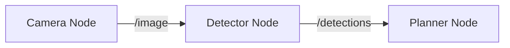

# Chapter Style Guide

**Purpose**: Define authoring standards for all chapters in the Physical AI & Humanoid Robotics textbook. This guide ensures consistency in structure, formatting, code examples, and pedagogical signaling across 50+ chapters.

**Companion files**:
- Chapter template: `templates/chapter-template.md`
- Migration guide: `docs-guides/migration-guide.md`
- Frontmatter schema: `specs/001-book-master-plan/contracts/frontmatter-schema.json`

---

## Table of Contents

1. [Heading Hierarchy](#heading-hierarchy)
2. [Code Block Standards](#code-block-standards)
3. [Available Prism Languages](#available-prism-languages)
4. [Showing Command Output](#showing-command-output)
5. [Admonition Usage](#admonition-usage)
6. [Admonition Frequency Guidelines](#admonition-frequency-guidelines)
7. [Admonition Nesting Rules](#admonition-nesting-rules)
8. [Navigation & Linking](#navigation--linking)
9. [Internal Linking Rules](#internal-linking-rules)
10. [Mermaid Diagrams](#mermaid-diagrams)
11. [MDX Escaping Rules](#mdx-escaping-rules)

---

## Heading Hierarchy

Docusaurus automatically generates the H1 heading from the `title` field in frontmatter. Never write a manual `#` heading in your content.

| Level | Markdown | Usage | Example |
|-------|----------|-------|---------|
| H1 | `#` | **Never use** — auto-generated from `title` frontmatter | — |
| H2 | `##` | Main sections | `## The Computational Graph` |
| H3 | `###` | Subsections within an H2 | `### Creating a Node` |
| H4 | `####` | **Maximum depth** — rarely needed | `#### Advanced Options` |

**Rules**:
- Never skip heading levels (e.g., going from H2 directly to H4)
- Every H3 must be inside an H2 section
- Every H4 must be inside an H3 section
- Use sentence case for headings ("Creating a node", not "Creating A Node")
- Keep headings concise (under 60 characters)

---

## Code Block Standards

Every code block in the textbook must follow these 4 rules.

### Rule 1: Language Identifier (Always Required)

Every code block must specify the language for syntax highlighting.

**Before** (non-compliant):
````markdown
```
import rclpy
```
````

**After** (compliant):
````markdown
```python
import rclpy
```
````

### Rule 2: Title Attribute (Always Required)

Every code block must have a `title` describing the file or purpose.

**Before** (non-compliant):
````markdown
```python
import rclpy
from rclpy.node import Node
```
````

**After** (compliant):
````markdown
```python title="minimal_node.py"
import rclpy
from rclpy.node import Node
```
````

**Title guidelines**:
- Use filenames when showing file content: `title="talker_node.py"`
- Use action descriptions for commands: `title="Install ROS 2 dependencies"`
- Fallback to language name if no better title exists: `title="Python"`

### Rule 3: Line Numbers (Conditional)

Code blocks exceeding 5 lines in Python, Bash, C++, or YAML must include `showLineNumbers`.

**Before** (non-compliant — 8 lines, no line numbers):
````markdown
```python title="publisher.py"
import rclpy
from rclpy.node import Node
from std_msgs.msg import String

class Publisher(Node):
    def __init__(self):
        super().__init__('publisher')
        self.pub = self.create_publisher(String, 'topic', 10)
```
````

**After** (compliant):
````markdown
```python title="publisher.py" showLineNumbers
import rclpy
from rclpy.node import Node
from std_msgs.msg import String

class Publisher(Node):
    def __init__(self):
        super().__init__('publisher')
        self.pub = self.create_publisher(String, 'topic', 10)
```
````

Short snippets (1-5 lines) should **not** use `showLineNumbers` to reduce visual noise.

### Rule 4: Line Highlighting (When Pedagogically Important)

Use highlighting to draw the reader's attention to key lines.

**Comment-based highlighting** (preferred — resilient to line changes):

```python title="highlight_example.py"
import rclpy

# highlight-next-line
important_function()

# highlight-start
block_of_important_code()
also_important()
# highlight-end
```

Comment styles by language:
- Python/Bash: `# highlight-next-line`
- C++/JSON: `// highlight-next-line`
- HTML/XML: `<!-- highlight-next-line -->`

**Metastring-based highlighting** (for static code where line numbers won't change):

````markdown
```python title="example.py" {3,7-9}
# Lines 3 and 7-9 will be highlighted
```
````

---

## Available Prism Languages

The following languages are configured for syntax highlighting in `docusaurus.config.ts`:

| Language ID | Use For |
|-------------|---------|
| `python` | Python scripts, ROS 2 nodes, machine learning code |
| `bash` | Terminal commands, shell scripts, installation steps |
| `yaml` | Configuration files, ROS 2 parameters, launch configs |
| `cpp` | C++ code, ROS 2 C++ nodes, low-level drivers |
| `json` | JSON data, API responses, schemas |
| `markup` | HTML, XML, URDF, SDF, launch files |

If you need a language not listed above, use `text` for plain unformatted blocks.

---

## Showing Command Output

When showing the expected output of a command, use a **separate** code block with `text` language:

````markdown
```bash title="Run the node"
ros2 run my_package my_node
```

```text title="Expected output"
[INFO] [my_node]: Node started!
[INFO] [my_node]: Publishing: "Hello World: 0"
```
````

**Rules**:
- Use `text` (not `bash`) for output blocks — output is not executable
- Always add `title="Expected output"` or `title="Output"`
- Place immediately after the command block

---

## Admonition Usage

Docusaurus provides 5 built-in admonition types. Each has a specific pedagogical purpose in this textbook.

### `:::note` — Supplementary Information

**Color**: Gray/blue | **Icon**: Info circle

**Use when**: Providing background context that enriches understanding but isn't essential to the main flow.

```markdown
:::note
ROS 2 uses DDS (Data Distribution Service) as its middleware layer.
This enables flexible quality-of-service configurations.
:::
```

**Do NOT use for**: Critical warnings, best practices, or learning objectives.

---

### `:::tip` — Best Practices & Shortcuts

**Color**: Green | **Icon**: Lightbulb

**Use when**: Sharing efficiency tips, best practices, keyboard shortcuts, or recommended approaches.

```markdown
:::tip[Pro Tip]
Use `ros2 topic echo --once /topic_name` to capture a single message
without flooding your terminal.
:::
```

**Do NOT use for**: Warnings about common mistakes or safety issues.

---

### `:::info` — Context & Learning Blocks

**Color**: Blue | **Icon**: Circle-i

**Use when**: Presenting learning objectives, prerequisites, or providing essential context blocks.

```markdown
:::info[What You'll Learn]
- Create ROS 2 publisher and subscriber nodes
- Configure Quality of Service profiles
- Debug topic communication issues
:::
```

**Do NOT use for**: Supplementary "nice to know" info (use `:::note` instead).

---

### `:::warning` — Common Mistakes & Gotchas

**Color**: Yellow | **Icon**: Exclamation triangle

**Use when**: Alerting readers to common errors, version-specific gotchas, deprecated patterns, or non-obvious behavior.

```markdown
:::warning[Common Mistake]
Do not call `rclpy.spin()` before creating all publishers and subscribers.
The node will start processing callbacks immediately, potentially missing
early messages.
:::
```

**Do NOT use for**: Safety-critical or hardware damage scenarios (use `:::danger`).

---

### `:::danger` — Safety & Data Loss

**Color**: Red | **Icon**: Flame

**Use when**: Warning about potential hardware damage, data loss, safety risks, or irreversible actions.

```markdown
:::danger[Hardware Safety]
Never send velocity commands to a real robot without first testing in
simulation. Unexpected motor movements can cause physical injury or
damage equipment.
:::
```

**Do NOT use for**: Recoverable mistakes or minor gotchas (use `:::warning`).

---

### Custom Titles

All admonitions support custom titles via bracket syntax:

```markdown
:::tip[Performance Tip]
Content here.
:::
```

If no custom title is provided, Docusaurus uses the type name (Note, Tip, Info, Warning, Danger).

---

## Admonition Frequency Guidelines

Each content type has different admonition needs:

| Content Type | Expected Density | Primary Types |
|-------------|-----------------|---------------|
| **Tutorial** | 2-4 per chapter | `:::tip` (shortcuts) + `:::warning` (gotchas) |
| **Concept** | 1-3 per chapter | `:::info` (context) + `:::note` (supplementary) |
| **Hands-on Lab** | 3-5 per chapter | `:::danger` (safety) + `:::warning` (errors) + `:::tip` (tips) |
| **Reference** | 1-2 per chapter | `:::note` (version notes) + `:::warning` (deprecations) |

Avoid overusing admonitions — too many breaks the reading flow. If you have more than 5 admonitions in one chapter, consider whether some content should be inline text instead.

---

## Admonition Nesting Rules

| Scenario | Supported? |
|----------|-----------|
| Admonition inside `<details>` block | Yes |
| Code block inside admonition | Yes |
| Mermaid diagram inside admonition | Yes |
| Admonition inside another admonition | **No** — avoid nesting |
| Admonition inside Tabs component | Yes — requires empty lines around Markdown syntax |

**Example — admonition inside details**:
```markdown
<details>
<summary>Click for more info</summary>

:::note
This works correctly when wrapped in a details block.
:::

</details>
```

**Example — code inside admonition**:
````markdown
:::tip[Quick Command]
```bash title="Check ROS 2 installation"
ros2 --version
```
:::
````

---

## Navigation & Linking

### Next Steps Section

Every chapter should end with a "Next Steps" section containing 1-3 links to related chapters.

**Pattern**:
```markdown
## Next Steps

Continue your learning journey:
- [Next Chapter Title](./next-chapter.md) — brief description
- [Related Chapter](../module-name/chapter.md) — why this is relevant
```

**Rules**:
- Include 1-3 links (not more)
- Use relative paths only (see Internal Linking Rules below)
- Module-ending chapters should link to the next module's overview
- Include a brief description (5-15 words) explaining why the link is relevant

---

## Internal Linking Rules

All internal links must use relative Docusaurus paths. Never use absolute URLs for internal content.

| Scenario | Pattern | Example |
|----------|---------|---------|
| Same directory | `./filename.md` | `[Core Concepts](./core-concepts.md)` |
| Parent directory | `../filename.md` | `[Introduction](../introduction/index.md)` |
| Different module | `../module-name/filename.md` | `[Installation](../module-1/installation.md)` |

**Never do**:
- `[Link](https://irshad-ai.github.io/hackathon-Book2026/docs/module-1/installation)` (absolute URL)
- `[Link](/docs/module-1/installation)` (absolute path)

Docusaurus validates all internal links at build time with `onBrokenLinks: 'throw'`. Broken links will fail the build.

---

## Mermaid Diagrams

Mermaid diagrams are rendered via `@docusaurus/theme-mermaid`. They support light/dark theme switching automatically.

### Supported Diagram Types

| Type | Use For | Syntax |
|------|---------|--------|
| `flowchart` | Architecture, data flow, processes | `flowchart LR` or `flowchart TB` |
| `sequenceDiagram` | Request-response, message passing | `sequenceDiagram` |
| `classDiagram` | Object relationships, inheritance | `classDiagram` |
| `stateDiagram-v2` | State machines, lifecycle | `stateDiagram-v2` |
| `graph` | Simple connections | `graph LR` |

### Example

````markdown

````

### Guidelines

- Keep diagrams simple — under 15 nodes
- Use `LR` (left-right) for process flows, `TB` (top-bottom) for hierarchies
- Label all connections with descriptive text
- Theme configuration is in `docusaurus.config.ts`: `neutral` for light, `dark` for dark mode

---

## MDX Escaping Rules

Docusaurus uses MDX (Markdown + JSX). Certain characters have special meaning in JSX and must be escaped outside of code blocks.

### Characters That Need Escaping

| Character | Escape To | When Required |
|-----------|----------|---------------|
| `<` | `&lt;` | In tables, inline text (NOT inside code blocks) |
| `>` | `&gt;` | In tables (NOT inside code blocks) |
| `{` | `&#123;` | Outside code blocks when not intended as JSX expression |
| `}` | `&#125;` | Outside code blocks when not intended as JSX expression |

### Why Escaping Is Required

MDX parses `<` as the start of a JSX/HTML tag and `{` as the start of a JavaScript expression. If these characters appear in regular markdown text (especially in tables), MDX will throw a build error.

### Before (breaks the build)

```markdown
| Operator | Meaning |
|----------|---------|
| < | Less than |
| > | Greater than |
```

### After (builds correctly)

```markdown
| Operator | Meaning |
|----------|---------|
| &lt; | Less than |
| &gt; | Greater than |
```

### Safe Contexts (no escaping needed)

- **Inside fenced code blocks**: `` ```python `` blocks are not parsed as JSX
- **Inside inline code**: `` `<tag>` `` is safe
- **In admonitions**: The content inside `:::` blocks is standard Markdown, but tables inside admonitions still need escaping

### Common Pitfalls

1. **Tables with angle brackets**: Always escape `<` and `>` in markdown tables
2. **Template syntax**: If describing template variables like `{variable}`, escape the braces
3. **HTML in markdown**: Use HTML entities (`&lt;`, `&gt;`) instead of raw `<`, `>`
4. **Math expressions**: Wrap in code blocks or use LaTeX syntax if available
