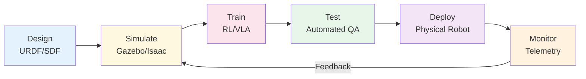
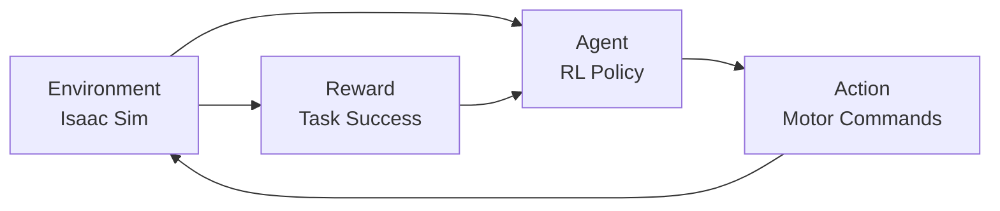

**Estimated Time**: 30 minutes

:::info[What You'll Learn]
- Describe the simulation-first development workflow
- Identify the key tools in a robotics development pipeline
- Understand the sim-to-real transfer process
- Apply testing strategies for robot software
:::

:::note[Prerequisites]
- [What is Physical AI?](./what-is-physical-ai.md) -- foundational understanding of Physical AI concepts
:::

Modern robotics development follows a simulation-first approach where software is developed, tested, and validated in simulation before deployment to physical hardware.

## The Simulation-First Pipeline



### Why Simulation First?

| Benefit | Description |
|---------|------------|
| **Safety** | No risk of hardware damage during development |
| **Speed** | Thousands of training episodes run faster than real-time |
| **Cost** | No physical hardware needed during early development |
| **Reproducibility** | Exact same conditions for every test run |
| **Parallelism** | Run hundreds of simulations simultaneously on GPU |

:::info[Simulation Is Not Optional]
In modern humanoid robotics, simulation-first development is not merely a convenience -- it is a necessity. Training a walking policy on physical hardware would take months and risk destroying the robot. In simulation, the same training completes in hours across thousands of parallel environments.
:::

## Development Tools

### Core Tools Used in This Course

| Tool | Purpose | Module |
|------|---------|--------|
| **ROS 2 Jazzy** | Middleware, communication | Module 1 |
| **Gazebo Harmonic** | Physics simulation | Module 2 |
| **NVIDIA Isaac Sim** | GPU-accelerated simulation | Module 3 |
| **Python 3.12** | Application development | All |
| **colcon** | Build system for ROS 2 | Module 1 |
| **rviz2** | Visualization | Module 1-3 |
| **Git** | Version control | All |

### Development Environment

```bash title="ros2_workspace_structure" showLineNumbers
# Typical robotics workspace structure
~/ros2_ws/
├── src/
│   ├── my_robot_description/    # URDF/SDF models
│   ├── my_robot_bringup/        # Launch files
│   ├── my_robot_perception/     # Vision pipeline
│   ├── my_robot_navigation/     # Nav2 configuration
│   └── my_robot_manipulation/   # Arm control
├── build/                       # Build artifacts (colcon)
├── install/                     # Installed packages
└── log/                         # Build and run logs
```

```bash title="build_ros2_workspace"
# Building a ROS 2 workspace
cd ~/ros2_ws
# highlight-next-line
colcon build --symlink-install
source install/setup.bash
```

## The Development Cycle

### 1. Model the Robot (URDF/SDF)

Define the robot's physical structure, joints, sensors, and visual appearance.

```xml title="simplified_urdf_example" showLineNumbers
<!-- Simplified URDF example -->
<robot name="my_humanoid">
  <link name="base_link">
    <visual>
      <geometry><box size="0.3 0.3 0.5"/></geometry>
    </visual>
  </link>
  <!-- highlight-next-line -->
  <joint name="head_joint" type="revolute">
    <parent link="base_link"/>
    <child link="head_link"/>
    <axis xyz="0 0 1"/>
    <limit lower="-1.57" upper="1.57" effort="10" velocity="1.0"/>
  </joint>
</robot>
```

### 2. Simulate

Load the robot model into a physics simulator and test behaviors.

```bash title="launch_gazebo_simulation" showLineNumbers
# Launch Gazebo with your robot
ros2 launch my_robot_bringup gazebo.launch.py

# In another terminal, send commands
ros2 topic pub /cmd_vel geometry_msgs/msg/Twist \
  "{linear: {x: 0.5}, angular: {z: 0.1}}"
```

### 3. Develop and Test

Write perception, planning, and control nodes. Test in simulation.

```python title="obstacle_avoidance_node" showLineNumbers
# Example: Simple obstacle avoidance node
class ObstacleAvoider(Node):
    def __init__(self):
        super().__init__('obstacle_avoider')
        self.scan_sub = self.create_subscription(
            LaserScan, '/scan', self.scan_callback, 10)
        self.cmd_pub = self.create_publisher(
            Twist, '/cmd_vel', 10)

    def scan_callback(self, msg):
        # highlight-next-line
        min_distance = min(msg.ranges)
        twist = Twist()
        if min_distance < 0.5:
            twist.angular.z = 0.5  # Turn away
        else:
            # highlight-next-line
            twist.linear.x = 0.3   # Move forward
        self.cmd_pub.publish(twist)
```

### 4. Train (Reinforcement Learning)

Use simulation to train policies for locomotion, manipulation, or navigation.



### 5. Deploy to Hardware

Transfer trained models and tested software to the physical robot.

```bash title="deploy_to_physical_robot" showLineNumbers
# Deploy ROS 2 packages to robot
ssh robot@192.168.1.100
cd ~/ros2_ws
colcon build --packages-select my_robot_bringup
# highlight-next-line
ros2 launch my_robot_bringup robot.launch.py
```

### 6. Monitor and Iterate

Collect telemetry data from the physical robot to improve simulation fidelity.

## Testing Strategies

### Unit Tests

Test individual functions and algorithms in isolation.

```python title="unit_test_path_planning" showLineNumbers
# test_planner.py
def test_path_planning():
    planner = PathPlanner()
    start = Pose(0, 0, 0)
    goal = Pose(5, 5, 0)
    path = planner.plan(start, goal)
    # highlight-next-line
    assert len(path) > 0
    assert path[-1].distance_to(goal) < 0.1
```

### Integration Tests

Test ROS 2 node communication and system behavior.

```bash title="integration_test_commands"
# Launch test with simulated hardware
ros2 launch my_robot_bringup test.launch.py
ros2 test my_robot_navigation
```

### Simulation Tests

Run complete scenarios in simulation to validate system behavior.

```bash title="automated_simulation_test"
# Run automated simulation test
ros2 launch my_robot_bringup simulation_test.launch.py \
  scenario:=pick_and_place \
  timeout:=120
```

### Hardware-in-the-Loop (HIL)

Connect real sensors/actuators to simulated environments for partial validation.

## Version Control Best Practices

```bash title="branch_naming_conventions"
# Branch naming for robotics projects
feature/perception-pipeline
feature/nav2-configuration
fix/lidar-transform
test/manipulation-scenarios
```

```bash title="commit_message_convention"
# Commit message convention
feat(perception): add YOLOv8 object detection node
fix(navigation): correct TF frame for lidar
test(manipulation): add pick-and-place simulation test
docs(readme): update hardware setup instructions
```

:::tip[Version Control for Robots]
Robotics projects have unique version control challenges: large binary assets (URDF meshes, trained models), hardware-specific configurations, and launch file parameters. Keep large files in Git LFS and use environment variables for hardware-specific settings.
:::

## Course Workflow

Throughout this course, you will follow this workflow:

1. **Module 1**: Set up ROS 2 and learn the communication framework
2. **Module 2**: Build a digital twin of your robot in Gazebo
3. **Module 3**: Add AI capabilities using NVIDIA Isaac
4. **Module 4**: Integrate VLA models and build the capstone project

Each module builds on the previous, creating a complete development stack for humanoid robotics.

:::tip[Key Takeaways]
- Simulation-first development is standard practice: design, simulate, train, test, deploy, monitor
- The core tool chain includes ROS 2 Jazzy, Gazebo Harmonic, NVIDIA Isaac Sim, Python, and colcon
- Testing spans four levels: unit tests, integration tests, simulation tests, and hardware-in-the-loop
- Version control with conventional commits keeps robotics projects maintainable
- Each course module maps to a stage in the development pipeline
:::

## Next Steps

You now have an overview of the complete Physical AI development workflow. Continue to [Module 1: ROS 2 Jazzy](../module-1/index.md) to start building your robotics development environment.
