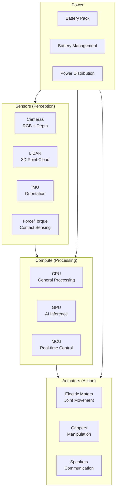
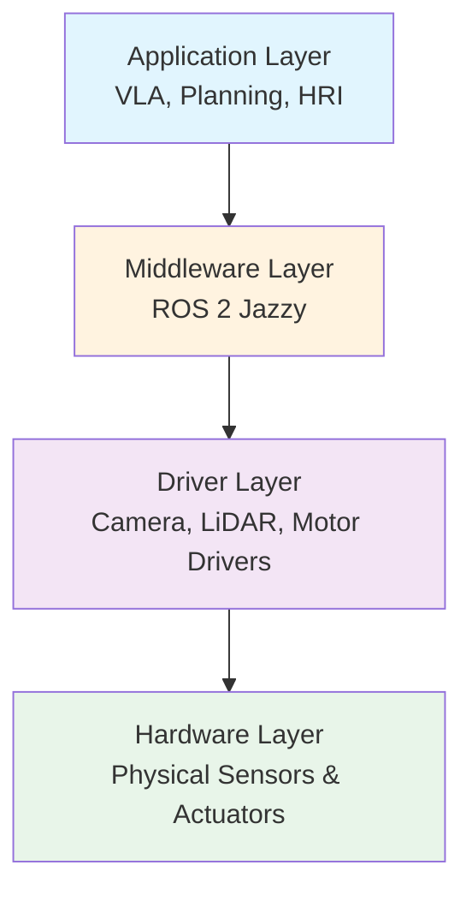

**Estimated Time**: 35 minutes

:::info[What You'll Learn]
- Identify the major hardware subsystems of a humanoid robot
- Understand the role of different sensor types in robot perception
- Compare compute platforms used in modern robotics
- Recognize the relationship between hardware and software architectures
:::

:::note[Prerequisites]
- [What is Physical AI?](./what-is-physical-ai.md) -- foundational understanding of Physical AI concepts
:::

Understanding robot hardware is essential for writing effective software. This chapter covers the key physical components that make up a humanoid robot system.

## Robot Subsystems



## Sensors

### Cameras

Cameras provide visual information about the robot's environment.

| Type | Resolution | Use Case | Example |
|------|-----------|----------|---------|
| RGB | 1080p-4K | Object recognition, scene understanding | Intel RealSense |
| Depth (Stereo) | 640x480-1280x720 | Distance measurement, 3D mapping | ZED 2i |
| Depth (ToF) | 640x480 | Close-range depth, gesture detection | Azure Kinect |
| Event | 1280x720 | High-speed motion detection | Prophesee |

```python title="camera_subscriber_ros2"
# Example: Reading camera data in ROS 2
import rclpy
from sensor_msgs.msg import Image
from cv_bridge import CvBridge

class CameraSubscriber(Node):
    def __init__(self):
        super().__init__('camera_subscriber')
        # highlight-next-line
        self.subscription = self.create_subscription(
            Image, '/camera/color/image_raw',
            self.image_callback, 10)
        self.bridge = CvBridge()

    def image_callback(self, msg):
        # highlight-next-line
        cv_image = self.bridge.imgmsg_to_cv2(msg, 'bgr8')
        # Process image...
```

### LiDAR

Light Detection and Ranging provides precise 3D point clouds for mapping and navigation.

| Type | Range | Points/sec | Use Case |
|------|-------|-----------|----------|
| 2D | 12-30m | 10K-40K | Indoor navigation |
| 3D Spinning | 100m+ | 300K-2M | Outdoor mapping |
| Solid State | 200m+ | 300K+ | Automotive, compact robots |

### Inertial Measurement Unit (IMU)

IMUs measure acceleration and angular velocity, essential for balance and orientation.

- **Accelerometer**: Measures linear acceleration (3 axes)
- **Gyroscope**: Measures angular velocity (3 axes)
- **Magnetometer**: Measures magnetic field for heading (3 axes)
- **Combined 9-DOF**: All three sensors in one package

### Force/Torque Sensors

Measure contact forces at joints and end-effectors for safe interaction.

```yaml title="force_torque_data_structure"
# Example: Force/torque sensor data structure
force:
  x: 0.0    # Newtons
  y: 0.0
  z: 9.81   # Gravity
torque:
  x: 0.0    # Newton-meters
  y: 0.0
  z: 0.0
```

## Compute Platforms

### Edge Compute for Robotics

| Platform | CPU | GPU | AI Performance | Power | Use Case |
|----------|-----|-----|---------------|-------|----------|
| NVIDIA Jetson Orin NX | 8-core ARM | 1024 CUDA | 100 TOPS | 25W | Mobile robots |
| NVIDIA Jetson AGX Orin | 12-core ARM | 2048 CUDA | 275 TOPS | 60W | Humanoid inference |
| Intel NUC | i7 x86 | Integrated | Limited | 28W | Basic ROS 2 nodes |
| Raspberry Pi 5 | 4-core ARM | None | None | 5W | Simple sensors/IO |

### GPU Acceleration

Modern robotics AI requires GPU acceleration for:

- **Perception**: Object detection, semantic segmentation (30+ FPS)
- **Planning**: Neural network-based motion planning
- **VLA Inference**: Vision-Language-Action model execution
- **SLAM**: Real-time simultaneous localization and mapping

```bash title="check_gpu_availability"
# Check GPU availability
nvidia-smi

# Expected output for Jetson Orin
# +-----------------------------------------------------------------------------+
# | NVIDIA-SMI 535.xx    Driver Version: 535.xx    CUDA Version: 12.x          |
# | GPU  Name    Persistence-M| Bus-Id   Disp.A | Volatile Uncorr. ECC |
# | 0    Orin    On           | 00000001:00:00.0 Off|                  N/A |
# +-----------------------------------------------------------------------------+
```

:::warning[GPU Memory Matters]
For NVIDIA Isaac Sim and VLA model inference, you need at least 8GB of GPU VRAM. Many perception and planning tasks can run on 4GB, but simulation and large model inference require significantly more. Check your GPU memory with `nvidia-smi` before starting Module 3.
:::

### Real-Time Control

Low-level motor control requires deterministic timing that general-purpose CPUs cannot guarantee:

- **Microcontrollers (MCU)**: STM32, ESP32 for joint-level control at 1 kHz+
- **FPGA**: Custom logic for ultra-low latency sensor processing
- **Real-time OS**: RT-Linux or Xenomai for soft real-time guarantees

## Actuators

### Electric Motors

Most humanoid robots use brushless DC (BLDC) motors with these configurations:

| Type | Torque | Speed | Use Case |
|------|--------|-------|----------|
| Direct Drive | Low | High | Small joints, wrists |
| Geared (Harmonic) | High | Low | Hip, knee, shoulder |
| Quasi-Direct Drive | Medium | Medium | Compliant manipulation |
| Linear Actuator | High | Low | Specialized joints |

### Grippers and Hands

| Design | DOF | Capability | Complexity |
|--------|-----|-----------|-----------|
| Parallel Jaw | 1 | Basic pick-and-place | Low |
| 3-Finger Adaptive | 3-4 | Versatile grasping | Medium |
| Dexterous Hand | 12-20 | Human-like manipulation | High |
| Soft Gripper | Variable | Delicate objects | Medium |

## Power Systems

| Robot Class | Battery | Runtime | Charging |
|-------------|---------|---------|----------|
| Small Mobile | 24V LiPo | 2-4 hours | 1-2 hours |
| Humanoid | 48-72V LiFePO4 | 1-3 hours | 2-4 hours |
| Industrial | Tethered/Swap | Continuous | Hot-swap |

## Hardware-Software Interface

The connection between hardware and software follows a layered architecture:



In this course, you will primarily work at the **Application** and **Middleware** layers, with simulation providing the hardware layer virtually.

:::tip[Key Takeaways]
- Humanoid robots have four major subsystems: sensors, compute, actuators, and power
- Camera and LiDAR sensors provide complementary perception capabilities (RGB/depth vs. precise 3D point clouds)
- GPU-accelerated edge compute (Jetson Orin family) enables on-robot AI inference at 100-275 TOPS
- The hardware-software interface follows a layered architecture where ROS 2 acts as middleware
- In this course, simulation replaces the physical hardware layer for safe, repeatable development
:::

## Next Steps

Continue to [Development Workflow](./development-workflow.md) to learn about the tools and processes used in modern robotics development.
