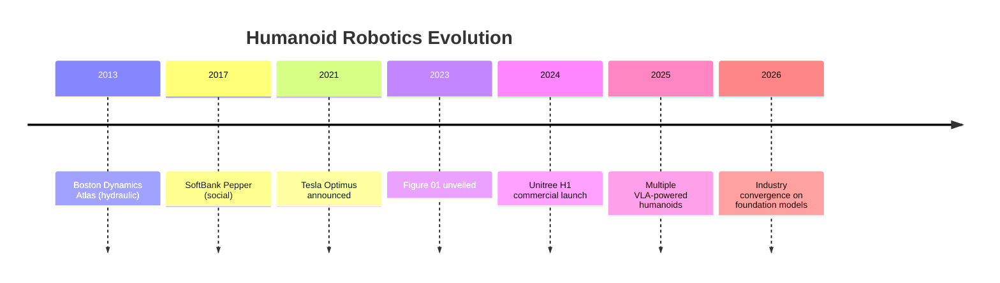
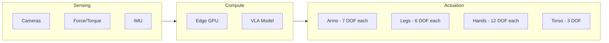
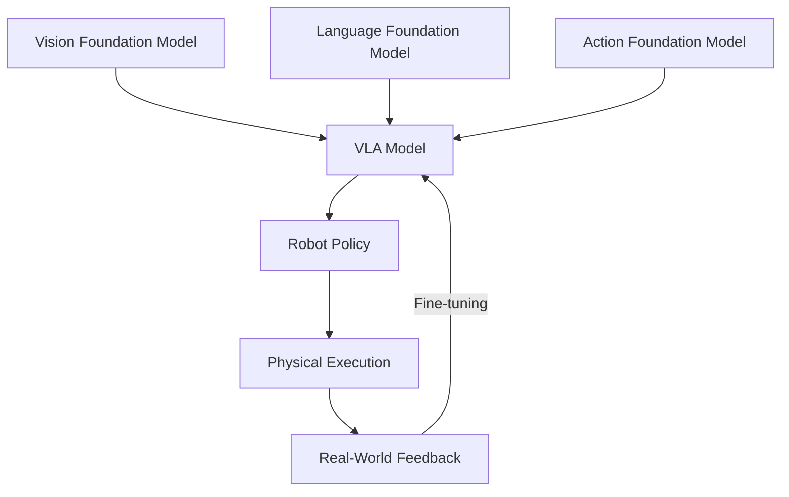

**Estimated Time**: 40 minutes

:::info[What You'll Learn]
- Identify the major companies and platforms in humanoid robotics
- Compare different approaches to humanoid robot design
- Understand the current capabilities and limitations of humanoid systems
- Recognize the role of simulation in humanoid development
:::

:::note[Prerequisites]
- [What is Physical AI?](./what-is-physical-ai.md) -- foundational understanding of Physical AI concepts
:::

The humanoid robotics industry has entered a period of rapid growth, with multiple companies demonstrating increasingly capable bipedal robots in real-world tasks.

## Industry Overview

## Major Players

### Hardware-First Companies

| Company | Robot | Approach | Key Strength |
|---------|-------|----------|-------------|
| Boston Dynamics | Atlas (Electric) | Full-body athletics | Dynamic movement |
| Tesla | Optimus (Gen 2) | Manufacturing focus | Scale + supply chain |
| Figure | Figure 02 | General purpose | VLA integration |
| Unitree | H1/G1 | Affordable hardware | Cost-effective platform |
| Agility Robotics | Digit | Warehouse logistics | Real-world deployment |
| 1X Technologies | NEO | Home assistance | Human-safe design |

### Software & AI Companies

| Company | Contribution | Impact |
|---------|-------------|--------|
| NVIDIA | Isaac Platform, GR00T | Simulation + foundation models |
| Google DeepMind | RT-2, Aloha | VLA architectures |
| OpenAI | Robotics research | LLM-driven planning |
| Hugging Face | LeRobot | Open-source robot learning |

:::tip[Industry Insight]
The humanoid robotics space is converging around foundation models. Companies that previously focused solely on hardware are now integrating VLA models, while AI companies are building robotics-specific platforms. This convergence is what makes the skills in this course so relevant.
:::

## Design Approaches

### Fully Actuated Humanoids

Full humanoid form factor with 30+ degrees of freedom, designed for human environments.

**Advantages**: Can operate in spaces designed for humans, use human tools, perform human-like manipulation.

**Challenges**: Balance control, energy efficiency, cost, safety around humans.

### Mobile Manipulators

Upper body on a wheeled or tracked base, trading bipedal locomotion for stability.

**Advantages**: More stable, simpler control, longer battery life.

**Challenges**: Cannot navigate stairs, limited to flat surfaces.

### Simulation-First Development

Modern humanoid development relies heavily on simulation before physical deployment:

1. **Digital Twin** -- Accurate physics model of the robot
2. **Domain Randomization** -- Varying simulation parameters for robustness
3. **Sim-to-Real Transfer** -- Deploying simulation-trained policies to hardware
4. **Continuous Learning** -- Refining models with real-world data

## Current Capabilities

### What Humanoids Can Do Today

- **Warehouse logistics**: Pick, pack, and transport items
- **Simple manipulation**: Open doors, push carts, carry boxes
- **Navigation**: Walk on flat surfaces, avoid obstacles
- **Teleoperation**: Perform complex tasks with human guidance
- **Scripted tasks**: Execute pre-programmed assembly sequences

### What Remains Challenging

- **Dexterous manipulation**: Fine motor tasks (threading, tool use)
- **Unstructured environments**: Cluttered homes, outdoor terrain
- **Long-horizon planning**: Multi-step tasks without human guidance
- **Robust locomotion**: Stairs, uneven ground, recovery from falls
- **Energy efficiency**: Most humanoids operate for 1-4 hours

:::warning[Reality Check]
Marketing videos often show humanoid robots in their best moments. Real-world deployment requires handling edge cases, failures, and environments the robot has never seen. This course emphasizes simulation-first development precisely because physical testing is expensive and risky.
:::

## The Role of Foundation Models

The convergence of large language models, vision models, and robotics is creating a new paradigm:

**Vision-Language-Action (VLA) models** combine:
- **Vision**: Understanding the scene from camera inputs
- **Language**: Interpreting natural language instructions
- **Action**: Generating motor commands for the robot

This is the focus of Module 4 in this course.

## Course Connection

This course prepares you to work with humanoid robotics by teaching:

| Module | Relevance to Humanoids |
|--------|----------------------|
| Module 1: ROS 2 | Communication framework for all robot subsystems |
| Module 2: Digital Twin | Simulation environment for safe development |
| Module 3: Isaac | GPU-accelerated perception, navigation, and RL |
| Module 4: VLA | Foundation model integration for intelligent behavior |

## Further Reading

- [NVIDIA Isaac Robotics Platform](https://developer.nvidia.com/isaac)
- [ROS 2 Documentation](https://docs.ros.org/en/jazzy/)
- [Open Robotics](https://www.openrobotics.org/)

:::tip[Key Takeaways]
- The humanoid robotics industry includes hardware-first companies (Boston Dynamics, Tesla, Figure) and software/AI companies (NVIDIA, DeepMind)
- Design approaches range from fully actuated humanoids to mobile manipulators, each with distinct tradeoffs
- Current humanoids excel at structured tasks but struggle with dexterous manipulation and unstructured environments
- Foundation models (VLA) are converging vision, language, and action into unified robot policies
- Simulation-first development is essential because physical testing is slow, expensive, and risky
:::

## Next Steps

Continue to [Hardware Overview](./hardware-overview.md) to understand the physical components that make humanoid robots work.
