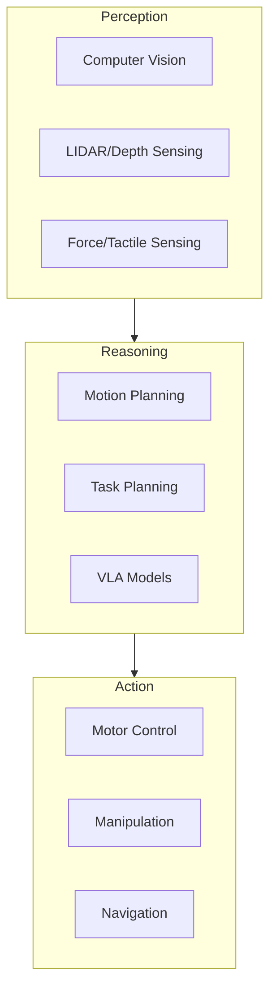

**Estimated Time**: 45 minutes

:::info[What You'll Learn]
- Define Physical AI and its four core capabilities: perceive, reason, act, and learn
- Identify real-world application domains for Physical AI systems
- Describe the key technology pillars including computer vision, planning, and motor control
- Explain how ROS 2, simulation, Isaac, and VLA models connect to Physical AI
:::

:::note[Prerequisites]
No prerequisites -- you can start here.
:::

Physical AI represents the convergence of advanced artificial intelligence with physical robotic systems capable of interacting with the real world.

## Definition

**Physical AI** refers to AI systems that:

1. **Perceive** the physical world through sensors
2. **Reason** about actions and their consequences
3. **Act** on the environment through actuators
4. **Learn** from physical interactions

:::info[Why This Matters]
Physical AI differs from purely digital AI because it must handle real-world uncertainty, physical constraints, and safety requirements. A chatbot can retry a response; a humanoid robot walking down stairs cannot.
:::

## Why Physical AI Matters

The next frontier of AI moves beyond digital-only systems into the physical world:

- **Manufacturing** -- Adaptive robots that handle variability
- **Healthcare** -- Assistive robots for patient care
- **Logistics** -- Autonomous systems for warehouses and delivery
- **Home** -- Humanoid assistants for daily tasks

## Key Technologies

## Course Connection

This course teaches you to build Physical AI systems using:

- **ROS 2** -- The middleware connecting perception, reasoning, and action
- **Simulation** -- Safe environment for testing and training
- **NVIDIA Isaac** -- GPU-accelerated AI for robotics
- **VLA Models** -- Vision-Language-Action for human-like task understanding

:::tip[Key Takeaways]
- Physical AI combines perception, reasoning, action, and learning in robotic systems
- Real-world applications span manufacturing, healthcare, logistics, and home assistance
- Three technology pillars -- perception, reasoning, and action -- form the foundation
- This course covers the full stack: ROS 2 middleware, simulation, GPU-accelerated AI, and VLA models
:::

## Next Steps

Continue to [The Humanoid Robotics Landscape](./humanoid-landscape.md) to explore the current state and future of humanoid robots.
