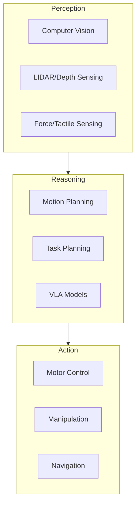

# What is Physical AI?

Physical AI represents the convergence of advanced artificial intelligence with physical robotic systems capable of interacting with the real world.

## Definition

**Physical AI** refers to AI systems that:

1. **Perceive** the physical world through sensors
2. **Reason** about actions and their consequences
3. **Act** on the environment through actuators
4. **Learn** from physical interactions

## Why Physical AI Matters

The next frontier of AI moves beyond digital-only systems into the physical world:

- **Manufacturing** — Adaptive robots that handle variability
- **Healthcare** — Assistive robots for patient care
- **Logistics** — Autonomous systems for warehouses and delivery
- **Home** — Humanoid assistants for daily tasks

## Key Technologies

## Course Connection

This course teaches you to build Physical AI systems using:

- **ROS 2** — The middleware connecting perception, reasoning, and action
- **Simulation** — Safe environment for testing and training
- **NVIDIA Isaac** — GPU-accelerated AI for robotics
- **VLA Models** — Vision-Language-Action for human-like task understanding

Continue to the next section to explore the humanoid robotics landscape.
