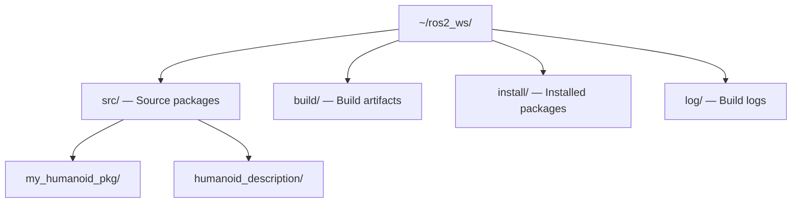

**Estimated Time**: 40 minutes

:::info[What You'll Learn]
- Create a new ROS 2 Python package from scratch
- Understand the ament build system and package.xml metadata
- Build packages with colcon and manage workspaces
- Configure setup.py with data_files for launch, config, and URDF files
- Write Python launch files with arguments, parameters, and remappings
:::

:::note[Prerequisites]
Before starting this chapter, complete:
- [ROS 2 Jazzy Installation](./installation.md)
- [Core Concepts](./core-concepts.md)
:::

Packages are the fundamental unit of organization in ROS 2. Every node, message definition, and launch file lives inside a package.

## Package Types

| Type | Build System | Language | Use Case |
|------|-------------|----------|----------|
| `ament_python` | setuptools | Python | AI, perception, planning |
| `ament_cmake` | CMake | C++ | Drivers, real-time control |
| `ament_cmake_python` | Both | Mixed | Hybrid packages |

This course focuses on Python packages (`ament_python`).

## Workspace Structure



| Directory | Contents | Managed By |
|-----------|----------|------------|
| `src/` | Your source packages (your code) | You |
| `build/` | Build artifacts (temporary, auto-generated) | colcon |
| `install/` | Installed packages (what you `source` and `ros2 run`) | colcon |
| `log/` | Build and runtime logs | colcon |

```bash title="Create workspace directory"
mkdir -p ~/ros2_ws/src
cd ~/ros2_ws
```

## Creating a Python Package

```bash title="Create a new Python package" showLineNumbers
cd ~/ros2_ws/src

# Create a Python package with dependencies
# highlight-next-line
ros2 pkg create --build-type ament_python \
  --dependencies rclpy sensor_msgs geometry_msgs trajectory_msgs \
  --node-name joint_reader \
  my_humanoid_pkg

# Package structure created:
# my_humanoid_pkg/
# ├── package.xml           # Package metadata and dependencies
# ├── setup.py              # Python package configuration
# ├── setup.cfg             # Entry point configuration
# ├── resource/
# │   └── my_humanoid_pkg   # ament_index resource marker
# ├── my_humanoid_pkg/
# │   ├── __init__.py
# │   └── joint_reader.py   # Your node
# └── test/
#     ├── test_copyright.py
#     ├── test_flake8.py
#     └── test_pep257.py
```

## Package Structure

### package.xml (Format 3)

The manifest file defines package metadata and dependencies:

```xml title="package.xml" showLineNumbers
<?xml version="1.0"?>
<package format="3">
  <name>my_humanoid_pkg</name>
  <version>0.1.0</version>
  <description>Humanoid robot control package</description>
  <maintainer email="you@email.com">Your Name</maintainer>
  <license>Apache-2.0</license>

  <!-- Build tool dependency -->
  <buildtool_depend>ament_python</buildtool_depend>

  <!-- Runtime dependencies (used by your nodes at execution time) -->
  <!-- highlight-start -->
  <exec_depend>rclpy</exec_depend>
  <exec_depend>sensor_msgs</exec_depend>
  <exec_depend>geometry_msgs</exec_depend>
  <exec_depend>trajectory_msgs</exec_depend>
  <!-- highlight-end -->

  <!-- Use <depend> as shorthand for both build + exec dependency -->
  <depend>std_msgs</depend>

  <!-- Test dependencies -->
  <test_depend>ament_copyright</test_depend>
  <test_depend>ament_flake8</test_depend>
  <test_depend>ament_pep257</test_depend>
  <test_depend>python3-pytest</test_depend>

  <export>
    <build_type>ament_python</build_type>
  </export>
</package>
```

**Dependency tag reference:**

| Tag | When to Use |
|-----|-------------|
| `<buildtool_depend>` | Build system itself (`ament_python`, `ament_cmake`) |
| `<exec_depend>` | Runtime-only dependencies (Python packages your nodes import) |
| `<build_depend>` | Build-only dependencies (code generators, compilers) |
| `<depend>` | Shorthand for both `<build_depend>` and `<exec_depend>` |
| `<test_depend>` | Dependencies needed only for testing |

### setup.py with data_files

The `setup.py` configures how your package is installed. The `data_files` list is critical — it tells colcon which non-Python files to install (launch files, config YAML, URDF files):

```python title="setup.py" showLineNumbers
import os
from glob import glob
from setuptools import find_packages, setup

package_name = 'my_humanoid_pkg'

setup(
    name=package_name,
    version='0.1.0',
    packages=find_packages(exclude=['test']),
    # highlight-start
    data_files=[
        # ament_index resource marker (REQUIRED — do not remove)
        ('share/ament_index/resource_index/packages',
            ['resource/' + package_name]),
        # Package manifest
        ('share/' + package_name, ['package.xml']),
        # Launch files — glob pattern picks up all launch files
        ('share/' + package_name + '/launch',
            glob(os.path.join('launch', '*launch.[pxy][yma]*'))),
        # Config / parameter files
        ('share/' + package_name + '/config',
            glob(os.path.join('config', '*.yaml'))),
        # URDF and Xacro files
        ('share/' + package_name + '/urdf',
            glob(os.path.join('urdf', '*.urdf*'))),
    ],
    # highlight-end
    install_requires=['setuptools'],
    zip_safe=True,
    maintainer='Your Name',
    maintainer_email='you@email.com',
    description='Humanoid robot control package',
    license='Apache-2.0',
    tests_require=['pytest'],
    entry_points={
        'console_scripts': [
            'joint_reader = my_humanoid_pkg.joint_reader:main',
            'joint_commander = my_humanoid_pkg.joint_commander:main',
        ],
    },
)
```

:::tip[Glob Patterns for data_files]
The glob pattern `*launch.[pxy][yma]*` matches `*.launch.py`, `*.launch.xml`, and `*.launch.yaml` — all three launch file formats that ROS 2 supports.
:::

### The ament_index Resource Marker

The `resource/my_humanoid_pkg` file is a **required marker** for the ament index system. It allows `ros2 pkg list` and `ros2 run` to discover your package.

:::danger[Do Not Delete the Resource Marker]
The file `resource/<package_name>` in your `data_files` must always be included. Without it, `ros2 run` and `ros2 launch` cannot find your package even after a successful build. The file can be empty — its existence is what matters.
:::

### setup.cfg

```ini title="setup.cfg"
[develop]
script_dir=$base/lib/my_humanoid_pkg

[install]
install_scripts=$base/lib/my_humanoid_pkg
```

This tells setuptools where to install executable scripts so `ros2 run` can find them.

## Building Packages

### Using colcon

```bash title="Build with colcon" showLineNumbers
cd ~/ros2_ws

# Build all packages in the workspace
colcon build

# Build a specific package only
colcon build --packages-select my_humanoid_pkg

# Build with symlink install (Python files linked, not copied)
# highlight-next-line
colcon build --symlink-install

# Source the workspace overlay AFTER building
source install/setup.bash
```

:::warning[Common Mistake]
Always run `source install/setup.bash` after building. Without it, ROS 2 cannot find your newly built packages, and `ros2 run` will fail with "package not found."
:::

### Common Build Flags

```bash title="Useful colcon flags" showLineNumbers
# Parallel build with limited workers
colcon build --parallel-workers 4

# Verbose output (see compiler/build details)
colcon build --event-handlers console_direct+

# Clean build (remove all build artifacts first)
rm -rf build/ install/ log/
colcon build
```

:::tip[Pro Tip]
Use `--symlink-install` during development. With symlinks, changes to Python source files take effect immediately without rebuilding. Only non-Python files (launch, config, URDF) require a rebuild after changes.
:::

## Launch Files

Launch files start multiple nodes with configured parameters, remappings, and arguments.

### Basic Launch File

```python title="launch/humanoid_bringup.launch.py" showLineNumbers
from launch import LaunchDescription
from launch_ros.actions import Node

def generate_launch_description():
    return LaunchDescription([
        Node(
            package='my_humanoid_pkg',
            executable='joint_reader',
            name='joint_reader',
            parameters=[{
                'joint_names': ['left_hip_pitch', 'left_knee_pitch'],
                'publish_rate': 50.0,
            }],
        ),
        Node(
            package='my_humanoid_pkg',
            executable='joint_commander',
            name='joint_commander',
            remappings=[
                ('/joint_states', '/humanoid/joint_states'),
            ],
        ),
    ])
```

### Launch Files with Arguments

Use `DeclareLaunchArgument` and `LaunchConfiguration` for configurable launch files:

```python title="launch/configurable.launch.py" showLineNumbers
from launch import LaunchDescription
from launch.actions import DeclareLaunchArgument
from launch.substitutions import LaunchConfiguration
from launch_ros.actions import Node

def generate_launch_description():
    # Declare arguments that users can override from the command line
    # highlight-next-line
    robot_name_arg = DeclareLaunchArgument(
        'robot_name', default_value='humanoid_01',
        description='Name of the robot instance')

    publish_rate_arg = DeclareLaunchArgument(
        'publish_rate', default_value='50.0',
        description='Joint state publish rate in Hz')

    return LaunchDescription([
        robot_name_arg,
        publish_rate_arg,
        Node(
            package='my_humanoid_pkg',
            executable='joint_reader',
            # highlight-next-line
            name=LaunchConfiguration('robot_name'),
            parameters=[{
                'publish_rate': LaunchConfiguration('publish_rate'),
            }],
        ),
    ])
```

```bash title="Launch with custom arguments"
ros2 launch my_humanoid_pkg configurable.launch.py robot_name:=atlas publish_rate:=100.0
```

### Loading Parameters from YAML

```python title="launch/with_params.launch.py" showLineNumbers
import os
from ament_index_python.packages import get_package_share_directory
from launch import LaunchDescription
from launch_ros.actions import Node

def generate_launch_description():
    # highlight-next-line
    config_file = os.path.join(
        get_package_share_directory('my_humanoid_pkg'),
        'config', 'humanoid_params.yaml')

    return LaunchDescription([
        Node(
            package='my_humanoid_pkg',
            executable='joint_reader',
            name='joint_reader',
            parameters=[config_file],
        ),
    ])
```

## Parameters

Parameters configure node behavior at runtime.

### Declaring and Using Parameters

```python title="configurable_node.py" showLineNumbers
class HumanoidController(Node):
    def __init__(self):
        super().__init__('humanoid_controller')
        # Declare parameters with default values
        # highlight-next-line
        self.declare_parameter('update_rate', 50.0)
        self.declare_parameter('joint_names', ['left_hip_pitch', 'left_knee_pitch'])
        self.declare_parameter('position_tolerance', 0.01)

        # Read parameter values
        rate = self.get_parameter('update_rate').value
        self.joint_names = self.get_parameter('joint_names').value
        self.tolerance = self.get_parameter('position_tolerance').value

        self.timer = self.create_timer(1.0 / rate, self.control_loop)
        self.get_logger().info(
            f'Controller started: {len(self.joint_names)} joints at {rate} Hz')
```

### Parameter Files (YAML)

```yaml title="config/humanoid_params.yaml"
humanoid_controller:
  ros__parameters:
    update_rate: 100.0
    joint_names:
      - left_hip_pitch
      - left_knee_pitch
      - left_ankle_pitch
      - right_hip_pitch
      - right_knee_pitch
      - right_ankle_pitch
    position_tolerance: 0.005
```

### Runtime Parameter Changes

```bash title="Parameter commands" showLineNumbers
# Get a parameter value
ros2 param get /humanoid_controller update_rate
# Expected: Double value is: 100.0

# Set a parameter at runtime
# highlight-next-line
ros2 param set /humanoid_controller position_tolerance 0.002
# Expected: Set parameter successful

# List all parameters for a node
ros2 param list /humanoid_controller
# Expected: joint_names, position_tolerance, update_rate, use_sim_time

# Dump all parameters to YAML
ros2 param dump /humanoid_controller
```

## Common Message Packages

| Package | Key Messages | Humanoid Use Case |
|---------|-------------|-------------------|
| `std_msgs` | `String`, `Int32`, `Float64`, `Bool` | Status flags, debug output |
| `sensor_msgs` | `JointState`, `Imu`, `Image`, `LaserScan` | Joint feedback, IMU data, cameras |
| `geometry_msgs` | `Twist`, `Pose`, `Transform`, `WrenchStamped` | Velocity commands, foot forces |
| `trajectory_msgs` | `JointTrajectory`, `JointTrajectoryPoint` | Joint motion commands |
| `control_msgs` | `JointTrajectoryControllerState` | Controller feedback and status |
| `nav_msgs` | `Odometry`, `Path`, `OccupancyGrid` | Navigation and mapping |

## Best Practices

### Package Organization

```text title="Recommended package layout"
my_humanoid_pkg/
├── package.xml            # Always at package root
├── setup.py               # Python build configuration
├── setup.cfg              # Script install directories
├── resource/              # ament_index marker
│   └── my_humanoid_pkg
├── my_humanoid_pkg/       # Python source (same name as package)
│   ├── __init__.py
│   ├── joint_reader.py    # One file per node
│   ├── joint_commander.py
│   └── utils/             # Shared utilities
│       └── math_helpers.py
├── launch/                # Launch files
│   └── humanoid_bringup.launch.py
├── config/                # Parameter YAML files
│   └── humanoid_params.yaml
├── urdf/                  # Robot description files
│   └── humanoid.urdf.xacro
└── test/                  # Unit tests
    └── test_joint_reader.py
```

### Naming Conventions

- **Package names**: `snake_case` (`my_humanoid_pkg`, not `MyHumanoidPkg`)
- **Node names**: `snake_case` matching the executable (`joint_reader`)
- **Topic names**: `/namespace/topic_name` (`/humanoid/joint_states`)
- **Service names**: `/namespace/service_name` (`/humanoid/calibrate_joints`)

### Dependency Management

1. **List all dependencies in `package.xml`** — not just in `setup.py`. This is how `rosdep` resolves system dependencies
2. **Use `<depend>` for most packages** — it covers both build and runtime
3. **Run `rosdep install`** before building to install missing dependencies:

```bash title="Install dependencies"
cd ~/ros2_ws
rosdep install --from-paths src --ignore-src -r -y
```

### Development Workflow

1. Edit source code in `src/my_humanoid_pkg/`
2. Build: `colcon build --symlink-install --packages-select my_humanoid_pkg`
3. Source: `source install/setup.bash` (only needed after first build or data_files changes)
4. Run: `ros2 run my_humanoid_pkg joint_reader`
5. Test: `colcon test --packages-select my_humanoid_pkg`

:::tip[Key Takeaways]
- ROS 2 packages use `ament_python` for Python projects with `package.xml` and `setup.py`
- `data_files` in `setup.py` installs launch files, config YAML, and URDF — use glob patterns for convenience
- The `resource/` marker file is required for `ros2 run` to discover your package — never delete it
- Build with `colcon build --symlink-install` for fast iteration during development
- Use `DeclareLaunchArgument` and `LaunchConfiguration` for configurable, reusable launch files
- Load parameters from YAML files and change them at runtime with `ros2 param set`
- Always source `install/setup.bash` after building to make packages discoverable
:::

## Next Steps

- [Python Agents](./python-agents.md) — build full ROS 2 applications using rclpy
- [URDF Basics](./urdf-basics.md) — describe your robot's physical structure
