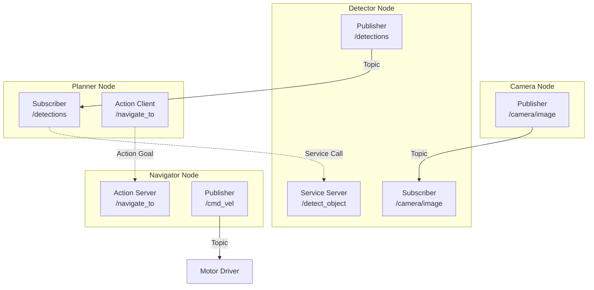
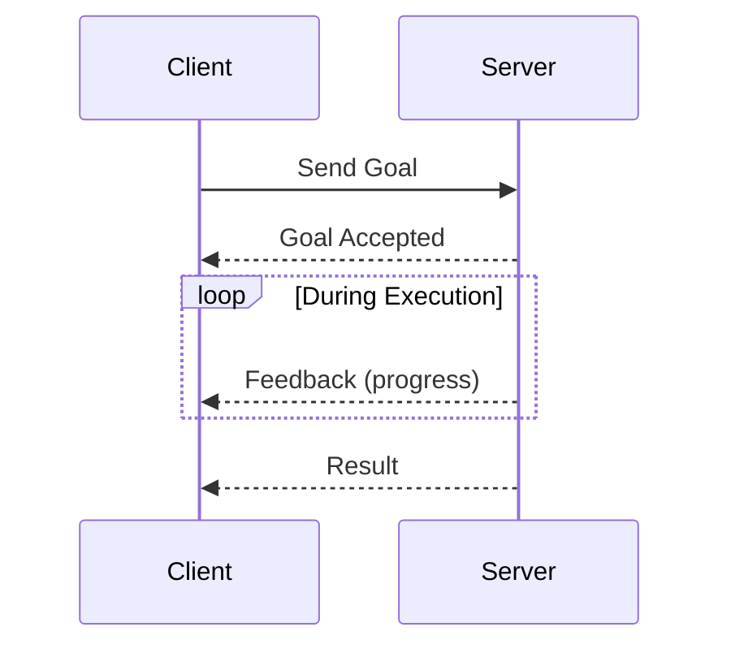
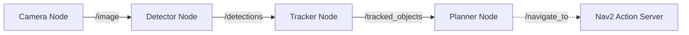

**Estimated Time**: 45 minutes

:::info[What You'll Learn]
- Explain the ROS 2 computational graph model
- Create and run ROS 2 nodes using Python
- Implement publishers and subscribers for topic communication
- Use services for synchronous request-response patterns
- Understand when to use actions for long-running tasks
:::

:::note[Prerequisites]
Before starting this chapter, complete:
- [ROS 2 Jazzy Installation](./installation.md)
:::

ROS 2 organizes robot software as a graph of communicating processes. Understanding these four communication patterns is essential for building any robot system.

## The Computational Graph



## Nodes

A **node** is a single-purpose process that performs one job in the robot system. Each node communicates with others through topics, services, and actions.

### Creating a Node

```python title="my_node.py" showLineNumbers
import rclpy
from rclpy.node import Node

class MyNode(Node):
    def __init__(self):
        super().__init__('my_node')
        # highlight-next-line
        self.get_logger().info('Node started!')

def main(args=None):
    rclpy.init(args=args)
    node = MyNode()
    rclpy.spin(node)
    node.destroy_node()
    rclpy.shutdown()

if __name__ == '__main__':
    main()
```

### Running Nodes

```bash title="Node management commands" showLineNumbers
# Run a node from a package
ros2 run my_package my_node

# List running nodes
ros2 node list

# Get info about a node
ros2 node info /my_node
```

### Node Design Principles

- **Single Responsibility**: One node = one function (camera driver, object detector, planner)
- **Composable**: Nodes can be combined in different configurations
- **Lifecycle**: Nodes can be managed (configure, activate, deactivate, shutdown)

:::tip[Pro Tip]
Use `ros2 node info /node_name` to inspect a running node's publishers, subscribers, services, and actions — this is invaluable for debugging communication issues.
:::

## Topics

**Topics** provide asynchronous, many-to-many publish-subscribe communication. Data flows continuously from publishers to subscribers.

### When to Use Topics

- Continuous data streams (sensor data, robot state)
- One-to-many or many-to-many communication
- Fire-and-forget messages (no response needed)

### Publisher

```python title="minimal_publisher.py" showLineNumbers
from std_msgs.msg import String

class MinimalPublisher(Node):
    def __init__(self):
        super().__init__('minimal_publisher')
        # highlight-next-line
        self.publisher_ = self.create_publisher(String, 'topic', 10)
        timer_period = 0.5  # seconds
        self.timer = self.create_timer(timer_period, self.timer_callback)
        self.i = 0

    def timer_callback(self):
        msg = String()
        msg.data = f'Hello World: {self.i}'
        self.publisher_.publish(msg)
        self.get_logger().info(f'Publishing: "{msg.data}"')
        self.i += 1
```

### Subscriber

```python title="minimal_subscriber.py" showLineNumbers
from std_msgs.msg import String

class MinimalSubscriber(Node):
    def __init__(self):
        super().__init__('minimal_subscriber')
        # highlight-next-line
        self.subscription = self.create_subscription(
            String, 'topic', self.listener_callback, 10)

    def listener_callback(self, msg):
        self.get_logger().info(f'I heard: "{msg.data}"')
```

### Topic Commands

```bash title="Topic inspection commands" showLineNumbers
# List all active topics
ros2 topic list

# Show topic message type
ros2 topic info /camera/image

# Echo messages on a topic
ros2 topic echo /camera/image

# Publish a message from command line
ros2 topic pub /cmd_vel geometry_msgs/msg/Twist \
  "{linear: {x: 0.5, y: 0.0, z: 0.0}, angular: {x: 0.0, y: 0.0, z: 0.1}}"

# Check publish rate
ros2 topic hz /camera/image
```

### Quality of Service (QoS)

QoS profiles control reliability and delivery guarantees:

| Profile | Reliability | Durability | Use Case |
|---------|------------|-----------|----------|
| Sensor Data | Best Effort | Volatile | Camera, LiDAR (high frequency) |
| System Default | Reliable | Volatile | General communication |
| Parameters | Reliable | Transient Local | Configuration values |
| Services | Reliable | Volatile | Request-response |

```python title="qos_configuration.py" showLineNumbers
from rclpy.qos import QoSProfile, ReliabilityPolicy

sensor_qos = QoSProfile(
    depth=10,
    # highlight-next-line
    reliability=ReliabilityPolicy.BEST_EFFORT
)
self.create_subscription(Image, '/camera/image', self.callback, sensor_qos)
```

:::warning[Common Mistake]
Using `RELIABLE` QoS for high-frequency sensor data (cameras, LiDAR) can cause message backlog and latency. Use `BEST_EFFORT` for sensor streams where occasional dropped messages are acceptable.
:::

## Services

**Services** provide synchronous request-response communication. A client sends a request and waits for a response.

### When to Use Services

- One-time requests (trigger a calibration, get a parameter)
- Operations that return a result
- Quick operations (should not block for long)

### Service Server

```python title="minimal_service.py" showLineNumbers
from example_interfaces.srv import AddTwoInts

class MinimalService(Node):
    def __init__(self):
        super().__init__('minimal_service')
        # highlight-next-line
        self.srv = self.create_service(
            AddTwoInts, 'add_two_ints', self.add_callback)

    def add_callback(self, request, response):
        response.sum = request.a + request.b
        self.get_logger().info(f'{request.a} + {request.b} = {response.sum}')
        return response
```

### Service Client

```python title="minimal_client.py" showLineNumbers
from example_interfaces.srv import AddTwoInts

class MinimalClient(Node):
    def __init__(self):
        super().__init__('minimal_client')
        self.cli = self.create_client(AddTwoInts, 'add_two_ints')
        # highlight-next-line
        while not self.cli.wait_for_service(timeout_sec=1.0):
            self.get_logger().info('Waiting for service...')

    def send_request(self, a, b):
        request = AddTwoInts.Request()
        request.a = a
        request.b = b
        future = self.cli.call_async(request)
        return future
```

### Service Commands

```bash title="Service commands" showLineNumbers
# List services
ros2 service list

# Call a service
ros2 service call /add_two_ints example_interfaces/srv/AddTwoInts \
  "{a: 2, b: 3}"
```

## Actions

**Actions** handle long-running tasks with feedback and the ability to cancel. They combine topics (feedback) and services (goal, result).

### When to Use Actions

- Long-running tasks (navigation, arm movement)
- Tasks that need progress feedback
- Tasks that may need to be cancelled

### Action Structure



### Action Server

```python title="fibonacci_action_server.py" showLineNumbers
from example_interfaces.action import Fibonacci
from rclpy.action import ActionServer

class FibonacciActionServer(Node):
    def __init__(self):
        super().__init__('fibonacci_server')
        # highlight-next-line
        self._action_server = ActionServer(
            self, Fibonacci, 'fibonacci',
            self.execute_callback)

    async def execute_callback(self, goal_handle):
        self.get_logger().info('Executing goal...')
        feedback_msg = Fibonacci.Feedback()
        feedback_msg.partial_sequence = [0, 1]

        for i in range(1, goal_handle.request.order):
            feedback_msg.partial_sequence.append(
                feedback_msg.partial_sequence[i]
                + feedback_msg.partial_sequence[i-1])
            # highlight-next-line
            goal_handle.publish_feedback(feedback_msg)

        goal_handle.succeed()
        result = Fibonacci.Result()
        result.sequence = feedback_msg.partial_sequence
        return result
```

### Action Client

```python title="fibonacci_action_client.py" showLineNumbers
from example_interfaces.action import Fibonacci
from rclpy.action import ActionClient

class FibonacciActionClient(Node):
    def __init__(self):
        super().__init__('fibonacci_client')
        self._action_client = ActionClient(
            self, Fibonacci, 'fibonacci')

    def send_goal(self, order):
        goal_msg = Fibonacci.Goal()
        goal_msg.order = order
        self._action_client.wait_for_server()
        # highlight-next-line
        self._send_goal_future = self._action_client.send_goal_async(
            goal_msg, feedback_callback=self.feedback_callback)

    def feedback_callback(self, feedback_msg):
        self.get_logger().info(
            f'Progress: {feedback_msg.feedback.partial_sequence}')
```

## Choosing the Right Pattern

| Pattern | Direction | Blocking | Feedback | Cancel | Use Case |
|---------|-----------|----------|----------|--------|----------|
| **Topic** | Many-to-many | No | No | N/A | Sensor streams, state |
| **Service** | One-to-one | Yes | No | No | Quick requests |
| **Action** | One-to-one | No | Yes | Yes | Long-running tasks |

## Practical Example: Robot Perception Pipeline



1. **Camera Node** publishes images on `/image` topic
2. **Detector Node** subscribes to images, publishes detections
3. **Tracker Node** tracks objects across frames
4. **Planner Node** sends navigation goals via action client

:::tip[Key Takeaways]
- ROS 2 organizes software as a computational graph of communicating nodes
- **Topics** are for continuous, many-to-many data streams (sensors, state)
- **Services** are for quick, one-time request-response operations
- **Actions** are for long-running tasks that need feedback and cancellation
- Choose QoS profiles carefully — `BEST_EFFORT` for sensors, `RELIABLE` for critical commands
- Each node should have a single responsibility for composability and reuse
:::

## Next Steps

Continue your learning journey:
- [Building Packages](./building-packages.md) — learn how to organize your code into reusable ROS 2 packages
- [Python Agents](./python-agents.md) — build intelligent agent nodes that combine these communication patterns
