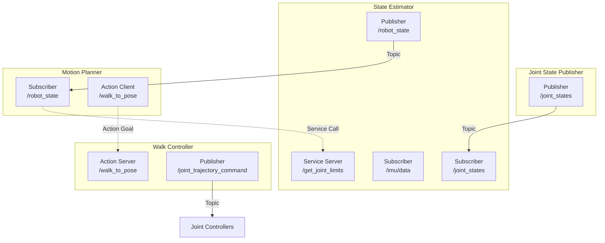
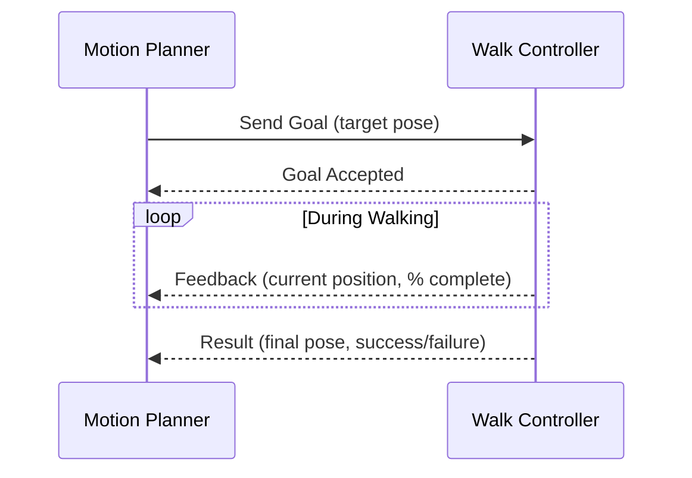
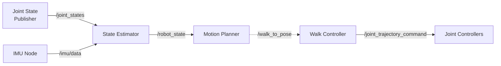

**Estimated Time**: 45 minutes

:::info[What You'll Learn]
- Explain the ROS 2 computational graph model
- Create and run ROS 2 nodes using Python
- Implement publishers and subscribers for topic communication
- Use services for synchronous request-response patterns
- Understand when to use actions for long-running tasks
- Configure Quality of Service (QoS) profiles for reliable communication
:::

:::note[Prerequisites]
Before starting this chapter, complete:
- [ROS 2 Jazzy Installation](./installation.md)
:::

ROS 2 organizes robot software as a graph of communicating processes. Understanding these four communication patterns is essential for building any robot system.

## The Computational Graph



## Nodes

A **node** is a single-purpose process that performs one job in the robot system. Each node communicates with others through topics, services, and actions.

### Creating a Node

```python title="my_node.py" showLineNumbers
import rclpy
from rclpy.node import Node

class MyNode(Node):
    def __init__(self):
        super().__init__('my_node')
        # highlight-next-line
        self.get_logger().info('Node started!')

def main(args=None):
    rclpy.init(args=args)
    node = MyNode()
    rclpy.spin(node)
    node.destroy_node()
    rclpy.shutdown()

if __name__ == '__main__':
    main()
```

### Running Nodes

```bash title="Node management commands" showLineNumbers
# Run a node from a package
ros2 run my_package my_node

# List running nodes
ros2 node list
# Expected: /my_node

# Get info about a node (publishers, subscribers, services)
ros2 node info /my_node
```

### Node Design Principles

- **Single Responsibility**: One node = one function (camera driver, object detector, planner)
- **Composable**: Nodes can be combined in different configurations
- **Lifecycle**: Nodes can be managed (configure, activate, deactivate, shutdown)

:::tip[Pro Tip]
Use `ros2 node info /node_name` to inspect a running node's publishers, subscribers, services, and actions — this is invaluable for debugging communication issues.
:::

## Topics

**Topics** provide asynchronous, many-to-many publish-subscribe communication. Data flows continuously from publishers to subscribers.

### When to Use Topics

- Continuous data streams (joint states, IMU data, camera images)
- One-to-many or many-to-many communication
- Fire-and-forget messages (no response needed)

### Publisher — Humanoid Joint States

```python title="joint_state_publisher.py" showLineNumbers
import rclpy
from rclpy.node import Node
from sensor_msgs.msg import JointState
import math

class HumanoidJointPublisher(Node):
    def __init__(self):
        super().__init__('humanoid_joint_publisher')
        # highlight-next-line
        self.publisher_ = self.create_publisher(JointState, '/joint_states', 10)
        self.timer = self.create_timer(0.02, self.timer_callback)  # 50 Hz
        self.t = 0.0

    def timer_callback(self):
        msg = JointState()
        msg.header.stamp = self.get_clock().now().to_msg()
        msg.name = ['left_hip_pitch', 'left_knee_pitch', 'left_ankle_pitch',
                     'right_hip_pitch', 'right_knee_pitch', 'right_ankle_pitch']
        # Simulate a walking gait with sinusoidal motion
        msg.position = [
            0.3 * math.sin(self.t),        # left hip
            -0.6 * abs(math.sin(self.t)),   # left knee (always negative)
            0.3 * math.sin(self.t + 0.5),   # left ankle
            0.3 * math.sin(self.t + math.pi),  # right hip (opposite phase)
            -0.6 * abs(math.sin(self.t + math.pi)),  # right knee
            0.3 * math.sin(self.t + math.pi + 0.5),  # right ankle
        ]
        msg.velocity = [0.0] * 6
        msg.effort = [0.0] * 6
        self.publisher_.publish(msg)
        self.t += 0.02
```

### Subscriber — Joint State Monitor

```python title="joint_monitor.py" showLineNumbers
from rclpy.node import Node
from sensor_msgs.msg import JointState

class JointMonitor(Node):
    def __init__(self):
        super().__init__('joint_monitor')
        # highlight-next-line
        self.subscription = self.create_subscription(
            JointState, '/joint_states', self.listener_callback, 10)

    def listener_callback(self, msg):
        for name, pos in zip(msg.name, msg.position):
            self.get_logger().info(f'{name}: {pos:.3f} rad')
```

### Topic Introspection Commands

```bash title="Topic inspection commands" showLineNumbers
# List all active topics
ros2 topic list
# Expected: /joint_states, /parameter_events, /rosout, ...

# Show topic message type and publisher/subscriber count
ros2 topic info /joint_states
# Expected: Type: sensor_msgs/msg/JointState, Publisher count: 1, ...

# Echo messages on a topic (live stream)
ros2 topic echo /joint_states

# Publish a Twist command from command line
ros2 topic pub /cmd_vel geometry_msgs/msg/Twist \
  "{linear: {x: 0.5, y: 0.0, z: 0.0}, angular: {x: 0.0, y: 0.0, z: 0.1}}"

# Check publish rate (Hz)
ros2 topic hz /joint_states
# Expected: average rate: 50.000 (for a 50 Hz publisher)
```

## Quality of Service (QoS)

QoS profiles control reliability and delivery guarantees. Choosing the right profile is critical for humanoid robot systems where some data is time-critical (sensors) and other data must be delivered reliably (commands).

### QoS Profile Parameters

| Parameter | Options | Description |
|-----------|---------|-------------|
| **Reliability** | `RELIABLE` / `BEST_EFFORT` | Whether delivery is guaranteed |
| **Durability** | `VOLATILE` / `TRANSIENT_LOCAL` | Whether late-joining subscribers get cached messages |
| **History** | `KEEP_LAST(N)` / `KEEP_ALL` | How many messages to buffer |
| **Depth** | Integer (default 10) | Queue size for `KEEP_LAST` |

### Predefined QoS Profiles

| Profile | Reliability | Durability | Use Case |
|---------|------------|-----------|----------|
| **Sensor Data** | Best Effort | Volatile | IMU at 200 Hz, camera at 30 Hz |
| **System Default** | Reliable | Volatile | General inter-node communication |
| **Parameters** | Reliable | Transient Local | Configuration values (late joiners get latest) |
| **Services** | Reliable | Volatile | Request-response patterns |

### Configuring QoS in Code

```python title="qos_configuration.py" showLineNumbers
from rclpy.qos import QoSProfile, ReliabilityPolicy, DurabilityPolicy

# For high-frequency sensor data (IMU, joint states)
sensor_qos = QoSProfile(
    depth=5,
    # highlight-next-line
    reliability=ReliabilityPolicy.BEST_EFFORT
)
self.create_subscription(JointState, '/joint_states', self.callback, sensor_qos)

# For critical commands that must be delivered
command_qos = QoSProfile(
    depth=10,
    reliability=ReliabilityPolicy.RELIABLE
)
self.create_publisher(JointTrajectory, '/joint_trajectory_command', command_qos)
```

### QoS Compatibility Rules

When a publisher and subscriber use different QoS settings, they must be **compatible** to communicate. If incompatible, **no error is raised** — messages are silently dropped.

| Publisher | Subscriber | Compatible? | Result |
|-----------|-----------|-------------|--------|
| Reliable | Reliable | Yes | All messages delivered |
| Best Effort | Best Effort | Yes | Messages may be dropped |
| Reliable | Best Effort | Yes | Messages may be dropped |
| **Best Effort** | **Reliable** | **No** | **No data received** |

:::warning[Silent QoS Mismatch]
If a **Best Effort** publisher connects to a **Reliable** subscriber, the subscriber receives **no data at all** — and ROS 2 does not raise an error. This is the most common cause of "my subscriber isn't getting any messages" bugs. Use `ros2 topic info -v /topic_name` to check QoS settings on both sides.
:::

## Services

**Services** provide synchronous request-response communication. A client sends a request and waits for a response.

### When to Use Services

- One-time requests (get joint limits, trigger a calibration)
- Operations that return a result
- Quick operations (should not block for long)

### Service Server

```python title="joint_limit_service.py" showLineNumbers
from example_interfaces.srv import AddTwoInts

class JointLimitService(Node):
    def __init__(self):
        super().__init__('joint_limit_service')
        # highlight-next-line
        self.srv = self.create_service(
            AddTwoInts, 'get_joint_limit', self.limit_callback)

    def limit_callback(self, request, response):
        # In a real system, look up joint limits from URDF
        response.sum = request.a + request.b
        self.get_logger().info(f'Joint limit query: {request.a} + {request.b} = {response.sum}')
        return response
```

### Async Service Client

```python title="joint_limit_client.py" showLineNumbers
from example_interfaces.srv import AddTwoInts

class JointLimitClient(Node):
    def __init__(self):
        super().__init__('joint_limit_client')
        self.cli = self.create_client(AddTwoInts, 'get_joint_limit')
        # highlight-next-line
        while not self.cli.wait_for_service(timeout_sec=1.0):
            self.get_logger().info('Waiting for service...')

    def send_request(self, a, b):
        request = AddTwoInts.Request()
        request.a = a
        request.b = b
        future = self.cli.call_async(request)
        return future
```

### Service Commands

```bash title="Service inspection commands" showLineNumbers
# List all services
ros2 service list
# Expected: /get_joint_limit, /node_name/describe_parameters, ...

# Get service type
ros2 service type /get_joint_limit
# Expected: example_interfaces/srv/AddTwoInts

# Call a service from command line
ros2 service call /get_joint_limit example_interfaces/srv/AddTwoInts \
  "{a: 2, b: 3}"
# Expected: sum: 5
```

## Actions

**Actions** handle long-running tasks with feedback and the ability to cancel. They combine topics (feedback) and services (goal, result).

### When to Use Actions

- Long-running tasks (walking to a position, executing a motion plan)
- Tasks that need progress feedback (% complete, current joint positions)
- Tasks that may need to be cancelled (stop walking, abort motion)

### Action Structure



### Action Server

```python title="walk_action_server.py" showLineNumbers
from example_interfaces.action import Fibonacci
from rclpy.action import ActionServer

class WalkActionServer(Node):
    def __init__(self):
        super().__init__('walk_server')
        # highlight-next-line
        self._action_server = ActionServer(
            self, Fibonacci, 'walk_to_pose',
            self.execute_callback)

    async def execute_callback(self, goal_handle):
        self.get_logger().info('Walking to target pose...')
        feedback_msg = Fibonacci.Feedback()
        feedback_msg.partial_sequence = [0, 1]

        for i in range(1, goal_handle.request.order):
            feedback_msg.partial_sequence.append(
                feedback_msg.partial_sequence[i]
                + feedback_msg.partial_sequence[i-1])
            # highlight-next-line
            goal_handle.publish_feedback(feedback_msg)

        goal_handle.succeed()
        result = Fibonacci.Result()
        result.sequence = feedback_msg.partial_sequence
        return result
```

### Action Client

```python title="walk_action_client.py" showLineNumbers
from example_interfaces.action import Fibonacci
from rclpy.action import ActionClient

class WalkActionClient(Node):
    def __init__(self):
        super().__init__('walk_client')
        self._action_client = ActionClient(
            self, Fibonacci, 'walk_to_pose')

    def send_goal(self, order):
        goal_msg = Fibonacci.Goal()
        goal_msg.order = order
        self._action_client.wait_for_server()
        # highlight-next-line
        self._send_goal_future = self._action_client.send_goal_async(
            goal_msg, feedback_callback=self.feedback_callback)

    def feedback_callback(self, feedback_msg):
        self.get_logger().info(
            f'Walk progress: {feedback_msg.feedback.partial_sequence}')
```

## Choosing the Right Pattern

| Pattern | Direction | Blocking | Feedback | Cancel | Humanoid Robot Example |
|---------|-----------|----------|----------|--------|----------------------|
| **Topic** | Many-to-many | No | No | N/A | Streaming joint states at 50 Hz |
| **Service** | One-to-one | Yes | No | No | Requesting joint limit values |
| **Action** | One-to-one | No | Yes | Yes | Walking to a target pose |

### Humanoid Robot Communication Map

| Data Flow | Pattern | Message Type | Frequency |
|-----------|---------|-------------|-----------|
| Joint positions → State estimator | Topic | `sensor_msgs/JointState` | 50–200 Hz |
| IMU data → Balance controller | Topic | `sensor_msgs/Imu` | 100–400 Hz |
| Foot force sensors → Gait controller | Topic | `geometry_msgs/WrenchStamped` | 100 Hz |
| Walk command → Walk controller | Action | Custom `WalkToPose.action` | On demand |
| Calibration request → Joint driver | Service | Custom `CalibrateJoint.srv` | On demand |
| Velocity command → Base controller | Topic | `geometry_msgs/Twist` | 10–50 Hz |
| Trajectory command → Joint controller | Topic | `trajectory_msgs/JointTrajectory` | On demand |

## Practical Example: Humanoid Perception Pipeline



1. **Joint State Publisher** publishes joint positions on `/joint_states` topic
2. **IMU Node** publishes orientation data on `/imu/data` topic
3. **State Estimator** fuses both inputs and publishes `/robot_state`
4. **Motion Planner** sends walk goals via `/walk_to_pose` action
5. **Walk Controller** publishes trajectory commands to joint controllers

## Common Mistakes

:::warning[Mistake 1: Service Deadlock in Single-Threaded Executor]
Calling a service from within a callback while using `SingleThreadedExecutor` causes **permanent deadlock**. The callback waits for the service response, but the executor cannot process the response because it is blocked by the callback.

**Fix**: Use `MultiThreadedExecutor` with separate `MutuallyExclusiveCallbackGroup` instances for the service client and the callback that calls it. See [Python Agents — Executors](./python-agents.md) for details.
:::

:::warning[Mistake 2: QoS Mismatch — Silent Data Loss]
A `RELIABLE` subscriber connected to a `BEST_EFFORT` publisher receives **zero messages** with **no error**. Use `ros2 topic info -v /topic_name` to check QoS compatibility when debugging missing data.
:::

:::warning[Mistake 3: Forgetting to Source After Build]
After `colcon build`, you must run `source install/setup.bash` before `ros2 run` can find your packages. Without this, you get "Package not found" errors.
:::

:::warning[Mistake 4: Unhandled Exceptions in Callbacks]
An exception that propagates out of a callback crashes the **entire node** — not just that callback. Always wrap callback logic in `try/except` and log the error instead.

```python title="Safe callback pattern"
def callback(self, msg):
    try:
        self.process(msg)
    except Exception as e:
        self.get_logger().error(f'Processing failed: {e}')
```
:::

:::warning[Mistake 5: `use_sim_time` Mismatch]
When some nodes use simulation time (`use_sim_time: true`) and others use wall time, TF2 `lookupTransform` calls fail with **extrapolation errors**. Ensure all nodes in a system use the same time source. Set `use_sim_time: true` for all nodes when running in Gazebo.
:::

:::tip[Key Takeaways]
- ROS 2 organizes software as a computational graph of communicating nodes
- **Topics** are for continuous, many-to-many data streams (joint states, IMU, camera)
- **Services** are for quick, one-time request-response operations (joint limits, calibration)
- **Actions** are for long-running tasks with feedback and cancellation (walking, motion planning)
- Choose QoS profiles carefully — `BEST_EFFORT` for high-frequency sensors, `RELIABLE` for critical commands
- A `RELIABLE` subscriber + `BEST_EFFORT` publisher = **silent data loss** (no error raised)
- Each node should have a single responsibility for composability and reuse
:::

## Next Steps

Continue your learning journey:
- [Building Packages](./building-packages.md) — learn how to organize your code into reusable ROS 2 packages
- [Python Agents](./python-agents.md) — build intelligent agent nodes that combine these communication patterns
