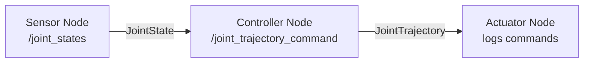

**Estimated Time**: 90 minutes

:::info[What You'll Learn]
- Apply ROS 2 concepts through practical exercises
- Build working humanoid robot nodes from specifications
- Debug common ROS 2 communication issues
- Create and visualize a custom robot model with URDF
:::

:::note[Prerequisites]
Before starting these exercises, complete all Module 1 chapters:
- [Installation](./installation.md)
- [Core Concepts](./core-concepts.md)
- [Building Packages](./building-packages.md)
- [Python Agents](./python-agents.md)
- [URDF Basics](./urdf-basics.md)
:::

These exercises reinforce the concepts from Module 1. Complete them in order, as each builds on the previous. Exercises progress from guided (step-by-step) to independent (specification-only).

## Exercise 1: Environment Verification

**Estimated Time**: 10 minutes | **Difficulty**: Guided

**Objective**: Confirm your ROS 2 installation and workspace are working correctly.

### Tasks

1. Verify the ROS 2 environment:

```bash title="Verify ROS 2 environment" showLineNumbers
# Check ROS 2 version
ros2 --version
# Expected: ros2 0.x.x

# Verify environment variables
printenv | grep -i ROS
# Expected: ROS_DISTRO=jazzy, ROS_VERSION=2

# Check system health
ros2 doctor --report
# Expected: no errors

# Verify topics are available
ros2 topic list
# Expected: /parameter_events, /rosout

# Check installed packages
ros2 pkg list | grep -c ros
# Expected: 200+ packages
```

2. Run the demo talker/listener:

```bash title="Run demo nodes"
# Terminal 1
ros2 run demo_nodes_cpp talker

# Terminal 2
ros2 run demo_nodes_py listener
```

3. Verify messages flow between the two nodes.

### Verification Checklist

- [ ] `ros2 --version` outputs a version number
- [ ] `ROS_DISTRO` is set to `jazzy`
- [ ] `ros2 doctor --report` shows no errors
- [ ] Talker publishes "Hello World" messages
- [ ] Listener receives and prints messages
- [ ] `ros2 pkg list | grep -c ros` returns 200+

---

## Exercise 2: Humanoid Joint Publisher-Subscriber

**Estimated Time**: 15 minutes | **Difficulty**: Guided

**Objective**: Create a joint state simulator and monitor for a humanoid robot leg.

### Specification

- **Publisher node** (`joint_simulator`): Publishes `sensor_msgs/JointState` on `/joint_states` at 10 Hz with simulated walking gait data for 6 leg joints
- **Subscriber node** (`joint_monitor`): Subscribes to `/joint_states` and logs warnings if any joint exceeds its position limit (±1.57 radians)

### Starter Code

```python title="joint_simulator.py" showLineNumbers
import rclpy
from rclpy.node import Node
from sensor_msgs.msg import JointState
import math

class JointSimulator(Node):
    def __init__(self):
        super().__init__('joint_simulator')
        # TODO: Create a publisher for JointState on '/joint_states'
        # highlight-next-line
        # TODO: Create a timer that fires at 10 Hz
        self.t = 0.0

    def timer_callback(self):
        msg = JointState()
        msg.header.stamp = self.get_clock().now().to_msg()
        # TODO: Set joint names for 6 leg joints:
        #   left_hip_pitch, left_knee_pitch, left_ankle_pitch,
        #   right_hip_pitch, right_knee_pitch, right_ankle_pitch
        # TODO: Set positions using sinusoidal motion (simulate walking)
        # TODO: Publish the message
        # TODO: Log the published joint positions
        self.t += 0.1

def main(args=None):
    rclpy.init(args=args)
    node = JointSimulator()
    rclpy.spin(node)
    node.destroy_node()
    rclpy.shutdown()
```

```python title="joint_monitor.py" showLineNumbers
import rclpy
from rclpy.node import Node
from sensor_msgs.msg import JointState

JOINT_LIMIT = 1.57  # radians (~90 degrees)

class JointMonitor(Node):
    def __init__(self):
        super().__init__('joint_monitor')
        # highlight-next-line
        # TODO: Create a subscriber for JointState on '/joint_states'
        pass

    def joint_callback(self, msg):
        # TODO: For each joint, log the position
        # TODO: If any joint exceeds ±JOINT_LIMIT, log a warning
        pass
```

### Expected Output

```text title="Expected output"
[joint_simulator] Publishing: left_hip_pitch=0.300, left_knee_pitch=-0.540, ...
[joint_monitor] left_hip_pitch: 0.300 rad
[joint_monitor] left_knee_pitch: -0.540 rad
[joint_monitor] WARNING: right_hip_pitch at 1.62 rad exceeds limit!
```

### Verification Checklist

- [ ] Publisher runs without errors and publishes at 10 Hz
- [ ] Subscriber receives and displays joint positions
- [ ] Warning appears when any joint exceeds ±1.57 radians
- [ ] `ros2 topic echo /joint_states` shows JointState messages
- [ ] `ros2 topic hz /joint_states` confirms ~10 Hz rate

---

## Exercise 3: Joint Limit Checking Service

**Estimated Time**: 15 minutes | **Difficulty**: Guided

**Objective**: Create a service that checks whether a requested joint position is within safe limits.

### Specification

Create a service server and client:
- **Server** (`joint_limit_checker`): Receives a joint index (request.a) and desired position × 100 (request.b), returns 1 if within limits or 0 if out of limits
- **Client**: Sends check requests for various joint positions

Use `example_interfaces/srv/AddTwoInts` as the service type (request.a = joint index 0–5, request.b = position × 100).

### Joint Limits

```python title="Joint limits reference"
JOINT_LIMITS = {
    0: (-1.57, 1.57),   # hip_pitch
    1: (0.0, 2.60),     # knee_pitch
    2: (-0.80, 0.80),   # ankle_pitch
    3: (-1.57, 1.57),   # hip_pitch (right)
    4: (0.0, 2.60),     # knee_pitch (right)
    5: (-0.80, 0.80),   # ankle_pitch (right)
}
```

### Tasks

1. Create a service server that looks up limits by joint index and checks if the position is in range
2. Create a service client that sends check requests
3. Test with command line: `ros2 service call`

### Verification Checklist

- [ ] Service appears in `ros2 service list`
- [ ] Joint 0 at position 1.0 (request: a=0, b=100) returns 1 (within limits)
- [ ] Joint 0 at position 2.0 (request: a=0, b=200) returns 0 (exceeds limits)
- [ ] Joint 1 at position -0.5 (request: a=1, b=-50) returns 0 (below lower limit)
- [ ] Service handles multiple sequential requests

---

## Exercise 4: Humanoid Joint Control System

**Estimated Time**: 20 minutes | **Difficulty**: Semi-guided

**Objective**: Build a three-node system for humanoid joint sensing, decision-making, and commanding.

### System Architecture



### Specifications

1. **Sensor Node** (`joint_sensor`): Publishes simulated `JointState` at 10 Hz for 6 humanoid leg joints with positions oscillating between -1.0 and 1.0 radians
2. **Controller Node** (`joint_controller`): Subscribes to `/joint_states`, publishes `trajectory_msgs/JointTrajectory` on `/joint_trajectory_command`:
   - If any joint position exceeds 0.8 rad: command it back to 0.0 (return to neutral)
   - If all joints within ±0.8 rad: command a small step forward (increment hip pitch by 0.1)
3. **Actuator Node** (`joint_actuator`): Subscribes to `/joint_trajectory_command` and logs the commanded trajectory points

:::danger[Hardware Safety]
These exercises use simulated data only. Never send trajectory commands to a real robot without proper safety checks, emergency stop capability, and a clear workspace.
:::

### Verification Checklist

- [ ] All three nodes start without errors
- [ ] `ros2 node list` shows all three nodes
- [ ] `ros2 topic list` shows `/joint_states` and `/joint_trajectory_command`
- [ ] Controller responds to joint limit violations
- [ ] Actuator node logs show trajectory commands with joint names and positions

---

## Exercise 5: URDF Robot Model

**Estimated Time**: 20 minutes | **Difficulty**: Semi-guided

**Objective**: Create and visualize a simple mobile robot with sensors using URDF.

### Specification

Build a URDF for a robot with:
- A rectangular base (0.3 × 0.2 × 0.1 m, blue)
- Two cylindrical drive wheels (radius 0.05 m, width 0.02 m, black) with `continuous` joints
- One caster wheel (sphere, radius 0.025 m) with a `fixed` joint
- A camera mounted on top (small box 0.02 × 0.05 × 0.02 m, red) with a `fixed` joint
- Proper `<inertial>` properties on all links

### Skeleton

```xml title="exercise_robot.urdf" showLineNumbers
<?xml version="1.0"?>
<robot name="exercise_robot">
  <!-- TODO: Base link with visual (blue box), collision, and inertial -->

  <!-- TODO: Left wheel link (black cylinder) and continuous joint -->
  <!--   Joint axis: 0 1 0 (rotation around Y) -->
  <!--   Origin: x=0, y=0.12, z=-0.025 -->

  <!-- TODO: Right wheel link and continuous joint -->
  <!--   Origin: x=0, y=-0.12, z=-0.025 -->

  <!-- TODO: Caster link (sphere) and fixed joint -->
  <!--   Origin: x=-0.12, y=0, z=-0.05 -->

  <!-- highlight-next-line -->
  <!-- TODO: Camera link (red box) and fixed joint -->
  <!--   Origin: x=0.12, y=0, z=0.06 -->
</robot>
```

### Tasks

1. Complete the URDF file with all links, joints, and inertial properties
2. Validate with `check_urdf exercise_robot.urdf`
3. Visualize in rviz2 using `robot_state_publisher`
4. Use `joint_state_publisher_gui` to rotate the drive wheels

### Verification Checklist

- [ ] `check_urdf` reports no errors
- [ ] Robot displays correctly in rviz2 with correct colors
- [ ] Both wheel joints are movable via the GUI sliders
- [ ] Camera is attached at the correct position on top of the base
- [ ] `ros2 run tf2_tools view_frames` shows all links connected in a tree

---

## Challenge Exercise: Humanoid Joint Patrol System

**Estimated Time**: 30 minutes | **Difficulty**: Independent

**Objective**: Build a complete ROS 2 system that combines packages, agents, and URDF concepts to create a parameterized joint patrol behavior.

### Requirements

1. Create a package called `humanoid_patrol` with `ros2 pkg create`
2. Create a `patrol_node` that:
   - Declares parameters: `joint_names` (list), `patrol_amplitude` (default 0.5 rad), `patrol_period` (default 4.0 s), `publish_rate` (default 10.0 Hz)
   - Publishes `trajectory_msgs/JointTrajectory` on `/joint_trajectory_controller/joint_trajectory`
   - Cycles through a sinusoidal motion pattern: joints move from 0 → +amplitude → 0 → -amplitude → 0
   - Logs the current phase (extending, neutral, flexing)
3. Create a `config/patrol_params.yaml` parameter file:

```yaml title="config/patrol_params.yaml"
patrol_node:
  ros__parameters:
    joint_names:
      - left_hip_pitch
      - left_knee_pitch
      - right_hip_pitch
      - right_knee_pitch
    patrol_amplitude: 0.5
    patrol_period: 4.0
    publish_rate: 10.0
```

4. Create a launch file `launch/patrol.launch.py` that starts the patrol node with the YAML parameters
5. Include the YAML and launch file in `setup.py` `data_files` using glob patterns

### Expected Behavior

```text title="Expected output"
[patrol_node] Starting patrol: 4 joints, amplitude=0.5, period=4.0s
[patrol_node] Phase: EXTENDING — left_hip_pitch=0.35, left_knee_pitch=0.35, ...
[patrol_node] Phase: NEUTRAL — all joints at 0.00
[patrol_node] Phase: FLEXING — left_hip_pitch=-0.35, left_knee_pitch=-0.35, ...
[patrol_node] Phase: NEUTRAL — all joints at 0.00
```

### Verification Checklist

- [ ] Package builds with `colcon build` without errors
- [ ] Node reads parameters from YAML file correctly
- [ ] `ros2 param list /patrol_node` shows all 4 parameters
- [ ] Parameters can be changed at runtime with `ros2 param set`
- [ ] Launch file starts the node with the correct parameters
- [ ] Joint trajectories publish on the expected topic
- [ ] `ros2 topic echo /joint_trajectory_controller/joint_trajectory` shows trajectory messages

---

## Summary

After completing these exercises, you should be comfortable with:

| Skill | Exercises | Chapter Reference |
|-------|-----------|-------------------|
| Environment verification | 1 | [Installation](./installation.md) |
| Topic pub/sub (JointState) | 2, 4 | [Core Concepts](./core-concepts.md) |
| Services | 3 | [Core Concepts](./core-concepts.md) |
| Multi-node systems | 4 | [Python Agents](./python-agents.md) |
| URDF modeling | 5 | [URDF Basics](./urdf-basics.md) |
| Parameters & launch files | Challenge | [Building Packages](./building-packages.md) |
| JointTrajectory publishing | Challenge | [Python Agents](./python-agents.md) |

:::tip[Key Takeaways]
- Verify your environment first (`ros2 doctor`, `ros2 topic list`) before building nodes
- Use `sensor_msgs/JointState` for reading joint positions and `trajectory_msgs/JointTrajectory` for commanding motion
- Build incrementally — test each node independently before connecting them
- Use `ros2 topic echo`, `ros2 node list`, `ros2 service list`, and `ros2 topic hz` for debugging
- Always include verification checklists when building ROS 2 systems to confirm correct operation
:::

## Next Steps

- [Module 2: Digital Twin](../module-2/index.md) — simulate your robot in Gazebo and learn about physics simulation
