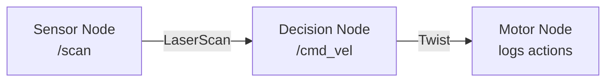

# Module 1 Exercises: ROS 2 Practice

These exercises reinforce the concepts from Module 1. Complete them in order, as each builds on the previous.

## Exercise 1: Environment Verification

**Objective**: Confirm your ROS 2 installation is working correctly.

### Tasks

1. Open a terminal and verify ROS 2 is installed:

```bash
# Check ROS 2 version
ros2 --version

# Verify environment
printenv | grep -i ROS

# Expected: ROS_DISTRO=jazzy, ROS_VERSION=2
```

2. Run the demo talker/listener:

```bash
# Terminal 1
ros2 run demo_nodes_cpp talker

# Terminal 2
ros2 run demo_nodes_cpp listener
```

3. Verify you see messages flowing between the two nodes.

### Verification Checklist

- [ ] `ros2 --version` outputs a version number
- [ ] `ROS_DISTRO` is set to `jazzy`
- [ ] Talker publishes "Hello World" messages
- [ ] Listener receives and prints messages

---

## Exercise 2: Custom Publisher-Subscriber

**Objective**: Create a temperature sensor simulator and monitor.

### Specification

- **Publisher node** (`temp_sensor`): Publishes random temperature readings (18.0-26.0°C) on `/temperature` at 2 Hz
- **Subscriber node** (`temp_monitor`): Subscribes to `/temperature` and logs warnings if temperature exceeds 24.0°C

### Starter Code

```python
# temp_sensor.py
import rclpy
from rclpy.node import Node
from std_msgs.msg import Float64
import random

class TempSensor(Node):
    def __init__(self):
        super().__init__('temp_sensor')
        # TODO: Create a publisher for Float64 on '/temperature'
        # TODO: Create a timer that fires at 2 Hz
        pass

    def timer_callback(self):
        # TODO: Generate random temp between 18.0 and 26.0
        # TODO: Publish the temperature
        # TODO: Log the published value
        pass

def main(args=None):
    rclpy.init(args=args)
    node = TempSensor()
    rclpy.spin(node)
    node.destroy_node()
    rclpy.shutdown()
```

```python
# temp_monitor.py
import rclpy
from rclpy.node import Node
from std_msgs.msg import Float64

class TempMonitor(Node):
    def __init__(self):
        super().__init__('temp_monitor')
        # TODO: Create a subscriber for Float64 on '/temperature'
        pass

    def temp_callback(self, msg):
        # TODO: Log the temperature
        # TODO: If temp > 24.0, log a warning
        pass
```

### Expected Output

```
[temp_sensor] Publishing temperature: 21.3°C
[temp_sensor] Publishing temperature: 23.7°C
[temp_sensor] Publishing temperature: 24.8°C
[temp_monitor] Temperature: 24.8°C - WARNING: Above threshold!
```

### Verification Checklist

- [ ] Publisher runs without errors
- [ ] Subscriber receives messages
- [ ] Warning appears when temperature exceeds 24.0°C
- [ ] `ros2 topic echo /temperature` shows Float64 messages

---

## Exercise 3: Service Implementation

**Objective**: Create a service that converts between Celsius and Fahrenheit.

### Specification

Create a custom service with:
- **Request**: `float64 temperature`, `string from_unit` ("C" or "F")
- **Response**: `float64 converted`, `string to_unit`

For simplicity, use `example_interfaces/srv/AddTwoInts` as a stand-in (request.a = temperature × 100, request.b = 0 for C→F or 1 for F→C).

### Tasks

1. Create a service server that performs the conversion
2. Create a service client that sends conversion requests
3. Test with command line: `ros2 service call`

### Conversion Formulas

```python
# Celsius to Fahrenheit
fahrenheit = celsius * 9.0 / 5.0 + 32.0

# Fahrenheit to Celsius
celsius = (fahrenheit - 32.0) * 5.0 / 9.0
```

### Verification Checklist

- [ ] Service appears in `ros2 service list`
- [ ] C→F conversion: 100°C = 212°F
- [ ] F→C conversion: 32°F = 0°C
- [ ] Service handles multiple requests

---

## Exercise 4: Multi-Node System

**Objective**: Build a simple robot behavior system with three communicating nodes.

### System Architecture



### Specifications

1. **Sensor Node**: Publishes simulated `LaserScan` data at 10 Hz with random ranges (0.2-5.0m)
2. **Decision Node**: Subscribes to `/scan`, publishes `Twist` on `/cmd_vel`:
   - If minimum range < 0.5m → stop (linear.x = 0)
   - If minimum range < 1.0m → slow (linear.x = 0.1)
   - Otherwise → full speed (linear.x = 0.5)
3. **Motor Node**: Subscribes to `/cmd_vel` and logs the commanded velocity

### Verification Checklist

- [ ] All three nodes start without errors
- [ ] `ros2 node list` shows all three nodes
- [ ] `ros2 topic list` shows `/scan` and `/cmd_vel`
- [ ] Motor node logs show varying speeds based on obstacle distance

---

## Exercise 5: URDF Robot Model

**Objective**: Create and visualize a simple mobile robot with a sensor.

### Specification

Build a URDF for a robot with:
- A rectangular base (0.3 × 0.2 × 0.1 m, blue)
- Two cylindrical wheels (radius 0.05m, width 0.02m, black)
- One caster wheel (sphere, radius 0.025m)
- A camera mounted on top (small box, red)

### Skeleton

```xml
<?xml version="1.0"?>
<robot name="exercise_robot">
  <!-- TODO: Base link with visual, collision, and inertial -->

  <!-- TODO: Left wheel link and continuous joint -->

  <!-- TODO: Right wheel link and continuous joint -->

  <!-- TODO: Caster wheel link and fixed joint -->

  <!-- TODO: Camera link and fixed joint -->
</robot>
```

### Tasks

1. Complete the URDF file
2. Validate with `check_urdf exercise_robot.urdf`
3. Visualize in rviz2 using `robot_state_publisher`
4. Use `joint_state_publisher_gui` to move the wheels

### Verification Checklist

- [ ] `check_urdf` reports no errors
- [ ] Robot displays correctly in rviz2
- [ ] Both wheel joints are movable
- [ ] Camera is attached to the base
- [ ] TF tree shows all links connected

---

## Challenge Exercise: Parameterized Patrol Robot

**Objective**: Build a complete patrol robot system using parameters and launch files.

### Requirements

1. Create a package called `patrol_robot`
2. Implement a `patrol_node` that:
   - Takes parameters: `patrol_speed` (default 0.3), `turn_duration` (default 2.0s), `patrol_duration` (default 5.0s)
   - Moves forward for `patrol_duration`, turns for `turn_duration`, repeats
   - Publishes `Twist` messages on `/cmd_vel`
3. Create a parameter file `config/patrol_params.yaml`
4. Create a launch file that starts the node with parameters

### Expected Behavior

```
[patrol_node] Starting patrol: speed=0.3, turn_time=2.0s
[patrol_node] Moving forward...
[patrol_node] Turning...
[patrol_node] Moving forward...
```

### Verification Checklist

- [ ] Package builds with `colcon build`
- [ ] Node reads parameters from YAML file
- [ ] Parameters can be changed at runtime with `ros2 param set`
- [ ] Launch file starts the node correctly

---

## Summary

After completing these exercises, you should be comfortable with:

| Skill | Exercises |
|-------|-----------|
| Node creation | 2, 3, 4 |
| Topic pub/sub | 2, 4 |
| Services | 3 |
| Parameters | Challenge |
| Launch files | Challenge |
| URDF modeling | 5 |

## Next Steps

With Module 1 complete, continue to [Module 2: Digital Twin](/docs/module-2/) to learn how to simulate your robot in Gazebo.
