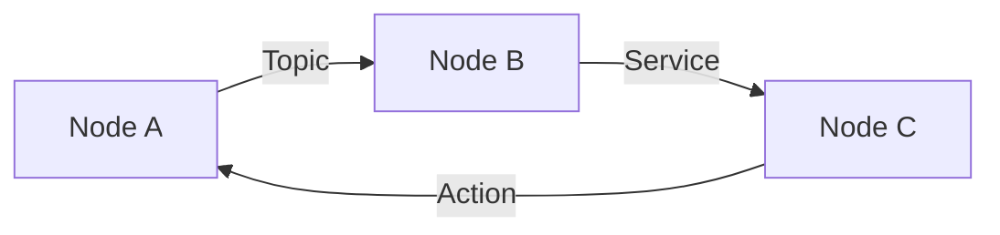

**Estimated Time**: 6 hours

:::info[What You'll Learn]
- Install and configure ROS 2 Jazzy on Ubuntu 24.04
- Understand the ROS 2 computational graph model
- Create Python-based ROS 2 packages with nodes and launch files
- Work with URDF robot descriptions and visualization
:::

:::note[Prerequisites]
No prerequisites — you can start here.
:::

**Weeks 3-5** | This module covers the foundational robot middleware that all subsequent modules build upon.

## Module Structure

| Chapter | Topic | Time |
|---------|-------|------|
| 1.1 | [Installation](./installation.md) | 60 min |
| 1.2 | [Core Concepts](./core-concepts.md) | 45 min |
| 1.3 | [Building Packages](./building-packages.md) | 40 min |
| 1.4 | [Python Agents](./python-agents.md) | 50 min |
| 1.5 | [URDF Basics](./urdf-basics.md) | 45 min |
| 1.6 | [Exercises](./exercises.md) | 90 min |

## Key Concepts

:::tip[Key Takeaways]
- ROS 2 is the standard middleware for modern robot development
- Nodes communicate via topics (streaming), services (request/response), and actions (long-running tasks)
- Python packages use the ament build system with colcon
- URDF describes robot structure for simulation and visualization
:::

## Next Steps

Begin with [Installation](./installation.md) to set up your ROS 2 environment.
