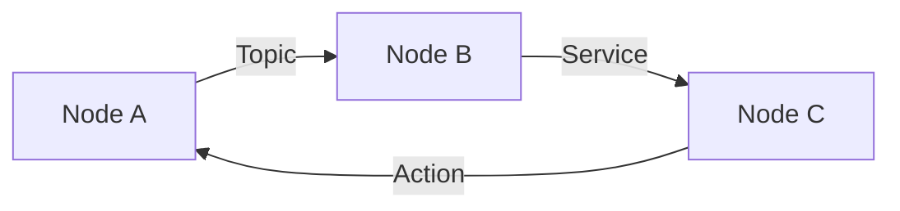

# Module 1: ROS 2 Jazzy Fundamentals

**Weeks 3-5** | Prerequisites: Introduction complete

## Learning Objectives

By the end of this module, you will be able to:

- Install and configure ROS 2 Jazzy on Ubuntu 24.04
- Understand the ROS 2 computational graph model
- Create Python-based ROS 2 packages
- Work with URDF robot descriptions
- Build and test ROS 2 nodes

## Module Structure

| Chapter | Topic | Time |
|---------|-------|------|
| 1.1 | Installation | 60 min |
| 1.2 | Core Concepts | 45 min |
| 1.3 | Building Packages | 90 min |
| 1.4 | Python Agents | 60 min |
| 1.5 | URDF Basics | 45 min |
| 1.6 | Exercises | 120 min |

## Key Concepts

Begin with [Installation](./installation) to set up your ROS 2 environment.
