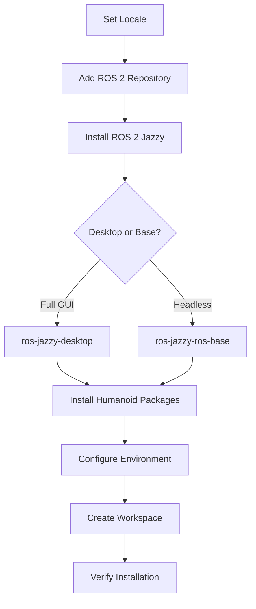

**Estimated Time**: 60 minutes

:::info[What You'll Learn]
- Install ROS 2 Jazzy from binary packages on Ubuntu 24.04
- Configure your development environment for ROS 2
- Verify the installation works correctly with demo nodes
- Install humanoid-robotics-specific packages for robot control and visualization
:::

:::note[Prerequisites]
No prerequisites — you can start here.
:::

This chapter guides you through installing ROS 2 Jazzy Jalisco on Ubuntu 24.04 LTS and setting up a complete development environment for humanoid robotics.



## System Requirements

| Resource | Minimum | Recommended |
|----------|---------|-------------|
| **OS** | Ubuntu 24.04 LTS (Noble Numbat) | Ubuntu 24.04 LTS |
| **RAM** | 4 GB | 8 GB or more |
| **Disk** | 20 GB free | 30 GB free |
| **CPU** | Dual-core x86_64 | Quad-core or better |
| **Network** | Internet connection | Broadband for package downloads |

You also need `sudo` (administrator) access to install system packages.

:::note[Not on Ubuntu 24.04?]
See the [Docker Alternative](#docker-alternative) section below if you are on macOS, Windows, or a different Linux distribution.
:::

## Installation Steps

### Step 1: Set Locale

ROS 2 requires a UTF-8 locale. Verify and configure it:

```bash title="Set UTF-8 locale" showLineNumbers
locale  # check for UTF-8

sudo apt update && sudo apt install locales
sudo locale-gen en_US en_US.UTF-8
sudo update-locale LC_ALL=en_US.UTF-8 LANG=en_US.UTF-8
# highlight-next-line
export LANG=en_US.UTF-8
```

Verify the locale is set correctly:

```bash title="Verify locale"
locale
# Expected: LANG=en_US.UTF-8
```

### Step 2: Setup Sources

Add the ROS 2 apt repository using the `ros2-apt-source` package — the current official method:

```bash title="Add ROS 2 repository using ros2-apt-source" showLineNumbers
# Install prerequisites
sudo apt update && sudo apt install -y software-properties-common curl

# Enable the Ubuntu Universe repository
sudo add-apt-repository universe

# Download and install the ros2-apt-source package
# highlight-next-line
sudo curl -sSL https://packages.ros.org/ros2-apt-source/ros2-apt-source_1-1_all.deb -o /tmp/ros2-apt-source.deb
sudo apt install /tmp/ros2-apt-source.deb

# Update the package index
sudo apt update
```

:::warning[Legacy Method Deprecated]
Older tutorials show manually downloading GPG keys and adding repository lines. The `ros2-apt-source` package handles all of this automatically and is the officially recommended method for Jazzy.
:::

### Step 3: Install ROS 2 Packages

```bash title="Install ROS 2 Jazzy" showLineNumbers
sudo apt update
sudo apt upgrade -y

# Desktop Install (Recommended) — includes RViz, demos, and tutorials
# highlight-next-line
sudo apt install -y ros-jazzy-desktop

# Development tools (colcon, rosdep, vcstool, etc.)
sudo apt install -y ros-dev-tools
```

#### Desktop vs Base Installation

| Package | Includes | When to Use |
|---------|----------|-------------|
| `ros-jazzy-desktop` | Core + RViz + demos + tutorials | **Recommended** for this course — you need RViz for URDF visualization |
| `ros-jazzy-ros-base` | Core libraries only (no GUI) | Headless servers, Docker containers, CI/CD pipelines |

### Step 4: Environment Setup

```bash title="Configure shell environment" showLineNumbers
# Add ROS 2 setup to your shell startup script
echo "source /opt/ros/jazzy/setup.bash" >> ~/.bashrc

# Source it now for the current terminal
# highlight-next-line
source ~/.bashrc
```

:::warning[Common Mistake]
Forgetting to source the ROS 2 setup script in each new terminal. Adding it to `~/.bashrc` ensures it loads automatically. If commands like `ros2` are "not found," this is almost always the issue.
:::

## Verification

Run these commands to verify your installation:

```bash title="Verify ROS 2 installation" showLineNumbers
# Check ROS 2 version and distribution
ros2 --version
# Expected output: ros2 0.x.x (version number)

# Verify environment variables
printenv | grep -i ROS
# Expected: ROS_DISTRO=jazzy, ROS_VERSION=2

# Run the system report
# highlight-next-line
ros2 doctor --report
# Should show no errors

# Verify topics are available
ros2 topic list
# Expected: /parameter_events, /rosout
```

Test inter-node communication:

```bash title="Run demo talker/listener" showLineNumbers
# Terminal 1: Start the talker
ros2 run demo_nodes_cpp talker

# Terminal 2: Start the listener
ros2 run demo_nodes_py listener
```

You should see the talker publishing `Hello World: N` messages and the listener receiving them.

## Humanoid Robotics Packages

Install packages needed for humanoid robot development throughout this course:

```bash title="Install humanoid robotics packages" showLineNumbers
sudo apt install -y \
  ros-jazzy-ros2-control \
  ros-jazzy-ros2-controllers \
  ros-jazzy-joint-state-publisher-gui \
  ros-jazzy-robot-state-publisher \
  ros-jazzy-xacro \
  ros-jazzy-moveit
```

| Package | Purpose |
|---------|---------|
| `ros2_control` | Hardware abstraction for joint control (Chapter 1.5) |
| `ros2_controllers` | Standard controllers: joint trajectory, velocity, effort |
| `joint_state_publisher_gui` | GUI for testing URDF joint movement (Chapter 1.5) |
| `robot_state_publisher` | Publishes TF transforms from URDF + joint states |
| `xacro` | XML macro preprocessor for URDF files (Chapter 1.5) |
| `moveit` | Motion planning framework (used in later modules) |

Verify the packages are installed:

```bash title="Verify humanoid packages"
ros2 pkg list | grep -c ros
# Expected: 200+ packages
```

## Workspace Creation

Create a ROS 2 workspace for your course projects:

```bash title="Create ROS 2 workspace" showLineNumbers
# Create workspace directory structure
mkdir -p ~/ros2_ws/src
cd ~/ros2_ws

# Initialize rosdep (only needed once)
# highlight-next-line
sudo rosdep init
rosdep update

# Build the empty workspace to verify colcon works
colcon build
source install/setup.bash

# Add workspace overlay to your shell
echo "source ~/ros2_ws/install/setup.bash" >> ~/.bashrc
source ~/.bashrc
```

:::tip[Workspace Overlay]
When you source both `/opt/ros/jazzy/setup.bash` and `~/ros2_ws/install/setup.bash`, your workspace packages **overlay** (take priority over) system packages. This lets you develop and test your own versions of packages without modifying system installations.
:::

## Docker Alternative

If you are not on Ubuntu 24.04 (macOS, Windows, or a different Linux distribution), use Docker to run ROS 2 Jazzy:

```bash title="Run ROS 2 Jazzy in Docker" showLineNumbers
# Pull the official ROS 2 Jazzy desktop image
docker pull osrf/ros:jazzy-desktop

# Run with GUI support (Linux host with X11)
# highlight-next-line
docker run -it \
  --env DISPLAY=$DISPLAY \
  --volume /tmp/.X11-unix:/tmp/.X11-unix \
  --name ros2_jazzy \
  osrf/ros:jazzy-desktop \
  bash

# Inside the container, verify:
ros2 --version
```

:::note[Windows/macOS Users]
For Windows, use WSL2 with Ubuntu 24.04 — this provides a native Linux environment without Docker overhead. For macOS, Docker Desktop with the command above works but GUI applications (RViz) require X11 forwarding via XQuartz.
:::

## Troubleshooting

### 1. Command Not Found: `ros2`

The most common issue. The ROS 2 environment is not sourced:

```bash title="Fix: Source ROS 2 setup"
source /opt/ros/jazzy/setup.bash
# Verify:
which ros2
# Expected: /opt/ros/jazzy/bin/ros2
```

Add to `~/.bashrc` to make it permanent (see Step 4).

### 2. Locale Errors

If you see `LC_ALL` or locale warnings during installation:

```bash title="Fix: Configure locale" showLineNumbers
sudo locale-gen en_US en_US.UTF-8
sudo update-locale LC_ALL=en_US.UTF-8 LANG=en_US.UTF-8
export LANG=en_US.UTF-8
```

### 3. APT Source / Repository Errors

If `sudo apt update` fails with GPG or repository errors:

```bash title="Fix: Reinstall ros2-apt-source" showLineNumbers
# Remove old repository configuration
sudo rm -f /etc/apt/sources.list.d/ros2.list
sudo rm -f /usr/share/keyrings/ros-archive-keyring.gpg

# Reinstall the ros2-apt-source package
sudo curl -sSL https://packages.ros.org/ros2-apt-source/ros2-apt-source_1-1_all.deb -o /tmp/ros2-apt-source.deb
sudo apt install /tmp/ros2-apt-source.deb
sudo apt update
```

### 4. Package Conflicts

If `apt install` fails with dependency conflicts:

```bash title="Fix: Resolve package conflicts" showLineNumbers
# Fix broken packages
sudo apt --fix-broken install

# If the above doesn't work, remove conflicting packages
sudo apt autoremove
sudo apt update
sudo apt install -y ros-jazzy-desktop
```

:::danger[Multiple ROS 2 Versions]
If you have ROS 2 Humble or another distribution installed alongside Jazzy, ensure you source only **one** distribution at a time. Having both sourced simultaneously causes unpredictable behavior. Check with `echo $ROS_DISTRO` — it should say `jazzy`.
:::

### 5. rosdep init Failure

If `sudo rosdep init` says it has already been initialized:

```bash title="Fix: Reset rosdep"
# This is safe — it just means rosdep was already set up
sudo rm /etc/ros/rosdep/sources.list.d/20-default.list
sudo rosdep init
rosdep update
```

:::tip[Key Takeaways]
- ROS 2 Jazzy requires Ubuntu 24.04 LTS (or Docker) with UTF-8 locale configured
- Use the `ros2-apt-source` package to set up the official apt repository — this is simpler and more reliable than the legacy manual GPG key method
- Install `ros-jazzy-desktop` for a complete development environment with RViz and demos
- Install humanoid-specific packages (`ros2_control`, `xacro`, `moveit`) for the rest of this course
- Source the setup scripts (`/opt/ros/jazzy/setup.bash` and your workspace overlay) in every terminal
- Create a workspace at `~/ros2_ws/` and initialize `rosdep` for dependency management
- Verify your installation by running `ros2 doctor --report` and the `talker`/`listener` demo
:::

## Next Steps

- [Core Concepts](./core-concepts.md) — learn about nodes, topics, services, and actions
- [Building Packages](./building-packages.md) — create your first ROS 2 package
