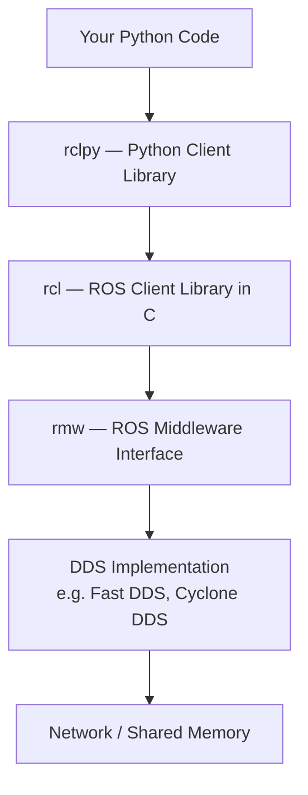

**Estimated Time**: 50 minutes

:::info[What You'll Learn]
- Build complete ROS 2 nodes using rclpy
- Read joint states and command joint trajectories for humanoid robots
- Implement multi-sensor fusion with concurrent callback groups
- Choose the correct executor and callback group for your use case
- Handle errors gracefully in callbacks to prevent node crashes
:::

:::note[Prerequisites]
Before starting this chapter, complete:
- [Core Concepts](./core-concepts.md)
- [Building Packages](./building-packages.md)
:::

`rclpy` is the Python client library for ROS 2. It provides a Pythonic API for creating nodes, publishing and subscribing to topics, calling services, and managing actions.

## The rclpy Architecture



Your Python code calls `rclpy`, which wraps the C-level `rcl` library. `rcl` communicates through the `rmw` interface to the DDS middleware, which handles actual network transport. This layered architecture means Python nodes have the same communication capabilities as C++ nodes.

## Building a Complete Agent

Let's build a humanoid robot agent that processes sensor data and publishes control commands.

### Project Structure

```text title="Package layout"
my_humanoid_control/
├── package.xml
├── setup.py
├── setup.cfg
├── my_humanoid_control/
│   ├── __init__.py
│   ├── joint_reader.py
│   ├── joint_commander.py
│   ├── state_estimator.py
│   └── utils.py
├── launch/
│   └── humanoid_control.launch.py
├── config/
│   └── control_params.yaml
└── test/
    └── test_joint_reader.py
```

## JointState Reader Pattern

The most fundamental humanoid robot node: reading joint positions, velocities, and efforts from the `/joint_states` topic.

```python title="joint_reader.py" showLineNumbers
import rclpy
from rclpy.node import Node
from sensor_msgs.msg import JointState

class JointReader(Node):
    """Reads and monitors humanoid joint states."""

    def __init__(self):
        super().__init__('joint_reader')

        # Declare parameters
        self.declare_parameter('monitored_joints', [
            'left_hip_pitch', 'left_knee_pitch', 'right_hip_pitch', 'right_knee_pitch'
        ])

        self.monitored = self.get_parameter('monitored_joints').value
        self.latest_positions = {}

        # highlight-next-line
        # Subscribe to joint states
        self.subscription = self.create_subscription(
            JointState, '/joint_states', self.joint_callback, 10)

        # Periodic status report at 1 Hz
        self.timer = self.create_timer(1.0, self.report_status)
        self.get_logger().info(f'Monitoring {len(self.monitored)} joints')

    def joint_callback(self, msg):
        """Store latest joint positions."""
        for name, position in zip(msg.name, msg.position):
            if name in self.monitored:
                self.latest_positions[name] = position

    def report_status(self):
        """Log current joint positions."""
        for name, pos in self.latest_positions.items():
            self.get_logger().info(f'  {name}: {pos:.4f} rad')

def main(args=None):
    rclpy.init(args=args)
    node = JointReader()
    try:
        rclpy.spin(node)
    except KeyboardInterrupt:
        pass
    finally:
        node.destroy_node()
        rclpy.shutdown()

if __name__ == '__main__':
    main()
```

## JointTrajectory Commander Pattern

Commanding joint motion by publishing `trajectory_msgs/JointTrajectory` messages with waypoints:

```python title="joint_commander.py" showLineNumbers
import rclpy
from rclpy.node import Node
from trajectory_msgs.msg import JointTrajectory, JointTrajectoryPoint
from builtin_interfaces.msg import Duration

class JointCommander(Node):
    """Sends joint trajectory commands to humanoid controllers."""

    def __init__(self):
        super().__init__('joint_commander')

        self.declare_parameter('controller_topic',
            '/joint_trajectory_controller/joint_trajectory')

        topic = self.get_parameter('controller_topic').value

        # highlight-next-line
        self.publisher = self.create_publisher(JointTrajectory, topic, 10)
        self.get_logger().info(f'Commander ready on {topic}')

    def send_trajectory(self, joint_names, positions, duration_sec=2.0):
        """Send a trajectory with a single waypoint."""
        msg = JointTrajectory()
        msg.header.stamp = self.get_clock().now().to_msg()
        msg.joint_names = joint_names

        # Create a waypoint
        point = JointTrajectoryPoint()
        # highlight-next-line
        point.positions = positions
        point.velocities = [0.0] * len(positions)  # Zero velocity at target
        point.time_from_start = Duration(
            sec=int(duration_sec),
            nanosec=int((duration_sec % 1) * 1e9))

        msg.points = [point]
        self.publisher.publish(msg)
        self.get_logger().info(
            f'Sent trajectory: {dict(zip(joint_names, positions))}')

    def wave_arm(self):
        """Example: wave the right arm."""
        self.send_trajectory(
            joint_names=['right_shoulder_pitch', 'right_elbow_pitch'],
            positions=[1.0, -0.5],
            duration_sec=1.5)

def main(args=None):
    rclpy.init(args=args)
    node = JointCommander()
    node.wave_arm()
    rclpy.spin(node)
    node.destroy_node()
    rclpy.shutdown()
```

## Multi-Sensor Fusion

Real humanoid robots fuse data from multiple sensors. This state estimator subscribes to joint states, IMU, and foot force sensors concurrently:

```python title="state_estimator.py" showLineNumbers
import rclpy
from rclpy.node import Node
from rclpy.callback_groups import ReentrantCallbackGroup
from rclpy.executors import MultiThreadedExecutor
from sensor_msgs.msg import JointState, Imu
from geometry_msgs.msg import WrenchStamped

class HumanoidStateEstimator(Node):
    """Fuses joint states, IMU, and force sensors for balance estimation."""

    def __init__(self):
        super().__init__('state_estimator')

        # Use ReentrantCallbackGroup so sensor callbacks can run concurrently
        # highlight-next-line
        self.sensor_group = ReentrantCallbackGroup()

        # Subscribe to three sensor streams concurrently
        self.joint_sub = self.create_subscription(
            JointState, '/joint_states', self.joint_callback, 10,
            callback_group=self.sensor_group)
        self.imu_sub = self.create_subscription(
            Imu, '/imu/data', self.imu_callback, 10,
            callback_group=self.sensor_group)
        self.force_sub = self.create_subscription(
            WrenchStamped, '/left_foot/force', self.force_callback, 10,
            callback_group=self.sensor_group)

        # Fused state output at 100 Hz
        self.timer = self.create_timer(0.01, self.estimate_state)

        # Internal state buffers
        self.latest_joints = None
        self.latest_imu = None
        self.latest_force = None

    def joint_callback(self, msg):
        self.latest_joints = msg

    def imu_callback(self, msg):
        self.latest_imu = msg

    def force_callback(self, msg):
        self.latest_force = msg

    def estimate_state(self):
        """Fuse sensor data to estimate humanoid balance state."""
        if self.latest_joints is None or self.latest_imu is None:
            return

        # Extract orientation from IMU
        pitch = self.latest_imu.orientation.y
        roll = self.latest_imu.orientation.x

        # Check balance threshold
        if abs(pitch) > 0.3 or abs(roll) > 0.2:
            self.get_logger().warn(
                f'Balance warning: pitch={pitch:.2f}, roll={roll:.2f}')

def main(args=None):
    rclpy.init(args=args)
    node = HumanoidStateEstimator()
    # highlight-next-line
    executor = MultiThreadedExecutor(num_threads=4)
    executor.add_node(node)
    try:
        executor.spin()
    except KeyboardInterrupt:
        pass
    finally:
        node.destroy_node()
        rclpy.shutdown()
```

## Timers and Callbacks

### Periodic Tasks

```python title="multi_rate_node.py" showLineNumbers
class MultiRateNode(Node):
    def __init__(self):
        super().__init__('multi_rate_node')

        # Fast timer for control loop (100 Hz)
        # highlight-next-line
        self.control_timer = self.create_timer(0.01, self.control_cb)

        # Slow timer for diagnostics (1 Hz)
        self.diag_timer = self.create_timer(1.0, self.diagnostics_cb)

    def control_cb(self):
        """High-frequency control loop."""
        pass

    def diagnostics_cb(self):
        """Low-frequency health reporting."""
        self.get_logger().info('System healthy')
```

### One-Shot Timers

```python title="one_shot_timer.py"
# Execute once after a delay
self.one_shot = self.create_timer(5.0, self.delayed_init)

def delayed_init(self):
    self.get_logger().info('Delayed initialization complete')
    # highlight-next-line
    self.one_shot.cancel()  # Cancel after first execution
```

## Error Handling

Always wrap callback logic in `try/except` to prevent node crashes:

```python title="robust_joint_reader.py" showLineNumbers
class RobustJointReader(Node):
    def __init__(self):
        super().__init__('robust_joint_reader')
        self.subscription = self.create_subscription(
            JointState, '/joint_states', self.joint_callback, 10)
        self.error_count = 0

    def joint_callback(self, msg):
        # highlight-next-line
        try:
            if len(msg.name) != len(msg.position):
                raise ValueError(
                    f'Mismatched names ({len(msg.name)}) and positions ({len(msg.position)})')

            for name, pos in zip(msg.name, msg.position):
                if abs(pos) > 3.14:
                    self.get_logger().warn(
                        f'Joint {name} position {pos:.2f} exceeds limits')
        except Exception as e:
            self.error_count += 1
            self.get_logger().error(f'Joint processing failed: {e}')
            if self.error_count > 100:
                # highlight-next-line
                self.get_logger().error(
                    'Too many errors — check sensor hardware',
                    throttle_duration_sec=10.0)
```

:::warning[Common Mistake]
Never let exceptions propagate out of callbacks — an unhandled exception in a callback will crash the entire node. Always wrap callback logic in try/except blocks.
:::

## Executors and Callback Groups

### The Service-in-Callback Deadlock

This is the **#1 reported bug** from ROS 2 students. Calling a service from within a callback using `SingleThreadedExecutor` causes permanent deadlock:

```python title="deadlock_example.py" showLineNumbers
# ❌ THIS WILL DEADLOCK with SingleThreadedExecutor
class DeadlockNode(Node):
    def __init__(self):
        super().__init__('deadlock_node')
        self.client = self.create_client(AddTwoInts, 'add')
        self.timer = self.create_timer(1.0, self.timer_callback)

    def timer_callback(self):
        request = AddTwoInts.Request()
        request.a = 1
        request.b = 2
        # This blocks waiting for the response, but the executor
        # cannot process the response because it's blocked here!
        # highlight-next-line
        future = self.client.call_async(request)
        rclpy.spin_until_future_complete(self, future)  # 💀 DEADLOCK
```

**The Fix**: Use `MultiThreadedExecutor` with separate callback groups:

```python title="deadlock_fix.py" showLineNumbers
from rclpy.executors import MultiThreadedExecutor
from rclpy.callback_groups import MutuallyExclusiveCallbackGroup

class FixedNode(Node):
    def __init__(self):
        super().__init__('fixed_node')
        # Separate callback groups prevent deadlock
        # highlight-next-line
        self.timer_group = MutuallyExclusiveCallbackGroup()
        self.client_group = MutuallyExclusiveCallbackGroup()

        self.client = self.create_client(
            AddTwoInts, 'add',
            callback_group=self.client_group)
        self.timer = self.create_timer(
            1.0, self.timer_callback,
            callback_group=self.timer_group)

    def timer_callback(self):
        request = AddTwoInts.Request()
        future = self.client.call_async(request)
        future.add_done_callback(self.response_callback)

    def response_callback(self, future):
        result = future.result()
        self.get_logger().info(f'Result: {result.sum}')

# Run with MultiThreadedExecutor
executor = MultiThreadedExecutor(num_threads=2)
executor.add_node(FixedNode())
executor.spin()
```

### Executor and Callback Group Reference Table

| Executor | Callback Group | Behavior | Use Case |
|----------|---------------|----------|----------|
| `SingleThreadedExecutor` | (default) | One callback at a time, deterministic order | Simple nodes, no service calls from callbacks |
| `MultiThreadedExecutor` | `MutuallyExclusiveCallbackGroup` | Group members never run concurrently | Control logic, state updates that must not overlap |
| `MultiThreadedExecutor` | `ReentrantCallbackGroup` | Group members can run in parallel | Independent sensor callbacks (IMU, joints, cameras) |
| `MultiThreadedExecutor` | Mixed groups | Per-group concurrency control | Service calls from callbacks (deadlock fix) |

**Rules of thumb:**
- Start with `SingleThreadedExecutor` (simplest, deterministic)
- Switch to `MultiThreadedExecutor` if you need to call services from callbacks
- Use `ReentrantCallbackGroup` for independent sensor streams that should not block each other
- Use `MutuallyExclusiveCallbackGroup` for callbacks that share mutable state

## Logging

```python title="logging_examples.py" showLineNumbers
# Log levels (in order of severity)
self.get_logger().debug('Detailed debug info')
self.get_logger().info('Normal operation message')
self.get_logger().warn('Something unexpected')
self.get_logger().error('Operation failed')
self.get_logger().fatal('System cannot continue')

# highlight-next-line
# Throttled logging — at most once per 5 seconds
self.get_logger().info('Heartbeat', throttle_duration_sec=5.0)

# Conditional logging — only log once
self.get_logger().info('Initialization complete', once=True)
```

:::tip[Throttled Logging]
In high-frequency callbacks (50+ Hz), use `throttle_duration_sec` to avoid flooding the console. Without throttling, a 100 Hz callback logging every message produces 6,000 log lines per minute.
:::

## Testing Python Nodes

```python title="test/test_joint_reader.py" showLineNumbers
import pytest
import rclpy
from my_humanoid_control.joint_reader import JointReader

@pytest.fixture
def node():
    # highlight-next-line
    rclpy.init()
    node = JointReader()
    yield node
    node.destroy_node()
    rclpy.shutdown()

def test_node_creation(node):
    assert node.get_name() == 'joint_reader'

def test_subscriber_created(node):
    topic_names = [t[0] for t in node.get_topic_names_and_types()]
    assert '/joint_states' in topic_names

def test_default_parameters(node):
    joints = node.get_parameter('monitored_joints').value
    assert 'left_hip_pitch' in joints
```

:::tip[Going Further: Composable Nodes]
For performance-critical systems, ROS 2 supports **composable nodes** that run in a single process, enabling **zero-copy** message passing via shared memory. Instead of publishing through DDS, messages are passed as shared pointers between nodes in the same process. This is ideal for high-bandwidth data like camera images. See the [ROS 2 Composition tutorial](https://docs.ros.org/en/jazzy/Tutorials/Intermediate/Composition.html) for details.
:::

:::tip[Going Further: Lifecycle Nodes]
**Lifecycle nodes** (`LifecycleNode`) add explicit state management: `unconfigured → inactive → active → finalized`. This pattern is essential for hardware drivers where you need to allocate resources in `on_configure()`, start publishing in `on_activate()`, and safely release hardware in `on_deactivate()` and `on_cleanup()`. See the [ROS 2 Managed Nodes design](https://design.ros2.org/articles/node_lifecycle.html).
:::

:::tip[Going Further: Walk Action Server]
A real humanoid walk controller would be implemented as an **Action Server** that accepts goal poses, publishes feedback (current position, step count, stability metric), and supports cancellation (stop and stabilize). The action interface provides the ideal pattern for long-running locomotion tasks. See [Actions](./core-concepts.md) for the action pattern basics.
:::

:::tip[Key Takeaways]
- `rclpy` provides the Python API for creating ROS 2 nodes with publishers, subscribers, timers, and services
- Use the **JointState reader** pattern to monitor humanoid joint positions, velocities, and efforts
- Use the **JointTrajectory commander** pattern to send joint motion commands
- Combine multiple subscribers with `ReentrantCallbackGroup` for concurrent sensor fusion
- Use `MultiThreadedExecutor` with separate `MutuallyExclusiveCallbackGroup` instances to fix the service-in-callback deadlock
- Always wrap callback logic in `try/except` to prevent node crashes
- Use throttled logging (`throttle_duration_sec`) in high-frequency callbacks
:::

## Next Steps

- [URDF Basics](./urdf-basics.md) — describe robot models that your agents will control
- [Module 1 Exercises](./exercises.md) — practice building ROS 2 agents hands-on
