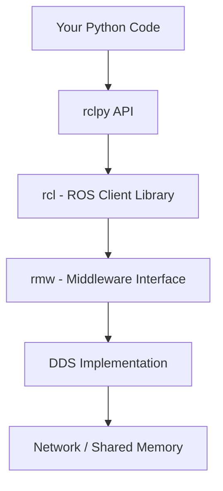

# Python Agents with rclpy

`rclpy` is the Python client library for ROS 2. It provides a Pythonic API for creating nodes, publishing and subscribing to topics, calling services, and managing actions.

## The rclpy Architecture



## Building a Complete Agent

Let's build a perception agent that processes camera images and publishes detected objects.

### Project Structure

```
my_robot_perception/
├── package.xml
├── setup.py
├── setup.cfg
├── my_robot_perception/
│   ├── __init__.py
│   ├── camera_processor.py
│   ├── object_detector.py
│   └── utils.py
├── launch/
│   └── perception.launch.py
├── config/
│   └── detector_params.yaml
└── test/
    └── test_detector.py
```

### Camera Processor Node

```python
import rclpy
from rclpy.node import Node
from sensor_msgs.msg import Image
from std_msgs.msg import String
from cv_bridge import CvBridge
import json

class CameraProcessor(Node):
    """Processes camera images and publishes analysis results."""

    def __init__(self):
        super().__init__('camera_processor')

        # Declare parameters
        self.declare_parameter('input_topic', '/camera/image_raw')
        self.declare_parameter('output_topic', '/camera/analysis')
        self.declare_parameter('process_rate', 10.0)

        # Get parameter values
        input_topic = self.get_parameter('input_topic').value
        output_topic = self.get_parameter('output_topic').value

        # Create subscriber
        self.subscription = self.create_subscription(
            Image, input_topic, self.image_callback, 10)

        # Create publisher
        self.publisher = self.create_publisher(
            String, output_topic, 10)

        # CV Bridge for image conversion
        self.bridge = CvBridge()
        self.frame_count = 0

        self.get_logger().info(
            f'Camera processor started: {input_topic} -> {output_topic}')

    def image_callback(self, msg):
        """Process incoming camera images."""
        self.frame_count += 1
        cv_image = self.bridge.imgmsg_to_cv2(msg, 'bgr8')
        height, width, _ = cv_image.shape

        # Publish analysis result
        result = String()
        result.data = json.dumps({
            'frame': self.frame_count,
            'width': width,
            'height': height,
            'timestamp': msg.header.stamp.sec
        })
        self.publisher.publish(result)

def main(args=None):
    rclpy.init(args=args)
    node = CameraProcessor()
    try:
        rclpy.spin(node)
    except KeyboardInterrupt:
        pass
    finally:
        node.destroy_node()
        rclpy.shutdown()

if __name__ == '__main__':
    main()
```

## Multi-Topic Communication

Real robot agents often subscribe to multiple topics and coordinate data.

```python
from rclpy.node import Node
from sensor_msgs.msg import LaserScan, Imu
from geometry_msgs.msg import Twist
from message_filters import Subscriber, ApproximateTimeSynchronizer

class NavigationAgent(Node):
    """Combines sensor data for navigation decisions."""

    def __init__(self):
        super().__init__('navigation_agent')

        # Multiple subscribers
        self.scan_sub = self.create_subscription(
            LaserScan, '/scan', self.scan_callback, 10)
        self.imu_sub = self.create_subscription(
            Imu, '/imu/data', self.imu_callback, 10)

        # Publisher for velocity commands
        self.cmd_pub = self.create_publisher(Twist, '/cmd_vel', 10)

        # Internal state
        self.latest_scan = None
        self.latest_imu = None

        # Control loop timer at 20 Hz
        self.timer = self.create_timer(0.05, self.control_loop)

    def scan_callback(self, msg):
        self.latest_scan = msg

    def imu_callback(self, msg):
        self.latest_imu = msg

    def control_loop(self):
        """Main control loop combining sensor data."""
        if self.latest_scan is None:
            return

        twist = Twist()
        min_range = min(self.latest_scan.ranges)

        if min_range < 0.5:
            # Obstacle detected - turn
            twist.angular.z = 0.5
            self.get_logger().warn(
                f'Obstacle at {min_range:.2f}m - turning')
        else:
            # Clear path - move forward
            twist.linear.x = 0.3

        self.cmd_pub.publish(twist)
```

## Timers and Callbacks

### Periodic Tasks

```python
class PeriodicNode(Node):
    def __init__(self):
        super().__init__('periodic_node')

        # Fast timer for control (100 Hz)
        self.control_timer = self.create_timer(0.01, self.control_cb)

        # Slow timer for diagnostics (1 Hz)
        self.diag_timer = self.create_timer(1.0, self.diagnostics_cb)

    def control_cb(self):
        """High-frequency control loop."""
        pass

    def diagnostics_cb(self):
        """Low-frequency health reporting."""
        self.get_logger().info('System healthy')
```

### One-Shot Timers

```python
# Execute once after a delay
self.one_shot = self.create_timer(5.0, self.delayed_init)

def delayed_init(self):
    self.get_logger().info('Delayed initialization complete')
    self.one_shot.cancel()  # Cancel after first execution
```

## Error Handling

```python
class RobustNode(Node):
    def __init__(self):
        super().__init__('robust_node')
        self.subscription = self.create_subscription(
            Image, '/camera/image', self.image_callback, 10)

    def image_callback(self, msg):
        try:
            cv_image = self.bridge.imgmsg_to_cv2(msg, 'bgr8')
            self.process_image(cv_image)
        except Exception as e:
            self.get_logger().error(f'Image processing failed: {e}')

    def process_image(self, image):
        """Process image with error recovery."""
        if image is None or image.size == 0:
            self.get_logger().warn('Received empty image')
            return
        # Processing logic here
```

## Executors and Callback Groups

For concurrent processing, use executors and callback groups.

```python
from rclpy.executors import MultiThreadedExecutor
from rclpy.callback_groups import (
    MutuallyExclusiveCallbackGroup,
    ReentrantCallbackGroup
)

class ConcurrentNode(Node):
    def __init__(self):
        super().__init__('concurrent_node')

        # Separate callback groups for concurrent execution
        self.sensor_group = ReentrantCallbackGroup()
        self.control_group = MutuallyExclusiveCallbackGroup()

        self.create_subscription(
            Image, '/camera', self.camera_cb, 10,
            callback_group=self.sensor_group)
        self.create_subscription(
            LaserScan, '/scan', self.scan_cb, 10,
            callback_group=self.sensor_group)
        self.create_timer(
            0.05, self.control_cb,
            callback_group=self.control_group)

# Run with multi-threaded executor
executor = MultiThreadedExecutor(num_threads=4)
executor.add_node(ConcurrentNode())
executor.spin()
```

## Composable Nodes

Run multiple nodes in a single process for lower overhead.

```python
# launch/composed.launch.py
from launch import LaunchDescription
from launch_ros.actions import ComposableNodeContainer
from launch_ros.descriptions import ComposableNode

def generate_launch_description():
    container = ComposableNodeContainer(
        name='perception_container',
        namespace='',
        package='rclcpp_components',
        executable='component_container',
        composable_node_descriptions=[
            ComposableNode(
                package='my_robot_pkg',
                plugin='CameraNode',
                name='camera'),
            ComposableNode(
                package='my_robot_pkg',
                plugin='DetectorNode',
                name='detector'),
        ],
    )
    return LaunchDescription([container])
```

## Logging

```python
# Log levels
self.get_logger().debug('Detailed debug info')
self.get_logger().info('Normal operation message')
self.get_logger().warn('Something unexpected')
self.get_logger().error('Operation failed')
self.get_logger().fatal('System cannot continue')

# Throttled logging (once per 5 seconds)
self.get_logger().info('Heartbeat', throttle_duration_sec=5.0)
```

## Testing Python Nodes

```python
# test/test_camera_processor.py
import pytest
import rclpy
from my_robot_pkg.camera_processor import CameraProcessor

@pytest.fixture
def node():
    rclpy.init()
    node = CameraProcessor()
    yield node
    node.destroy_node()
    rclpy.shutdown()

def test_node_creation(node):
    assert node.get_name() == 'camera_processor'

def test_publisher_created(node):
    topic_names = [t[0] for t in node.get_topic_names_and_types()]
    assert '/camera/analysis' in topic_names
```

## Next Steps

Continue to [URDF Basics](./urdf-basics.md) to learn how to describe robot models that your agents will control.
