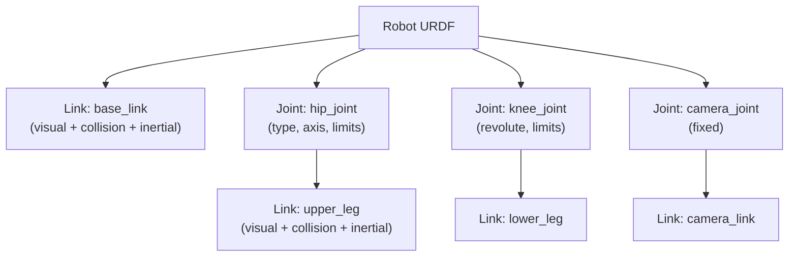
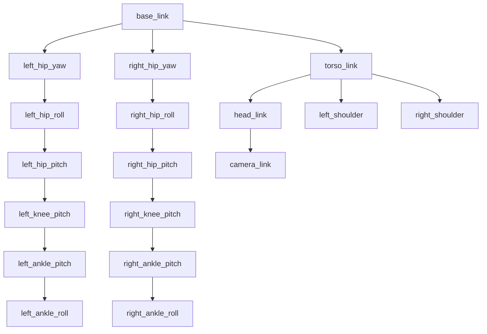

**Estimated Time**: 60 minutes

:::info[What You'll Learn]
- Write URDF files that define robot structure with links and joints
- Configure links with visual, collision, and inertial properties
- Define joints connecting robot parts with appropriate types and limits
- Use Xacro macros to build reusable humanoid limb definitions
- Visualize and validate robot models in rviz2
- Integrate ros2_control hardware interfaces into URDF
:::

:::note[Prerequisites]
Before starting this chapter, complete:
- [Core Concepts](./core-concepts.md)
:::

URDF (Unified Robot Description Format) is the standard XML format for describing robot models in ROS. It defines the physical structure, appearance, and kinematics of a robot as a tree of links connected by joints.

## URDF Structure Overview



A URDF is a tree — each link has exactly one parent joint (except `base_link`). This maps directly to the TF2 transform tree.

## Links

A link defines a rigid body with three properties:

### Visual

How the link appears in visualization tools (rviz2):

```xml title="Visual geometry options"
<visual>
  <geometry>
    <!-- Primitive shapes -->
    <box size="x y z"/>
    <cylinder radius="r" length="l"/>
    <sphere radius="r"/>
    <!-- Or mesh files -->
    <mesh filename="package://my_robot/meshes/body.stl" scale="1.0 1.0 1.0"/>
  </geometry>
  <origin xyz="0 0 0" rpy="0 0 0"/>
  <material name="color_name">
    <color rgba="r g b a"/>
  </material>
</visual>
```

### Collision

Simplified geometry for physics simulation (often simpler than visual to improve performance):

```xml title="Collision geometry"
<collision>
  <geometry>
    <box size="0.4 0.3 0.1"/>
  </geometry>
  <origin xyz="0 0 0" rpy="0 0 0"/>
</collision>
```

### Inertial

Mass and moment of inertia for dynamics simulation:

```xml title="Inertial properties"
<inertial>
  <mass value="5.0"/>
  <origin xyz="0 0 0" rpy="0 0 0"/>
  <inertia ixx="0.01" ixy="0.0" ixz="0.0"
           iyy="0.01" iyz="0.0" izz="0.01"/>
</inertial>
```

:::warning[Common Mistake]
Always include `<inertial>` properties for every link that participates in physics simulation. Missing inertial values cause Gazebo to treat the link as having zero mass, which leads to unstable physics and exploding robots.
:::

## Joints

Joints connect links and define how they move relative to each other.

### Joint Types

| Type | DOF | Description | Humanoid Example |
|------|-----|-------------|-----------------|
| `revolute` | 1 | Rotation with limits | Hip pitch, knee, elbow |
| `continuous` | 1 | Unlimited rotation | Wheel, rotating sensor |
| `prismatic` | 1 | Linear sliding | Linear actuator, gripper |
| `fixed` | 0 | No movement | Sensor mount, camera |

### Joint Properties

```xml title="Complete joint example" showLineNumbers
<!-- highlight-next-line -->
<joint name="left_hip_pitch" type="revolute">
  <!-- Which links this joint connects -->
  <parent link="pelvis_link"/>
  <child link="left_upper_leg_link"/>

  <!-- Position and orientation of joint relative to parent -->
  <origin xyz="0.0 0.1 -0.05" rpy="0 0 0"/>

  <!-- Axis of rotation (Y-axis = pitch) -->
  <axis xyz="0 1 0"/>

  <!-- Joint limits -->
  <limit lower="-1.57" upper="1.57"
         effort="150.0" velocity="6.28"/>

  <!-- Dynamics (for simulation) -->
  <dynamics damping="0.5" friction="0.1"/>
</joint>
```

**Joint limit parameters:**

| Parameter | Description | Unit |
|-----------|-------------|------|
| `lower` / `upper` | Position limits | radians (revolute) or meters (prismatic) |
| `effort` | Maximum force/torque | N·m (revolute) or N (prismatic) |
| `velocity` | Maximum velocity | rad/s (revolute) or m/s (prismatic) |

## Minimal URDF Example

```xml title="simple_humanoid.urdf" showLineNumbers
<?xml version="1.0"?>
<robot name="simple_humanoid" xmlns:xacro="http://www.ros.org/wiki/xacro">

  <!-- Pelvis (base) -->
  <!-- highlight-next-line -->
  <link name="base_link">
    <visual>
      <geometry><box size="0.3 0.25 0.15"/></geometry>
      <material name="grey"><color rgba="0.5 0.5 0.5 1.0"/></material>
    </visual>
    <collision>
      <geometry><box size="0.3 0.25 0.15"/></geometry>
    </collision>
    <inertial>
      <mass value="8.0"/>
      <inertia ixx="0.04" ixy="0.0" ixz="0.0"
               iyy="0.05" iyz="0.0" izz="0.03"/>
    </inertial>
  </link>

  <!-- Upper leg -->
  <link name="upper_leg_link">
    <visual>
      <geometry><cylinder radius="0.04" length="0.35"/></geometry>
      <origin xyz="0 0 -0.175"/>
      <material name="blue"><color rgba="0.0 0.0 0.8 1.0"/></material>
    </visual>
    <collision>
      <geometry><cylinder radius="0.04" length="0.35"/></geometry>
      <origin xyz="0 0 -0.175"/>
    </collision>
    <inertial>
      <mass value="3.0"/>
      <origin xyz="0 0 -0.175"/>
      <inertia ixx="0.03" ixy="0.0" ixz="0.0"
               iyy="0.03" iyz="0.0" izz="0.002"/>
    </inertial>
  </link>

  <!-- Hip joint -->
  <!-- highlight-next-line -->
  <joint name="hip_pitch" type="revolute">
    <parent link="base_link"/>
    <child link="upper_leg_link"/>
    <origin xyz="0 0.1 -0.075" rpy="0 0 0"/>
    <axis xyz="0 1 0"/>
    <limit lower="-1.57" upper="1.57" effort="150" velocity="6.28"/>
  </joint>

</robot>
```

## TF2: Transform Tree

URDF automatically creates a transform tree. The `robot_state_publisher` node converts URDF + `JointState` messages into TF2 transforms that all nodes can query.



### Viewing Transforms

```bash title="TF2 inspection commands" showLineNumbers
# Generate a PDF of the complete transform tree
# highlight-next-line
ros2 run tf2_tools view_frames
# Creates: frames_YYYY-MM-DD_HH.MM.SS.pdf

# Look up a specific transform between two frames
ros2 run tf2_ros tf2_echo base_link left_ankle_roll
# Expected: Translation: [x, y, z], Rotation: [qx, qy, qz, qw]

# Monitor all transforms
ros2 topic echo /tf
```

:::tip[Pro Tip]
Run `ros2 run tf2_tools view_frames` to generate a PDF of the complete transform tree. This is invaluable for debugging coordinate frame issues — you can verify that all joints are connected correctly and frames appear in the right places.
:::

## Xacro: XML Macros

Xacro simplifies URDF files with variables, macros, and math expressions. A humanoid robot has many symmetric structures — Xacro lets you define them once and reuse them.

### Properties (Variables)

```xml title="Xacro properties" showLineNumbers
<!-- highlight-next-line -->
<xacro:property name="upper_leg_length" value="0.35"/>
<xacro:property name="upper_leg_radius" value="0.04"/>
<xacro:property name="upper_leg_mass" value="3.0"/>

<link name="upper_leg_link">
  <visual>
    <geometry>
      <cylinder radius="${upper_leg_radius}" length="${upper_leg_length}"/>
    </geometry>
    <!-- Math expressions with ${} -->
    <origin xyz="0 0 ${-upper_leg_length/2}"/>
  </visual>
</link>
```

### Inertia Calculation Macros

Computing inertia tensors by hand is error-prone. Define reusable macros for common primitive shapes:

```xml title="inertia_macros.xacro" showLineNumbers
<!-- Cylinder inertia (solid, aligned along Z axis) -->
<!-- highlight-next-line -->
<xacro:macro name="cylinder_inertia" params="mass radius length">
  <inertial>
    <mass value="${mass}"/>
    <inertia
      ixx="${mass * (3 * radius * radius + length * length) / 12}"
      ixy="0.0" ixz="0.0"
      iyy="${mass * (3 * radius * radius + length * length) / 12}"
      iyz="0.0"
      izz="${mass * radius * radius / 2}"/>
  </inertial>
</xacro:macro>

<!-- Box inertia (solid) -->
<xacro:macro name="box_inertia" params="mass x y z">
  <inertial>
    <mass value="${mass}"/>
    <inertia
      ixx="${mass * (y * y + z * z) / 12}"
      ixy="0.0" ixz="0.0"
      iyy="${mass * (x * x + z * z) / 12}"
      iyz="0.0"
      izz="${mass * (x * x + y * y) / 12}"/>
  </inertial>
</xacro:macro>

<!-- Sphere inertia (solid) -->
<xacro:macro name="sphere_inertia" params="mass radius">
  <inertial>
    <mass value="${mass}"/>
    <inertia
      ixx="${2 * mass * radius * radius / 5}"
      ixy="0.0" ixz="0.0"
      iyy="${2 * mass * radius * radius / 5}"
      iyz="0.0"
      izz="${2 * mass * radius * radius / 5}"/>
  </inertial>
</xacro:macro>
```

Usage:

```xml title="Using inertia macros"
<link name="upper_leg_link">
  <visual>...</visual>
  <collision>...</collision>
  <xacro:cylinder_inertia mass="3.0" radius="0.04" length="0.35"/>
</link>
```

### Humanoid Leg Macro

Define a complete 6-DOF leg and instantiate it for left and right sides using the `reflect` parameter:

```xml title="humanoid_leg.xacro" showLineNumbers
<!-- highlight-next-line -->
<xacro:macro name="humanoid_leg" params="prefix reflect">
  <!-- === Hip Yaw === -->
  <link name="${prefix}_hip_yaw_link">
    <visual>
      <geometry><cylinder radius="0.03" length="0.05"/></geometry>
      <material name="joint_color"><color rgba="0.3 0.3 0.3 1.0"/></material>
    </visual>
    <collision>
      <geometry><cylinder radius="0.03" length="0.05"/></geometry>
    </collision>
    <xacro:cylinder_inertia mass="0.5" radius="0.03" length="0.05"/>
  </link>
  <joint name="${prefix}_hip_yaw" type="revolute">
    <parent link="base_link"/>
    <child link="${prefix}_hip_yaw_link"/>
    <origin xyz="0.0 ${reflect * 0.1} -0.05" rpy="0 0 0"/>
    <axis xyz="0 0 1"/>
    <limit lower="-0.5" upper="0.5" effort="100" velocity="4.0"/>
  </joint>

  <!-- === Hip Roll === -->
  <link name="${prefix}_hip_roll_link">
    <visual>
      <geometry><cylinder radius="0.03" length="0.05"/></geometry>
      <material name="joint_color"/>
    </visual>
    <collision>
      <geometry><cylinder radius="0.03" length="0.05"/></geometry>
    </collision>
    <xacro:cylinder_inertia mass="0.5" radius="0.03" length="0.05"/>
  </link>
  <joint name="${prefix}_hip_roll" type="revolute">
    <parent link="${prefix}_hip_yaw_link"/>
    <child link="${prefix}_hip_roll_link"/>
    <origin xyz="0 0 0" rpy="0 0 0"/>
    <axis xyz="1 0 0"/>
    <limit lower="-0.5" upper="0.5" effort="100" velocity="4.0"/>
  </joint>

  <!-- === Hip Pitch === -->
  <link name="${prefix}_upper_leg_link">
    <visual>
      <geometry><cylinder radius="0.04" length="0.35"/></geometry>
      <origin xyz="0 0 -0.175"/>
      <material name="leg_color"><color rgba="0.0 0.0 0.8 1.0"/></material>
    </visual>
    <collision>
      <geometry><cylinder radius="0.04" length="0.35"/></geometry>
      <origin xyz="0 0 -0.175"/>
    </collision>
    <xacro:cylinder_inertia mass="3.0" radius="0.04" length="0.35"/>
  </link>
  <!-- highlight-next-line -->
  <joint name="${prefix}_hip_pitch" type="revolute">
    <parent link="${prefix}_hip_roll_link"/>
    <child link="${prefix}_upper_leg_link"/>
    <origin xyz="0 0 0" rpy="0 0 0"/>
    <axis xyz="0 1 0"/>
    <limit lower="-1.57" upper="0.5" effort="150" velocity="6.28"/>
  </joint>

  <!-- === Knee Pitch === -->
  <link name="${prefix}_lower_leg_link">
    <visual>
      <geometry><cylinder radius="0.035" length="0.3"/></geometry>
      <origin xyz="0 0 -0.15"/>
      <material name="leg_color"/>
    </visual>
    <collision>
      <geometry><cylinder radius="0.035" length="0.3"/></geometry>
      <origin xyz="0 0 -0.15"/>
    </collision>
    <xacro:cylinder_inertia mass="2.0" radius="0.035" length="0.3"/>
  </link>
  <joint name="${prefix}_knee_pitch" type="revolute">
    <parent link="${prefix}_upper_leg_link"/>
    <child link="${prefix}_lower_leg_link"/>
    <origin xyz="0 0 -0.35" rpy="0 0 0"/>
    <axis xyz="0 1 0"/>
    <limit lower="0.0" upper="2.6" effort="150" velocity="6.28"/>
  </joint>

  <!-- === Ankle Pitch === -->
  <link name="${prefix}_foot_link">
    <visual>
      <geometry><box size="0.2 0.1 0.03"/></geometry>
      <origin xyz="0.05 0 -0.015"/>
      <material name="foot_color"><color rgba="0.2 0.2 0.2 1.0"/></material>
    </visual>
    <collision>
      <geometry><box size="0.2 0.1 0.03"/></geometry>
      <origin xyz="0.05 0 -0.015"/>
    </collision>
    <xacro:box_inertia mass="1.0" x="0.2" y="0.1" z="0.03"/>
  </link>
  <joint name="${prefix}_ankle_pitch" type="revolute">
    <parent link="${prefix}_lower_leg_link"/>
    <child link="${prefix}_foot_link"/>
    <origin xyz="0 0 -0.3" rpy="0 0 0"/>
    <axis xyz="0 1 0"/>
    <limit lower="-0.8" upper="0.8" effort="100" velocity="4.0"/>
  </joint>

  <!-- === Ankle Roll === -->
  <link name="${prefix}_ankle_roll_link">
    <visual>
      <geometry><sphere radius="0.02"/></geometry>
      <material name="joint_color"/>
    </visual>
    <collision>
      <geometry><sphere radius="0.02"/></geometry>
    </collision>
    <xacro:sphere_inertia mass="0.1" radius="0.02"/>
  </link>
  <joint name="${prefix}_ankle_roll" type="revolute">
    <parent link="${prefix}_foot_link"/>
    <child link="${prefix}_ankle_roll_link"/>
    <origin xyz="0 0 0" rpy="0 0 0"/>
    <axis xyz="1 0 0"/>
    <limit lower="-0.3" upper="0.3" effort="80" velocity="4.0"/>
  </joint>
</xacro:macro>

<!-- Instantiate both legs -->
<!-- highlight-start -->
<xacro:humanoid_leg prefix="left" reflect="1"/>
<xacro:humanoid_leg prefix="right" reflect="-1"/>
<!-- highlight-end -->
```

### Humanoid Kinematic Chain

Standard humanoid robots use a consistent joint naming convention: `{side}_{segment}_{axis}`.

```text title="Humanoid joint naming convention"
base_link (pelvis)
├── left_hip_yaw        (Z-axis rotation)
│   └── left_hip_roll   (X-axis rotation)
│       └── left_hip_pitch   (Y-axis rotation)
│           └── left_knee_pitch  (Y-axis)
│               └── left_ankle_pitch (Y-axis)
│                   └── left_ankle_roll  (X-axis)
├── right_hip_yaw → ... (mirror of left)
├── torso_pitch
│   ├── left_shoulder_pitch → left_shoulder_roll → left_elbow_pitch → left_wrist_yaw
│   ├── right_shoulder_pitch → ... (mirror of left)
│   └── head_yaw → head_pitch
```

A typical humanoid has **30–40 degrees of freedom**: 6 per leg (12 total), 4–7 per arm (8–14 total), 1–3 torso, and 2 head.

### Humanoid URDF Considerations

| Aspect | Convention | Rationale |
|--------|-----------|-----------|
| **Coordinate frame** | X-forward, Y-left, Z-up (REP 103) | Standard for all ROS robots |
| **Base link** | `base_link` at pelvis center | Stable reference for humanoids |
| **Collision geometry** | Simplified primitives (cylinders, boxes) | 10x faster than mesh collision |
| **Mass distribution** | Concentrate mass at link center | Realistic dynamics in simulation |
| **Joint naming** | `{side}_{segment}_{axis}` | Consistent across humanoid platforms |
| **DOF count** | 30–40 typical | Hips (6×2), knees (2), ankles (4×2), arms, torso, head |

### Processing and Validating

```bash title="Xacro conversion and validation" showLineNumbers
# Convert Xacro to plain URDF
xacro humanoid.urdf.xacro > humanoid.urdf

# Validate the URDF structure
# highlight-next-line
check_urdf humanoid.urdf
# Expected: robot name is: my_humanoid
#           ---------- Successfully Parsed XML ---------------
#           root Link: base_link has N child(ren)
#           ... (full link/joint tree)

# Check for common errors
urdf_to_graphviz humanoid.urdf  # Visual dependency graph
```

## Mesh Files

For production robots, visual geometry uses detailed mesh files instead of primitives:

```xml title="Using mesh files" showLineNumbers
<link name="torso_link">
  <visual>
    <!-- highlight-next-line -->
    <geometry>
      <mesh filename="package://humanoid_description/meshes/torso.stl"
            scale="0.001 0.001 0.001"/>
    </geometry>
    <material name="white"><color rgba="0.9 0.9 0.9 1.0"/></material>
  </visual>
  <collision>
    <!-- Use simplified geometry for collision, not the mesh -->
    <geometry><box size="0.3 0.25 0.4"/></geometry>
  </collision>
</link>
```

:::warning[STL Scale Conversion]
Many CAD programs export STL files in **millimeters**. ROS uses **meters**. Add `scale="0.001 0.001 0.001"` to convert mm→m. If your robot appears 1000x too large (or tiny) in rviz2, this is almost always the issue.
:::

**Mesh format reference:**

| Format | Colors | Notes |
|--------|--------|-------|
| `.stl` | No (single color via `<material>`) | Most common, widely supported |
| `.dae` (Collada) | Yes (embedded textures) | Best for colored/textured models |
| `.obj` | Via `.mtl` file | Good alternative to DAE |

## Adding Sensors

Attach sensors to the robot using fixed joints:

```xml title="Sensor attachments" showLineNumbers
<!-- Camera on the head -->
<link name="camera_link">
  <visual>
    <geometry><box size="0.02 0.06 0.02"/></geometry>
    <material name="black"><color rgba="0.1 0.1 0.1 1.0"/></material>
  </visual>
</link>
<!-- highlight-next-line -->
<joint name="camera_joint" type="fixed">
  <parent link="head_link"/>
  <child link="camera_link"/>
  <!-- Camera faces forward (X-axis), mounted at front of head -->
  <origin xyz="0.08 0.0 0.02" rpy="0 0 0"/>
</joint>

<!-- IMU in the pelvis -->
<link name="imu_link">
  <visual>
    <geometry><box size="0.02 0.02 0.01"/></geometry>
  </visual>
</link>
<joint name="imu_joint" type="fixed">
  <parent link="base_link"/>
  <child link="imu_link"/>
  <origin xyz="0 0 0" rpy="0 0 0"/>
</joint>

<!-- LiDAR on the torso -->
<link name="lidar_link">
  <visual>
    <geometry><cylinder radius="0.04" length="0.05"/></geometry>
  </visual>
</link>
<joint name="lidar_joint" type="fixed">
  <parent link="torso_link"/>
  <child link="lidar_link"/>
  <origin xyz="0.1 0 0.2" rpy="0 0 0"/>
</joint>
```

## ros2_control Integration

The `<ros2_control>` URDF tag defines hardware interfaces for each joint, enabling `ros2_control` controllers to command the robot:

```xml title="ros2_control URDF tags" showLineNumbers
<ros2_control name="humanoid_control" type="system">
  <hardware>
    <plugin>mock_components/GenericSystem</plugin>
  </hardware>

  <!-- highlight-next-line -->
  <joint name="left_hip_pitch">
    <command_interface name="position">
      <param name="min">-1.57</param>
      <param name="max">0.5</param>
    </command_interface>
    <command_interface name="velocity">
      <param name="min">-6.28</param>
      <param name="max">6.28</param>
    </command_interface>
    <state_interface name="position"/>
    <state_interface name="velocity"/>
    <state_interface name="effort"/>
  </joint>

  <joint name="left_knee_pitch">
    <command_interface name="position"/>
    <state_interface name="position"/>
    <state_interface name="velocity"/>
  </joint>

  <!-- Repeat for all joints... -->
</ros2_control>
```

| Interface | Direction | Purpose |
|-----------|-----------|---------|
| `command_interface` | Controller → Hardware | Send position, velocity, or effort commands |
| `state_interface` | Hardware → Controller | Read current position, velocity, effort |

## Visualizing in rviz2

### Display Launch File

```python title="launch/display.launch.py" showLineNumbers
from launch import LaunchDescription
from launch_ros.actions import Node
from launch.substitutions import Command
from ament_index_python.packages import get_package_share_directory
import os

def generate_launch_description():
    urdf_path = os.path.join(
        get_package_share_directory('humanoid_description'),
        'urdf', 'humanoid.urdf.xacro')

    return LaunchDescription([
        # highlight-next-line
        Node(
            package='robot_state_publisher',
            executable='robot_state_publisher',
            parameters=[{
                'robot_description': Command(['xacro ', urdf_path])
            }]),
        Node(
            package='joint_state_publisher_gui',
            executable='joint_state_publisher_gui'),
        Node(
            package='rviz2',
            executable='rviz2'),
    ])
```

```bash title="Launch visualization"
ros2 launch humanoid_description display.launch.py
```

In rviz2, add a `RobotModel` display and set the `Description Topic` to `/robot_description`. Use the `joint_state_publisher_gui` sliders to move each joint interactively.

:::tip[Key Takeaways]
- URDF defines robot structure as a tree of links connected by joints
- Each link has visual (appearance), collision (physics), and inertial (mass + inertia) properties
- Joint types: `revolute` (bounded rotation), `continuous` (wheel), `prismatic` (slide), `fixed` (sensor mount)
- Use Xacro macros to define reusable structures — define a leg once, instantiate for left and right with `reflect`
- Use inertia calculation macros (`cylinder_inertia`, `box_inertia`, `sphere_inertia`) to avoid manual math errors
- Humanoid naming convention: `{side}_{segment}_{axis}` (e.g., `left_hip_pitch`)
- ROS coordinate convention: X-forward, Y-left, Z-up (REP 103)
- Validate with `check_urdf` and visualize in rviz2 with `robot_state_publisher` + `joint_state_publisher_gui`
- Use `<ros2_control>` tags to define hardware interfaces for joint controllers
:::

## Next Steps

- [Module 1 Exercises](./exercises.md) — hands-on challenges covering nodes, topics, packages, and URDF
