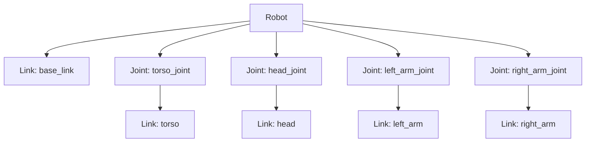
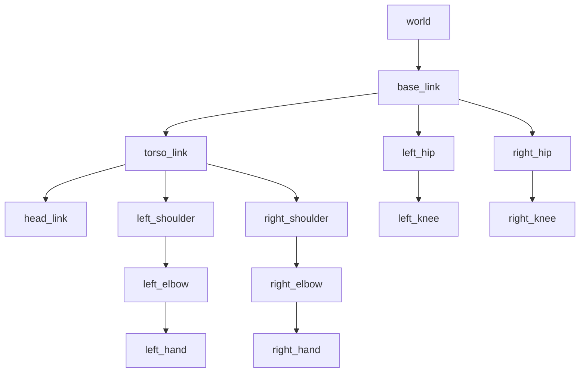

# URDF: Robot Description Format

URDF (Unified Robot Description Format) is the standard XML format for describing robot models in ROS. It defines the physical structure, appearance, and kinematics of a robot.

## URDF Structure



## Basic URDF

### Minimal Robot

```xml
<?xml version="1.0"?>
<robot name="simple_robot" xmlns:xacro="http://www.ros.org/wiki/xacro">

  <!-- Base Link -->
  <link name="base_link">
    <visual>
      <geometry>
        <box size="0.4 0.3 0.1"/>
      </geometry>
      <material name="blue">
        <color rgba="0.0 0.0 0.8 1.0"/>
      </material>
    </visual>
    <collision>
      <geometry>
        <box size="0.4 0.3 0.1"/>
      </geometry>
    </collision>
    <inertial>
      <mass value="5.0"/>
      <inertia ixx="0.01" ixy="0.0" ixz="0.0"
               iyy="0.01" iyz="0.0" izz="0.01"/>
    </inertial>
  </link>

  <!-- Arm Link -->
  <link name="arm_link">
    <visual>
      <geometry>
        <cylinder radius="0.05" length="0.4"/>
      </geometry>
      <origin xyz="0 0 0.2" rpy="0 0 0"/>
      <material name="red">
        <color rgba="0.8 0.0 0.0 1.0"/>
      </material>
    </visual>
    <collision>
      <geometry>
        <cylinder radius="0.05" length="0.4"/>
      </geometry>
      <origin xyz="0 0 0.2" rpy="0 0 0"/>
    </collision>
    <inertial>
      <mass value="1.0"/>
      <origin xyz="0 0 0.2"/>
      <inertia ixx="0.005" ixy="0.0" ixz="0.0"
               iyy="0.005" iyz="0.0" izz="0.001"/>
    </inertial>
  </link>

  <!-- Joint connecting base to arm -->
  <joint name="arm_joint" type="revolute">
    <parent link="base_link"/>
    <child link="arm_link"/>
    <origin xyz="0.2 0 0.05" rpy="0 0 0"/>
    <axis xyz="0 1 0"/>
    <limit lower="-1.57" upper="1.57" effort="100" velocity="1.0"/>
  </joint>

</robot>
```

## Links

A link defines a rigid body with three properties:

### Visual

How the link appears in visualization tools.

```xml
<visual>
  <geometry>
    <!-- Primitive shapes -->
    <box size="x y z"/>
    <cylinder radius="r" length="l"/>
    <sphere radius="r"/>
    <!-- Or mesh files -->
    <mesh filename="package://my_robot/meshes/body.stl" scale="1.0 1.0 1.0"/>
  </geometry>
  <origin xyz="0 0 0" rpy="0 0 0"/>
  <material name="color_name">
    <color rgba="r g b a"/>
  </material>
</visual>
```

### Collision

Simplified geometry for physics simulation (often simpler than visual).

```xml
<collision>
  <geometry>
    <box size="0.4 0.3 0.1"/>
  </geometry>
  <origin xyz="0 0 0" rpy="0 0 0"/>
</collision>
```

### Inertial

Mass and moment of inertia for dynamics simulation.

```xml
<inertial>
  <mass value="5.0"/>
  <origin xyz="0 0 0" rpy="0 0 0"/>
  <inertia ixx="0.01" ixy="0.0" ixz="0.0"
           iyy="0.01" iyz="0.0" izz="0.01"/>
</inertial>
```

## Joints

Joints connect links and define how they move relative to each other.

### Joint Types

| Type | DOF | Description | Example |
|------|-----|-------------|---------|
| `revolute` | 1 | Rotation with limits | Elbow, knee |
| `continuous` | 1 | Unlimited rotation | Wheel |
| `prismatic` | 1 | Linear sliding | Linear actuator |
| `fixed` | 0 | No movement | Sensor mount |
| `floating` | 6 | Free movement | Mobile base |
| `planar` | 2 | Movement in a plane | XY table |

### Joint Definition

```xml
<joint name="shoulder_joint" type="revolute">
  <parent link="torso_link"/>
  <child link="upper_arm_link"/>
  <origin xyz="0.15 0.2 0.3" rpy="0 0 0"/>
  <axis xyz="0 1 0"/>
  <limit lower="-3.14" upper="3.14"
         effort="150" velocity="2.0"/>
  <dynamics damping="0.5" friction="0.1"/>
</joint>
```

## TF2: Transform Tree

URDF automatically creates a transform tree that tracks the position of every link.



### Publishing Robot State

```python
from sensor_msgs.msg import JointState
from tf2_ros import TransformBroadcaster

class JointStatePublisher(Node):
    def __init__(self):
        super().__init__('joint_state_publisher')
        self.publisher = self.create_publisher(
            JointState, '/joint_states', 10)
        self.timer = self.create_timer(0.02, self.publish_state)

    def publish_state(self):
        msg = JointState()
        msg.header.stamp = self.get_clock().now().to_msg()
        msg.name = ['shoulder_joint', 'elbow_joint']
        msg.position = [0.5, -0.3]
        msg.velocity = [0.0, 0.0]
        msg.effort = [0.0, 0.0]
        self.publisher.publish(msg)
```

### Viewing Transforms

```bash
# View the TF tree
ros2 run tf2_tools view_frames

# Look up a specific transform
ros2 run tf2_ros tf2_echo base_link head_link
```

## Xacro: XML Macros

Xacro simplifies URDF files with variables, macros, and includes.

### Variables and Math

```xml
<xacro:property name="arm_length" value="0.4"/>
<xacro:property name="arm_radius" value="0.05"/>
<xacro:property name="arm_mass" value="1.0"/>

<link name="arm_link">
  <visual>
    <geometry>
      <cylinder radius="${arm_radius}" length="${arm_length}"/>
    </geometry>
    <origin xyz="0 0 ${arm_length/2}"/>
  </visual>
</link>
```

### Macros

```xml
<!-- Define a reusable arm macro -->
<xacro:macro name="arm" params="prefix side reflect">
  <link name="${prefix}_arm_link">
    <visual>
      <geometry>
        <cylinder radius="0.05" length="0.4"/>
      </geometry>
    </visual>
  </link>
  <joint name="${prefix}_shoulder_joint" type="revolute">
    <parent link="torso_link"/>
    <child link="${prefix}_arm_link"/>
    <origin xyz="0 ${reflect * 0.2} 0.3"/>
    <axis xyz="0 1 0"/>
    <limit lower="-3.14" upper="3.14" effort="100" velocity="1.0"/>
  </joint>
</xacro:macro>

<!-- Use the macro for both arms -->
<xacro:arm prefix="left" side="left" reflect="1"/>
<xacro:arm prefix="right" side="right" reflect="-1"/>
```

### Processing Xacro

```bash
# Convert xacro to URDF
xacro my_robot.urdf.xacro > my_robot.urdf

# Validate URDF
check_urdf my_robot.urdf
```

## Visualizing in rviz2

```bash
# Launch rviz2 with robot model
ros2 launch my_robot_description display.launch.py

# Or manually
rviz2 -d config/robot_view.rviz
```

### Display Launch File

```python
# launch/display.launch.py
from launch import LaunchDescription
from launch_ros.actions import Node
from launch.substitutions import Command
from ament_index_python.packages import get_package_share_directory
import os

def generate_launch_description():
    urdf_path = os.path.join(
        get_package_share_directory('my_robot_description'),
        'urdf', 'my_robot.urdf.xacro')

    return LaunchDescription([
        Node(
            package='robot_state_publisher',
            executable='robot_state_publisher',
            parameters=[{
                'robot_description': Command(['xacro ', urdf_path])
            }]),
        Node(
            package='joint_state_publisher_gui',
            executable='joint_state_publisher_gui'),
        Node(
            package='rviz2',
            executable='rviz2',
            arguments=['-d', 'config/robot_view.rviz']),
    ])
```

## Adding Sensors to URDF

```xml
<!-- Camera sensor -->
<link name="camera_link">
  <visual>
    <geometry><box size="0.02 0.05 0.02"/></geometry>
  </visual>
</link>
<joint name="camera_joint" type="fixed">
  <parent link="head_link"/>
  <child link="camera_link"/>
  <origin xyz="0.05 0 0" rpy="0 0 0"/>
</joint>

<!-- LiDAR sensor -->
<link name="lidar_link">
  <visual>
    <geometry><cylinder radius="0.04" length="0.05"/></geometry>
  </visual>
</link>
<joint name="lidar_joint" type="fixed">
  <parent link="base_link"/>
  <child link="lidar_link"/>
  <origin xyz="0 0 0.15" rpy="0 0 0"/>
</joint>
```

## Next Steps

Practice what you've learned in the [Module 1 Exercises](./exercises.md) with hands-on challenges covering nodes, topics, packages, and URDF.
