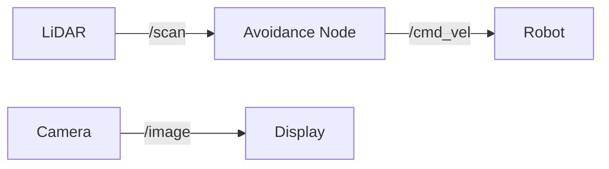

# Module 2 Exercises: Digital Twin Practice

These exercises guide you through building and testing a complete digital twin of a mobile robot in Gazebo.

## Exercise 1: Gazebo World Building

**Objective**: Create a custom Gazebo world with walls, obstacles, and lighting.

### Tasks

1. Create a new SDF world file:

```xml
<?xml version="1.0"?>
<sdf version="1.9">
  <world name="robot_world">
    <physics type="ode">
      <max_step_size>0.001</max_step_size>
      <real_time_factor>1.0</real_time_factor>
    </physics>

    <!-- TODO: Add ground plane -->
    <!-- TODO: Add sun light -->
    <!-- TODO: Add 4 walls forming a 10m x 10m room -->
    <!-- TODO: Add 3 box obstacles at different positions -->
    <!-- TODO: Add a table with objects on it -->
  </world>
</sdf>
```

2. Launch your world:

```bash
gz sim robot_world.sdf
```

### Verification Checklist

- [ ] World loads without errors
- [ ] Room has 4 walls enclosing the space
- [ ] Obstacles are placed at different positions
- [ ] Lighting illuminates the scene

---

## Exercise 2: Simulation-Ready Robot

**Objective**: Convert a URDF model to work in Gazebo with proper physics.

### Tasks

1. Start with this robot URDF and make it simulation-ready:

```xml
<?xml version="1.0"?>
<robot name="sim_robot">
  <!-- Base -->
  <link name="base_link">
    <visual>
      <geometry><box size="0.4 0.3 0.1"/></geometry>
      <material name="blue"><color rgba="0 0 0.8 1"/></material>
    </visual>
    <!-- TODO: Add collision -->
    <!-- TODO: Add inertial (mass: 5kg) -->
  </link>

  <!-- Left wheel -->
  <link name="left_wheel">
    <visual>
      <geometry><cylinder radius="0.05" length="0.02"/></geometry>
    </visual>
    <!-- TODO: Add collision with friction -->
    <!-- TODO: Add inertial (mass: 0.5kg) -->
  </link>
  <joint name="left_wheel_joint" type="continuous">
    <parent link="base_link"/>
    <child link="left_wheel"/>
    <origin xyz="0 0.16 -0.025" rpy="1.5707 0 0"/>
    <axis xyz="0 0 1"/>
  </joint>

  <!-- TODO: Add right wheel (mirror of left) -->
  <!-- TODO: Add caster wheel -->
  <!-- TODO: Add Gazebo differential drive plugin -->
</robot>
```

2. Spawn it in your world from Exercise 1.

3. Drive it using `ros2 topic pub`:

```bash
ros2 topic pub /cmd_vel geometry_msgs/msg/Twist \
  "{linear: {x: 0.3}, angular: {z: 0.0}}"
```

### Verification Checklist

- [ ] Robot spawns in Gazebo without errors
- [ ] Robot does not fall through the ground
- [ ] Wheels spin when velocity commands are sent
- [ ] Robot moves forward and turns correctly
- [ ] `ros2 topic echo /odom` shows odometry data

---

## Exercise 3: Sensor Configuration

**Objective**: Add a camera and LiDAR to the robot and process their data.

### Tasks

1. Add a camera sensor to the robot URDF:
   - Mounted on top of the base
   - Resolution: 640×480
   - Frame rate: 30 Hz
   - FOV: 60 degrees

2. Add a 2D LiDAR sensor:
   - Mounted on the front
   - Range: 0.12m to 10m
   - 360 samples
   - Update rate: 10 Hz

3. Create a ROS 2 node that:
   - Subscribes to the camera image
   - Subscribes to the LiDAR scan
   - Logs the minimum LiDAR range
   - Counts camera frames received

```python
# exercise_sensor_node.py
class SensorExercise(Node):
    def __init__(self):
        super().__init__('sensor_exercise')
        # TODO: Subscribe to /camera/image_raw
        # TODO: Subscribe to /scan
        self.frame_count = 0

    def image_callback(self, msg):
        self.frame_count += 1
        # TODO: Log frame count every 30 frames

    def scan_callback(self, msg):
        # TODO: Find minimum range
        # TODO: Log warning if obstacle closer than 0.5m
        pass
```

### Verification Checklist

- [ ] Camera image visible in `rqt_image_view`
- [ ] LiDAR scan visible in rviz2
- [ ] Node logs camera frame count
- [ ] Node detects nearby obstacles via LiDAR

---

## Exercise 4: Obstacle Avoidance

**Objective**: Build a reactive obstacle avoidance system using simulated sensors.

### Architecture



### Behavior Specification

| LiDAR Min Range | Action |
|----------------|--------|
| > 1.5m | Full speed (0.5 m/s) |
| 0.8m - 1.5m | Slow down (0.2 m/s) |
| 0.3m - 0.8m | Turn in place (0.5 rad/s) |
| < 0.3m | Back up (-0.1 m/s) |

### Tasks

1. Implement the avoidance node
2. Test in the world from Exercise 1
3. Verify the robot navigates without hitting walls

### Verification Checklist

- [ ] Robot moves forward in open space
- [ ] Robot slows down near obstacles
- [ ] Robot turns to avoid walls
- [ ] Robot does not collide with any obstacle over 60 seconds

---

## Exercise 5: Multi-Robot Simulation

**Objective**: Spawn two robots in the same world with different namespaces.

### Tasks

1. Create a launch file that spawns two robots:

```python
# launch/multi_robot.launch.py
def generate_launch_description():
    # TODO: Spawn robot_1 at position (1, 1, 0)
    # TODO: Spawn robot_2 at position (-1, -1, 0)
    # TODO: Each robot has its own namespace
    #   robot_1: /robot_1/cmd_vel, /robot_1/scan
    #   robot_2: /robot_2/cmd_vel, /robot_2/scan
    pass
```

2. Run the avoidance node for each robot
3. Verify both robots navigate independently

### Verification Checklist

- [ ] Both robots visible in Gazebo
- [ ] `ros2 node list` shows nodes for both robots
- [ ] Each robot has its own namespaced topics
- [ ] Robots avoid each other as obstacles

---

## Challenge Exercise: Warehouse Simulation

**Objective**: Build a complete warehouse simulation with shelves, a robot, and a pick-up task.

### Requirements

1. Create a warehouse world with:
   - 4 rows of shelves
   - Loading/unloading zones marked with colored floor areas
   - Overhead lighting

2. Robot must:
   - Navigate from the loading zone to a specific shelf
   - Stop at the shelf (detected by LiDAR proximity)
   - Return to the unloading zone

3. Record and replay the navigation path

### Verification Checklist

- [ ] Warehouse world renders correctly
- [ ] Robot can navigate between zones
- [ ] Path is recorded to a ROS 2 bag file
- [ ] Bag file can be replayed

---

## Summary

| Exercise | Skills Practiced |
|----------|-----------------|
| 1. World Building | SDF worlds, environment design |
| 2. Sim-Ready Robot | URDF physics, Gazebo plugins |
| 3. Sensors | Camera, LiDAR, data processing |
| 4. Avoidance | Reactive control, sensor fusion |
| 5. Multi-Robot | Namespaces, multi-agent simulation |
| Challenge | Complete system integration |

## Next Steps

With simulation mastered, continue to [Module 3: NVIDIA Isaac](/docs/module-3/) to learn GPU-accelerated AI for robotics.
