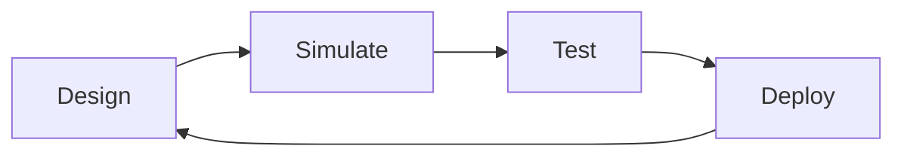

**Estimated Time**: 6 hours

:::info[What You'll Learn]
- Set up Gazebo Harmonic simulation environment
- Create and convert URDF/SDF robot models
- Configure physics and sensor simulation
- Bridge simulation with Unity for visualization
:::

:::note[Prerequisites]
Before starting this module, complete:
- [Module 1: ROS 2 Jazzy Fundamentals](../module-1/index.md)
:::

**Weeks 6-7** | This module teaches simulation-driven development for safe, rapid iteration before hardware deployment.

## Why Simulation?

Simulation enables rapid iteration and safe testing before deploying to real hardware.

## Module Structure

| Chapter | Topic | Time |
|---------|-------|------|
| 2.1 | [Gazebo Setup](./gazebo-setup.md) | 60 min |
| 2.2 | [URDF & SDF](./urdf-sdf.md) | 35 min |
| 2.3 | [Physics Simulation](./physics-sim.md) | 40 min |
| 2.4 | [Sensors](./sensors.md) | 45 min |
| 2.5 | [Unity Bridge](./unity-bridge.md) | 35 min |
| 2.6 | [Exercises](./exercises.md) | 120 min |

:::tip[Key Takeaways]
- Digital twins let you test robot behavior in simulation before deploying to hardware
- Gazebo provides physics, sensor simulation, and ROS 2 integration
- The design→simulate→test→deploy cycle accelerates robotics development
:::

## Next Steps

Begin with [Gazebo Setup](./gazebo-setup.md) to start building your digital twin.
