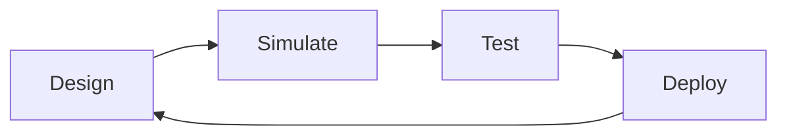

# Module 2: Digital Twin & Simulation

**Weeks 6-7** | Prerequisites: Module 1 complete

## Learning Objectives

By the end of this module, you will be able to:

- Set up Gazebo simulation environment
- Create URDF/SDF robot models
- Configure physics and sensor simulation
- Build digital twins of physical robots
- Bridge simulation with Unity for visualization

## Module Structure

| Chapter | Topic | Time |
|---------|-------|------|
| 2.1 | Gazebo Setup | 60 min |
| 2.2 | URDF & SDF | 90 min |
| 2.3 | Physics Simulation | 60 min |
| 2.4 | Sensor Simulation | 45 min |
| 2.5 | Unity Bridge | 60 min |
| 2.6 | Exercises | 90 min |

## Why Simulation?

Simulation enables rapid iteration and safe testing before deploying to real hardware.

Begin with [Gazebo Setup](./gazebo-setup) to start building your digital twin.
