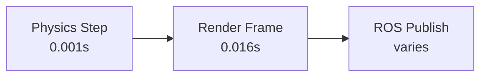

# Physics Simulation in Gazebo

Gazebo uses physics engines to simulate rigid body dynamics, collisions, and contact forces. Understanding these systems is essential for creating realistic robot simulations.

## Physics Engines

Gazebo supports multiple physics engines:

| Engine | Strengths | Best For |
|--------|-----------|----------|
| **ODE** (default) | Stable, well-tested | General robotics |
| **Bullet** | Soft body, GPU acceleration | Manipulation |
| **DART** | Accurate joint dynamics | Articulated robots |
| **TPE** | Simple, fast | Large-scale swarms |

### Configuring the Physics Engine

```xml
<!-- In your SDF world file -->
<physics type="ode">
  <max_step_size>0.001</max_step_size>
  <real_time_factor>1.0</real_time_factor>
  <real_time_update_rate>1000</real_time_update_rate>
  <ode>
    <solver>
      <type>quick</type>
      <iters>50</iters>
      <sor>1.3</sor>
    </solver>
    <constraints>
      <cfm>0.0</cfm>
      <erp>0.2</erp>
      <contact_max_correcting_vel>100.0</contact_max_correcting_vel>
      <contact_surface_layer>0.001</contact_surface_layer>
    </constraints>
  </ode>
</physics>
```

## Simulation Time

### Step Size and Real-Time Factor



| Parameter | Value | Effect |
|-----------|-------|--------|
| `max_step_size` | 0.001 | Physics accuracy (smaller = more accurate, slower) |
| `real_time_factor` | 1.0 | 1.0 = real-time, 2.0 = 2× speed, 0.5 = half speed |
| `real_time_update_rate` | 1000 | Steps per second attempted |

### Running Faster Than Real-Time

For reinforcement learning, you often want simulation to run as fast as possible:

```xml
<physics type="ode">
  <max_step_size>0.002</max_step_size>
  <real_time_factor>0</real_time_factor>  <!-- As fast as possible -->
  <real_time_update_rate>0</real_time_update_rate>
</physics>
```

## Collision Detection

### Collision Geometry

Use simplified shapes for collision (not visual meshes):

```xml
<link name="robot_body">
  <visual>
    <!-- Detailed mesh for appearance -->
    <geometry>
      <mesh><uri>model://robot/meshes/body_detailed.stl</uri></mesh>
    </geometry>
  </visual>
  <collision>
    <!-- Simple box for physics -->
    <geometry>
      <box><size>0.4 0.3 0.5</size></box>
    </geometry>
  </collision>
</link>
```

### Contact Properties

```xml
<collision name="wheel_collision">
  <geometry>
    <cylinder><radius>0.05</radius><length>0.02</length></cylinder>
  </geometry>
  <surface>
    <friction>
      <ode>
        <mu>1.0</mu>      <!-- Primary friction coefficient -->
        <mu2>0.5</mu2>    <!-- Secondary friction coefficient -->
        <slip1>0.0</slip1>
        <slip2>0.0</slip2>
      </ode>
    </friction>
    <contact>
      <ode>
        <kp>1e6</kp>       <!-- Contact stiffness -->
        <kd>100</kd>        <!-- Contact damping -->
        <max_vel>0.1</max_vel>
        <min_depth>0.001</min_depth>
      </ode>
    </contact>
    <bounce>
      <restitution_coefficient>0.0</restitution_coefficient>
      <threshold>0.01</threshold>
    </bounce>
  </surface>
</collision>
```

## Gravity and Environment

```xml
<world name="default">
  <!-- Earth gravity -->
  <gravity>0 0 -9.81</gravity>

  <!-- Atmosphere for drag effects -->
  <atmosphere type="adiabatic">
    <temperature>288.15</temperature>
    <pressure>101325</pressure>
  </atmosphere>

  <!-- Wind (affects light objects) -->
  <wind>
    <linear_velocity>0.5 0 0</linear_velocity>
  </wind>
</world>
```

## Joint Dynamics

### Damping and Friction

```xml
<joint name="shoulder" type="revolute">
  <parent>torso</parent>
  <child>upper_arm</child>
  <axis>
    <xyz>0 1 0</xyz>
    <limit>
      <lower>-1.57</lower>
      <upper>1.57</upper>
      <effort>100</effort>
      <velocity>2.0</velocity>
    </limit>
    <dynamics>
      <damping>0.5</damping>     <!-- Viscous friction (Nm·s/rad) -->
      <friction>0.1</friction>    <!-- Static friction (Nm) -->
      <spring_stiffness>0.0</spring_stiffness>
      <spring_reference>0.0</spring_reference>
    </dynamics>
  </axis>
</joint>
```

### PID Controllers

```python
# Controlling joints with effort commands
from std_msgs.msg import Float64

class JointController(Node):
    def __init__(self):
        super().__init__('joint_controller')
        self.publisher = self.create_publisher(
            Float64, '/shoulder_position_controller/command', 10)

    def set_position(self, angle):
        msg = Float64()
        msg.data = angle
        self.publisher.publish(msg)
```

## Debugging Physics

### Common Issues

| Problem | Cause | Fix |
|---------|-------|-----|
| Robot flies away | Missing/wrong inertia | Check inertial properties |
| Robot vibrates | Step size too large | Reduce `max_step_size` |
| Robot sinks through floor | Missing collision | Add collision geometry |
| Joints are loose | No damping | Add `dynamics` to joints |
| Simulation is slow | Too many polygons in collision | Simplify collision geometry |

### Visualization Tools

```bash
# View collision geometry in Gazebo
# Menu > View > Collisions

# View center of mass
# Menu > View > Center of Mass

# View joint axes
# Menu > View > Joints

# View contact points
# Menu > View > Contacts
```

## Performance Optimization

| Technique | Impact | Trade-off |
|-----------|--------|-----------|
| Increase step size | 2-5× faster | Less accurate |
| Simplify collision meshes | 2-10× faster | Less precise contact |
| Disable shadows | 1.5× faster | Less realistic visuals |
| Reduce sensor rates | 1.5× faster | Less data |
| Use headless mode | 3× faster | No visualization |

```bash
# Run Gazebo headless (no GUI) for training
gz sim -s world.sdf  # Server only, no GUI
```

## Next Steps

Continue to [Sensors in Simulation](./sensors.md) to learn how to simulate cameras, LiDAR, IMU, and other sensors in Gazebo.
