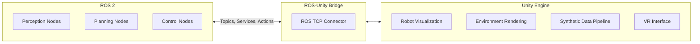
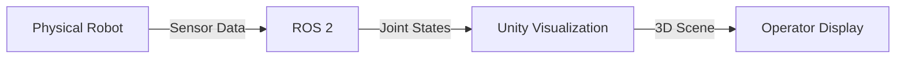
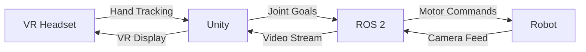
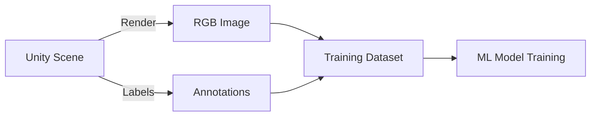

**Estimated Time**: 35 minutes

:::info[What You'll Learn]
- Understand the ROS-Unity integration architecture
- Set up bidirectional communication between ROS 2 and Unity
- Generate synthetic training data using Unity
- Compare Unity and Gazebo simulation capabilities
:::

:::note[Prerequisites]
Before starting this chapter, complete:
- [Gazebo Setup](./gazebo-setup.md)
:::

Unity is a powerful rendering engine that complements Gazebo's physics simulation. The ROS-Unity bridge enables high-fidelity visualization, synthetic data generation, and human-robot interaction scenarios.

## Why Unity + ROS 2?

| Capability | Gazebo | Unity | Combined |
|-----------|--------|-------|----------|
| Physics simulation | Excellent | Good | Gazebo |
| Visual fidelity | Basic | Photorealistic | Unity |
| Synthetic data | Limited | Excellent | Unity |
| HRI simulation | None | Rich | Unity |
| ROS integration | Native | Via bridge | Both |
| VR/AR support | None | Full | Unity |

## Architecture



## ROS TCP Connector

The ROS TCP Connector is the primary bridge between ROS 2 and Unity.

### Unity Side Setup

```csharp title="RobotController.cs" showLineNumbers
using Unity.Robotics.ROSTCPConnector;
using RosMessageTypes.Geometry;

public class RobotController : MonoBehaviour
{
    ROSConnection ros;

    void Start()
    {
        // highlight-next-line
        ros = ROSConnection.GetOrCreateInstance();
        ros.Subscribe<TwistMsg>("/cmd_vel", OnVelocityReceived);
    }

    void OnVelocityReceived(TwistMsg msg)
    {
        float linearX = (float)msg.linear.x;
        float angularZ = (float)msg.angular.z;
        // Apply to Unity robot model
        transform.Translate(Vector3.forward * linearX * Time.deltaTime);
        transform.Rotate(Vector3.up * angularZ * Mathf.Rad2Deg * Time.deltaTime);
    }
}
```

### ROS 2 Side

```bash title="Launch ROS TCP endpoint"
# Install ROS TCP Endpoint
sudo apt install ros-jazzy-ros-tcp-endpoint

# Launch the endpoint
# highlight-next-line
ros2 launch ros_tcp_endpoint endpoint.launch.py
```

### Publishing from Unity to ROS

```csharp title="CameraPublisher.cs" showLineNumbers
using Unity.Robotics.ROSTCPConnector;
using RosMessageTypes.Sensor;

public class CameraPublisher : MonoBehaviour
{
    ROSConnection ros;
    Camera sensorCamera;
    string topicName = "/unity/camera/image";

    void Start()
    {
        ros = ROSConnection.GetOrCreateInstance();
        // highlight-next-line
        ros.RegisterPublisher<ImageMsg>(topicName);
        sensorCamera = GetComponent<Camera>();
    }

    void PublishImage()
    {
        RenderTexture rt = sensorCamera.targetTexture;
        Texture2D tex = new Texture2D(rt.width, rt.height, TextureFormat.RGB24, false);
        RenderTexture.active = rt;
        tex.ReadPixels(new Rect(0, 0, rt.width, rt.height), 0, 0);
        tex.Apply();

        ImageMsg imageMsg = new ImageMsg();
        imageMsg.width = (uint)tex.width;
        imageMsg.height = (uint)tex.height;
        imageMsg.encoding = "rgb8";
        imageMsg.data = tex.GetRawTextureData();
        ros.Publish(topicName, imageMsg);
    }
}
```

## Synthetic Data Generation

Unity's rendering pipeline enables high-quality synthetic data for training perception models.

### Domain Randomization

Vary visual properties to improve model robustness:

```csharp title="DomainRandomizer.cs" showLineNumbers
public class DomainRandomizer : MonoBehaviour
{
    public Light[] lights;
    public Material[] materials;
    public GameObject[] distractors;

    public void Randomize()
    {
        // highlight-next-line
        // Randomize lighting
        foreach (var light in lights)
        {
            light.intensity = Random.Range(0.5f, 2.0f);
            light.color = Random.ColorHSV(0f, 1f, 0.5f, 1f, 0.8f, 1f);
        }

        // Randomize textures
        foreach (var mat in materials)
        {
            mat.color = Random.ColorHSV();
        }

        // Randomize distractor objects
        foreach (var obj in distractors)
        {
            obj.transform.position = new Vector3(
                Random.Range(-2f, 2f),
                Random.Range(0f, 1f),
                Random.Range(-2f, 2f));
        }
    }
}
```

:::info[Key Insight]
Domain randomization trains perception models on varied visual conditions (lighting, textures, object positions) so they generalize better to real-world environments where conditions are never identical to training data.
:::

### Perception Package

Unity's Perception package generates labeled datasets:

- **Bounding boxes**: 2D/3D object detection labels
- **Semantic segmentation**: Per-pixel class labels
- **Instance segmentation**: Per-pixel object instance IDs
- **Keypoints**: Object keypoint annotations
- **Depth**: Per-pixel depth values

## Use Cases

### 1. Digital Twin Visualization



### 2. VR Teleoperation



### 3. Training Data Pipeline



## Gazebo vs Unity: When to Use Each

| Scenario | Recommended Tool |
|----------|-----------------|
| Physics-accurate simulation | Gazebo |
| Photorealistic rendering | Unity |
| RL training (fast iteration) | Gazebo or Isaac Sim |
| Synthetic data generation | Unity Perception |
| VR/AR interfaces | Unity |
| ROS 2 native development | Gazebo |
| Multi-robot swarm simulation | Gazebo |
| Human-robot interaction | Unity |

## Limitations

- **Network latency**: ROS-Unity bridge adds ~1-5ms latency
- **Physics mismatch**: Unity physics differs from Gazebo; don't use both simultaneously for the same robot
- **Message types**: Not all ROS 2 message types are supported out of the box
- **Build complexity**: Requires managing both ROS 2 and Unity projects

:::warning[Common Mistake]
Do not run physics simulation in both Gazebo and Unity simultaneously for the same robot — their physics engines will produce conflicting results. Use Gazebo for physics and Unity for visualization/data generation.
:::

:::tip[Key Takeaways]
- Unity complements Gazebo by providing photorealistic rendering and synthetic data generation
- The ROS TCP Connector bridges bidirectional communication between ROS 2 and Unity
- Domain randomization in Unity improves perception model robustness for sim-to-real transfer
- Use Gazebo for physics-accurate simulation and Unity for visualization, VR, and training data
- The Perception package automates labeled dataset generation for object detection and segmentation
:::

## Next Steps

- [Module 2 Exercises](./exercises.md) — practice simulation integration hands-on
