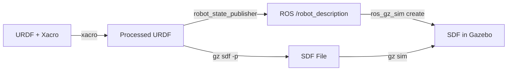

# URDF to SDF Conversion

URDF (Unified Robot Description Format) is the ROS standard for robot models, while SDF (Simulation Description Format) is Gazebo's native format with richer simulation features. Understanding both formats and how to convert between them is essential for robot simulation.

## Format Comparison

| Feature | URDF | SDF |
|---------|------|-----|
| **Kinematic chains** | Single parent tree | Multiple roots, closed loops |
| **World description** | Not supported | Full world, models, lights |
| **Sensor plugins** | Via Gazebo extensions | Native support |
| **Material/textures** | Basic color | PBR materials |
| **Physics properties** | Basic inertia | Full physics engine config |
| **Use case** | ROS robot description | Gazebo simulation |

## SDF Structure

```xml
<?xml version="1.0"?>
<sdf version="1.9">
  <world name="default">
    <!-- World properties -->
    <physics type="ode">
      <max_step_size>0.001</max_step_size>
      <real_time_factor>1.0</real_time_factor>
    </physics>

    <!-- Ground plane -->
    <include>
      <uri>model://ground_plane</uri>
    </include>

    <!-- Sun light -->
    <include>
      <uri>model://sun</uri>
    </include>

    <!-- Your robot -->
    <include>
      <uri>model://my_robot</uri>
      <pose>0 0 0.5 0 0 0</pose>
    </include>
  </world>
</sdf>
```

## Automatic Conversion

Gazebo automatically converts URDF to SDF when loading models through ROS.

```python
# launch/gazebo.launch.py
from launch import LaunchDescription
from launch.actions import IncludeLaunchDescription
from launch.launch_description_sources import PythonLaunchDescriptionSource
from launch_ros.actions import Node
from launch.substitutions import Command
import os

def generate_launch_description():
    urdf_file = os.path.join(
        get_package_share_directory('my_robot_description'),
        'urdf', 'my_robot.urdf.xacro')

    return LaunchDescription([
        # Robot state publisher (publishes URDF to /robot_description)
        Node(
            package='robot_state_publisher',
            executable='robot_state_publisher',
            parameters=[{
                'robot_description': Command(['xacro ', urdf_file])
            }]),

        # Spawn robot in Gazebo
        Node(
            package='ros_gz_sim',
            executable='create',
            arguments=[
                '-topic', '/robot_description',
                '-name', 'my_robot',
                '-z', '0.5'
            ]),
    ])
```

### Manual Conversion

```bash
# Convert URDF to SDF manually
gz sdf -p my_robot.urdf > my_robot.sdf

# Validate SDF
gz sdf -k my_robot.sdf
```

## Adding Gazebo Properties to URDF

Use the `<gazebo>` extension tags in URDF for simulation-specific properties.

### Surface Properties

```xml
<!-- Friction and contact properties -->
<gazebo reference="wheel_link">
  <mu1>1.0</mu1>
  <mu2>1.0</mu2>
  <material>Gazebo/Black</material>
  <kp>1000000.0</kp>
  <kd>100.0</kd>
</gazebo>
```

### Sensor Plugins

```xml
<!-- Camera sensor -->
<gazebo reference="camera_link">
  <sensor name="camera" type="camera">
    <always_on>true</always_on>
    <update_rate>30.0</update_rate>
    <camera>
      <horizontal_fov>1.047</horizontal_fov>
      <image>
        <width>640</width>
        <height>480</height>
        <format>R8G8B8</format>
      </image>
      <clip>
        <near>0.1</near>
        <far>100.0</far>
      </clip>
    </camera>
    <plugin name="camera_controller"
            filename="libgazebo_ros_camera.so">
      <ros>
        <remapping>~/image_raw:=/camera/image_raw</remapping>
      </ros>
      <camera_name>camera</camera_name>
      <frame_name>camera_link</frame_name>
    </plugin>
  </sensor>
</gazebo>

<!-- LiDAR sensor -->
<gazebo reference="lidar_link">
  <sensor name="lidar" type="ray">
    <always_on>true</always_on>
    <update_rate>10.0</update_rate>
    <ray>
      <scan>
        <horizontal>
          <samples>360</samples>
          <resolution>1</resolution>
          <min_angle>-3.14159</min_angle>
          <max_angle>3.14159</max_angle>
        </horizontal>
      </scan>
      <range>
        <min>0.12</min>
        <max>12.0</max>
        <resolution>0.01</resolution>
      </range>
    </ray>
    <plugin name="lidar_controller"
            filename="libgazebo_ros_ray_sensor.so">
      <ros>
        <remapping>~/out:=/scan</remapping>
      </ros>
      <output_type>sensor_msgs/LaserScan</output_type>
      <frame_name>lidar_link</frame_name>
    </plugin>
  </sensor>
</gazebo>
```

### Differential Drive Plugin

```xml
<gazebo>
  <plugin name="diff_drive"
          filename="libgazebo_ros_diff_drive.so">
    <ros>
      <remapping>cmd_vel:=/cmd_vel</remapping>
      <remapping>odom:=/odom</remapping>
    </ros>
    <left_joint>left_wheel_joint</left_joint>
    <right_joint>right_wheel_joint</right_joint>
    <wheel_separation>0.3</wheel_separation>
    <wheel_diameter>0.1</wheel_diameter>
    <max_wheel_torque>20</max_wheel_torque>
    <publish_odom>true</publish_odom>
    <publish_odom_tf>true</publish_odom_tf>
    <odometry_frame>odom</odometry_frame>
    <robot_base_frame>base_link</robot_base_frame>
  </plugin>
</gazebo>
```

## Common Conversion Issues

### Missing Inertia

SDF requires inertial properties for all non-fixed links.

```xml
<!-- Fix: Add inertial to every non-fixed link -->
<link name="sensor_link">
  <inertial>
    <mass value="0.1"/>
    <inertia ixx="0.0001" ixy="0" ixz="0"
             iyy="0.0001" iyz="0" izz="0.0001"/>
  </inertial>
</link>
```

### Collision Without Visual

Gazebo requires collision geometry for physics interaction.

```xml
<!-- Fix: Always include collision geometry -->
<link name="my_link">
  <visual><!-- ... --></visual>
  <collision>
    <geometry>
      <box size="0.1 0.1 0.1"/>
    </geometry>
  </collision>
</link>
```

### Mesh Path Resolution

```xml
<!-- URDF uses package:// URI -->
<mesh filename="package://my_robot/meshes/body.stl"/>

<!-- SDF uses model:// URI -->
<mesh><uri>model://my_robot/meshes/body.stl</uri></mesh>
```

## Workflow Summary



## Next Steps

Continue to [Physics Simulation](./physics-sim.md) to learn how Gazebo's physics engines simulate real-world dynamics.
