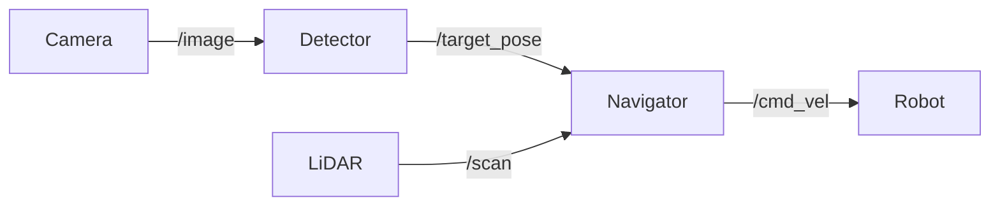

**Estimated Time**: 120 minutes

:::info[What You'll Learn]
- Implement a complete perception pipeline with object detection
- Configure and test Nav2 navigation in simulation
- Set up and monitor an RL training run
- Apply domain randomization for sim-to-real robustness
:::

:::note[Prerequisites]
- [Isaac Sim Setup](./isaac-sim-setup.md) -- NVIDIA Isaac Sim installed and configured
- [Perception](./perception.md) -- GPU-accelerated perception pipelines
- [Navigation](./navigation.md) -- Nav2 configuration and path planning
- [Reinforcement Learning](./reinforcement-learning.md) -- RL training fundamentals
:::

These exercises build skills with GPU-accelerated robotics using NVIDIA Isaac.

## Exercise 1: Perception Pipeline

**Objective**: Build a perception node that detects and localizes objects in the robot's camera feed.

### Tasks

1. Create a ROS 2 node that subscribes to a camera image topic
2. Implement simple color-based object detection (detect red objects)
3. Publish bounding boxes as `Detection2DArray` messages
4. Display results in rviz2

### Starter Code

```python title="color_detector_starter" showLineNumbers
import rclpy
from rclpy.node import Node
from sensor_msgs.msg import Image
from vision_msgs.msg import Detection2DArray, Detection2D, ObjectHypothesisWithPose
from cv_bridge import CvBridge
import cv2
import numpy as np

class ColorDetector(Node):
    def __init__(self):
        super().__init__('color_detector')
        self.bridge = CvBridge()
        # highlight-next-line
        self.subscription = self.create_subscription(
            Image, '/camera/image_raw', self.image_callback, 10)
        self.detection_pub = self.create_publisher(
            Detection2DArray, '/detections', 10)
        self.debug_pub = self.create_publisher(
            Image, '/debug/image', 10)

    def image_callback(self, msg):
        cv_image = self.bridge.imgmsg_to_cv2(msg, 'bgr8')
        # highlight-next-line
        # TODO: Convert to HSV
        # TODO: Mask for red color range
        # TODO: Find contours
        # TODO: Create Detection2D for each contour > min_area
        # TODO: Publish detections
        # TODO: Draw bounding boxes on debug image
        pass
```

:::tip[HSV Color Range for Red]
Red wraps around the HSV hue wheel, so you need two ranges: (0-10) and (170-180) for the hue channel. Use `cv2.inRange()` twice and combine the masks with bitwise OR. Typical saturation and value thresholds are 100-255 for each.
:::

### Verification Checklist

- [ ] Node starts and subscribes to camera topic
- [ ] Red objects are detected in the camera feed
- [ ] Bounding boxes published on `/detections`
- [ ] Debug image shows drawn bounding boxes

---

## Exercise 2: Nav2 Navigation

**Objective**: Configure Nav2 and navigate a robot through a series of waypoints.

### Tasks

1. Create a Nav2 parameter file for a differential drive robot
2. Launch Nav2 with a pre-built map
3. Send the robot to 3 waypoints programmatically

```python title="nav2_waypoint_exercise" showLineNumbers
from nav2_simple_commander.robot_navigator import BasicNavigator
from geometry_msgs.msg import PoseStamped
import rclpy

def create_pose(x, y, yaw):
    pose = PoseStamped()
    pose.header.frame_id = 'map'
    pose.pose.position.x = x
    pose.pose.position.y = y
    pose.pose.orientation.z = math.sin(yaw / 2.0)
    pose.pose.orientation.w = math.cos(yaw / 2.0)
    return pose

def main():
    rclpy.init()
    # highlight-next-line
    navigator = BasicNavigator()

    # Wait for Nav2 to be ready
    navigator.waitUntilNav2Active()

    # Define waypoints
    waypoints = [
        create_pose(2.0, 0.0, 0.0),
        create_pose(2.0, 2.0, 1.57),
        create_pose(0.0, 2.0, 3.14),
    ]

    # TODO: Send waypoints to navigator
    # TODO: Monitor progress and log distance remaining
    # TODO: Handle navigation failures

    rclpy.shutdown()
```

### Verification Checklist

- [ ] Nav2 launches without errors
- [ ] Robot navigates to the first waypoint
- [ ] Robot completes all 3 waypoints
- [ ] Robot avoids obstacles along the path
- [ ] Navigation state logged to console

---

## Exercise 3: RL Environment Setup

**Objective**: Define a simple RL task for training a robot to reach a target position.

### Specification

- **Observation**: Robot position (x, y), target position (x, y), distance to target
- **Action**: Velocity command (linear_x, angular_z)
- **Reward**: -distance_to_target (closer = better), +10 for reaching target
- **Termination**: Target reached (distance < 0.2m) or timeout (200 steps)

### Starter Code

```python title="reach_target_rl_environment" showLineNumbers
import numpy as np

class ReachTargetEnv:
    """Simple reach-target environment for RL training."""

    def __init__(self, num_envs=64):
        self.num_envs = num_envs
        self.max_steps = 200
        # highlight-next-line
        self.target_threshold = 0.2

    def reset(self):
        # TODO: Random robot positions near origin
        # TODO: Random target positions within 3m
        # TODO: Reset step counter
        # TODO: Return initial observations
        pass

    def step(self, actions):
        # TODO: Apply velocity actions (clip to [-1, 1])
        # TODO: Update robot positions
        # TODO: Compute distances to targets
        # highlight-next-line
        # TODO: Compute rewards
        # TODO: Check termination conditions
        # TODO: Return (obs, rewards, dones, infos)
        pass

    def _get_obs(self):
        # TODO: Return [robot_x, robot_y, target_x, target_y, distance]
        pass
```

### Verification Checklist

- [ ] Environment resets correctly
- [ ] Actions move the robot
- [ ] Reward decreases as robot approaches target
- [ ] Episode terminates when target reached
- [ ] Episode terminates on timeout

---

## Exercise 4: Domain Randomization

**Objective**: Add domain randomization to the reach-target environment.

### Tasks

1. Randomize the following per episode:
   - Robot initial position (+/-2m)
   - Target position (1-4m from robot)
   - Action noise (Gaussian, sigma=0.05)
   - Observation noise (Gaussian, sigma=0.01)
   - Simulated "friction" (action scaling: 0.7-1.3)

2. Train two policies:
   - One without randomization
   - One with randomization

3. Evaluate both on a set of 100 fixed test scenarios with moderate noise

:::warning[Fair Evaluation]
When comparing policies trained with and without domain randomization, always evaluate both on the same set of fixed test scenarios with identical noise levels. Using different test conditions will produce misleading results about the effectiveness of randomization.
:::

### Verification Checklist

- [ ] Randomization parameters change each episode
- [ ] Training converges for both policies
- [ ] Randomized policy has higher success rate on noisy test scenarios
- [ ] Results documented with success rates

---

## Exercise 5: Integration Challenge

**Objective**: Combine perception, navigation, and a simple policy into a complete system.

### System Architecture



### Specification

1. Detector node finds a colored marker in the camera image and estimates its position
2. Navigator node receives the marker position and navigates toward it
3. Robot stops within 0.5m of the marker

### Verification Checklist

- [ ] Detector identifies the marker in camera feed
- [ ] Navigator receives target position
- [ ] Robot moves toward the marker
- [ ] Robot stops within 0.5m of the marker
- [ ] System handles marker not visible (rotates to search)

---

## Summary

| Exercise | Skills |
|----------|--------|
| 1. Perception | Image processing, ROS 2 vision messages |
| 2. Navigation | Nav2 configuration, waypoint following |
| 3. RL Setup | Environment design, reward shaping |
| 4. Domain Randomization | Robustness, evaluation methodology |
| 5. Integration | Full system combining perception + navigation |

:::tip[Key Takeaways]
- Color-based detection in HSV space is a practical starting point before moving to neural network detectors
- Nav2's BasicNavigator API simplifies sending goals and monitoring progress programmatically
- RL environment design requires careful reward shaping to guide the agent toward desired behavior
- Domain randomization consistently improves policy robustness on out-of-distribution test scenarios
- System integration exercises reveal interface issues that are invisible when testing components in isolation
:::

## Next Steps

With Module 3 complete, continue to [Module 4: VLA & Capstone](../module-4/index.md) to integrate vision-language-action models and build the capstone project.
