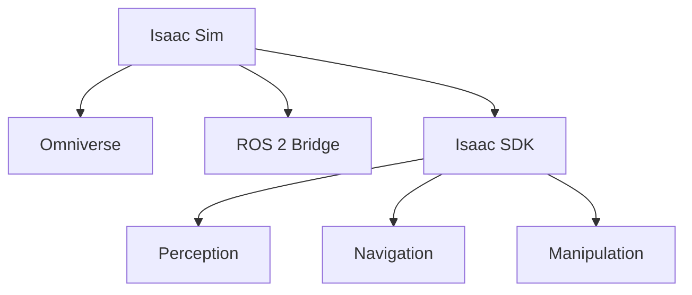

**Estimated Time**: 30 minutes

:::info[What You'll Learn]
- Set up and navigate NVIDIA Isaac Sim
- Implement AI-powered perception pipelines with GPU acceleration
- Build autonomous navigation systems using Nav2
- Train robots using reinforcement learning in parallel environments
- Transfer learned policies from simulation to reality
:::

:::note[Prerequisites]
No prerequisites — you can start here.
:::

**Weeks 8-10** | Prerequisites: Module 2 complete

## Module Structure

| Chapter | Topic | Time |
|---------|-------|------|
| 3.1 | Isaac Sim Setup | 90 min |
| 3.2 | Perception | 90 min |
| 3.3 | Navigation | 90 min |
| 3.4 | Reinforcement Learning | 120 min |
| 3.5 | Sim-to-Real Transfer | 60 min |
| 3.6 | Exercises | 120 min |

## The Isaac Ecosystem

:::tip[Why Isaac Sim?]
NVIDIA Isaac Sim provides GPU-accelerated physics simulation with photorealistic rendering, enabling you to train and test robot AI at thousands of times real-world speed. This massively reduces development time and cost compared to physical hardware testing alone.
:::

:::tip[Key Takeaways]
- Isaac Sim is built on NVIDIA Omniverse with RTX rendering and PhysX 5 physics
- The platform integrates seamlessly with ROS 2 via built-in bridge nodes
- GPU acceleration enables thousands of parallel simulation environments for RL training
- The Isaac SDK provides ready-made modules for perception, navigation, and manipulation
- Sim-to-real transfer techniques allow policies trained in simulation to work on real hardware
:::

## Next Steps

Begin with [Isaac Sim Setup](./isaac-sim-setup.md) to enter the world of GPU-accelerated robotics.
