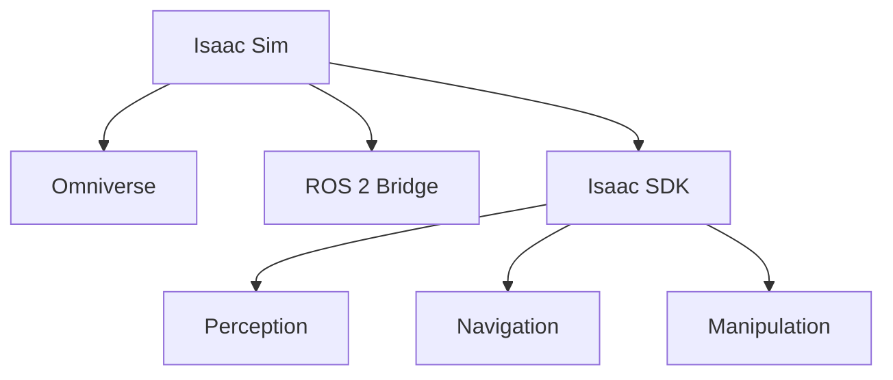

# Module 3: NVIDIA Isaac Platform

**Weeks 8-10** | Prerequisites: Module 2 complete

## Learning Objectives

By the end of this module, you will be able to:

- Set up and navigate Isaac Sim
- Implement AI-powered perception pipelines
- Build autonomous navigation systems
- Train robots using reinforcement learning
- Transfer learned policies from simulation to reality

## Module Structure

| Chapter | Topic | Time |
|---------|-------|------|
| 3.1 | Isaac Sim Setup | 90 min |
| 3.2 | Perception | 90 min |
| 3.3 | Navigation | 90 min |
| 3.4 | Reinforcement Learning | 120 min |
| 3.5 | Sim-to-Real Transfer | 60 min |
| 3.6 | Exercises | 120 min |

## The Isaac Ecosystem

Begin with [Isaac Sim Setup](./isaac-sim-setup) to enter the world of GPU-accelerated robotics.
