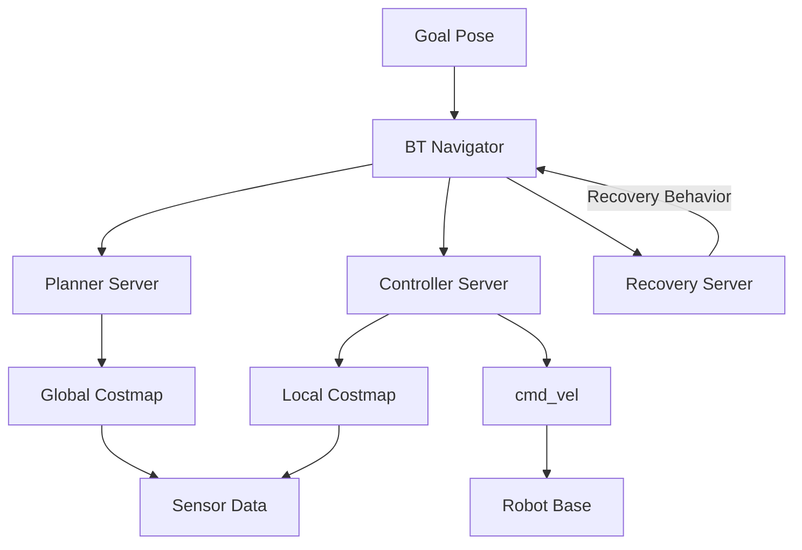
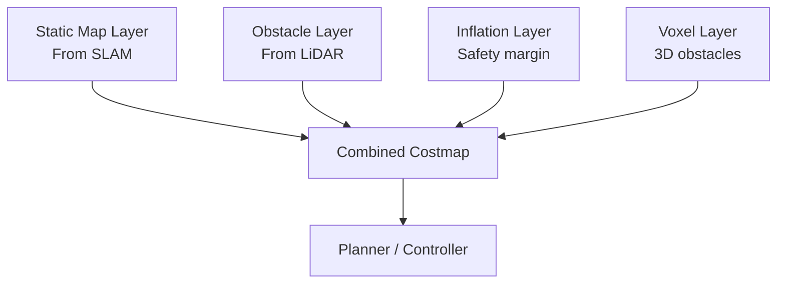
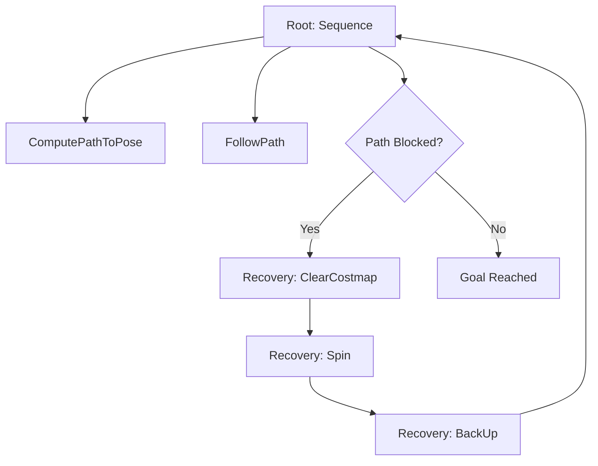

**Estimated Time**: 50 minutes

:::info[What You'll Learn]
- Configure Nav2 for autonomous robot navigation
- Understand costmap layers and obstacle avoidance
- Implement path planning with different planner algorithms
- Use behavior trees for complex navigation scenarios
:::

:::note[Prerequisites]
- [Isaac Sim Setup](./isaac-sim-setup.md) -- NVIDIA Isaac Sim installed and configured
- [Perception](./perception.md) -- Understanding of perception pipelines for sensor data
:::

Nav2 (Navigation 2) is the ROS 2 navigation framework that enables autonomous robot movement. It handles path planning, obstacle avoidance, and recovery behaviors.

## Nav2 Architecture



## Setting Up Nav2

### Installation

```bash title="install_nav2_packages"
# Install Nav2 packages
sudo apt install ros-jazzy-navigation2 ros-jazzy-nav2-bringup
```

### Configuration

```yaml title="nav2_params_yaml" showLineNumbers
# config/nav2_params.yaml
bt_navigator:
  ros__parameters:
    global_frame: map
    robot_base_frame: base_link
    odom_topic: /odom
    # highlight-next-line
    default_bt_xml_filename: "navigate_w_replanning_and_recovery.xml"
    plugin_lib_names:
      - nav2_compute_path_to_pose_action_bt_node
      - nav2_follow_path_action_bt_node
      - nav2_back_up_action_bt_node
      - nav2_spin_action_bt_node
      - nav2_wait_action_bt_node
      - nav2_clear_costmap_service_bt_node

controller_server:
  ros__parameters:
    controller_frequency: 20.0
    min_x_velocity_threshold: 0.001
    min_y_velocity_threshold: 0.5
    min_theta_velocity_threshold: 0.001
    FollowPath:
      # highlight-next-line
      plugin: "dwb_core::DWBLocalPlanner"
      max_vel_x: 0.5
      min_vel_x: -0.1
      max_vel_theta: 1.0
      min_speed_xy: 0.0
      max_speed_xy: 0.5
      acc_lim_x: 2.5
      decel_lim_x: -2.5
      acc_lim_theta: 3.2
      decel_lim_theta: -3.2

planner_server:
  ros__parameters:
    planner_plugins: ["GridBased"]
    GridBased:
      plugin: "nav2_navfn_planner/NavfnPlanner"
      tolerance: 0.5
      use_astar: false
      allow_unknown: true
```

### Launch Nav2

```python title="navigation_launch_file" showLineNumbers
# launch/navigation.launch.py
from launch import LaunchDescription
from launch.actions import IncludeLaunchDescription
from launch.launch_description_sources import PythonLaunchDescriptionSource
from ament_index_python.packages import get_package_share_directory
import os

def generate_launch_description():
    nav2_bringup_dir = get_package_share_directory('nav2_bringup')
    # highlight-next-line
    params_file = os.path.join(
        get_package_share_directory('my_robot_nav'),
        'config', 'nav2_params.yaml')

    return LaunchDescription([
        IncludeLaunchDescription(
            PythonLaunchDescriptionSource(
                os.path.join(nav2_bringup_dir, 'launch',
                            'navigation_launch.py')),
            launch_arguments={
                'params_file': params_file,
                'use_sim_time': 'true'
            }.items()),
    ])
```

## Costmaps

Costmaps represent the environment as a grid where each cell has a cost value indicating traversability.

### Costmap Layers



| Layer | Source | Update Rate | Purpose |
|-------|--------|-------------|---------|
| Static | SLAM map | Once | Known walls/furniture |
| Obstacle | LiDAR, depth | Real-time | Dynamic obstacles |
| Inflation | Computed | Real-time | Safety buffer around obstacles |
| Voxel | 3D sensors | Real-time | 3D obstacle detection |

### Costmap Configuration

```yaml title="costmap_configuration" showLineNumbers
# Global costmap (for path planning)
global_costmap:
  ros__parameters:
    update_frequency: 1.0
    publish_frequency: 1.0
    global_frame: map
    robot_base_frame: base_link
    resolution: 0.05
    plugins: ["static_layer", "obstacle_layer", "inflation_layer"]
    static_layer:
      plugin: "nav2_costmap_2d::StaticLayer"
      map_subscribe_transient_local: true
    obstacle_layer:
      plugin: "nav2_costmap_2d::ObstacleLayer"
      observation_sources: scan
      scan:
        topic: /scan
        max_obstacle_height: 2.0
        clearing: true
        marking: true
    # highlight-next-line
    inflation_layer:
      plugin: "nav2_costmap_2d::InflationLayer"
      cost_scaling_factor: 3.0
      inflation_radius: 0.55

# Local costmap (for obstacle avoidance)
local_costmap:
  ros__parameters:
    update_frequency: 5.0
    publish_frequency: 2.0
    global_frame: odom
    robot_base_frame: base_link
    rolling_window: true
    width: 3
    height: 3
    resolution: 0.05
    plugins: ["obstacle_layer", "inflation_layer"]
```

:::info[Inflation Radius]
The `inflation_radius` parameter controls the safety buffer around obstacles. A larger value keeps the robot farther from walls and obstacles but may make narrow passages impassable. Start with your robot's radius plus 5-10 cm and adjust based on testing.
:::

## Path Planners

### Available Planners

| Planner | Algorithm | Best For |
|---------|-----------|----------|
| NavFn | Dijkstra / A* | General indoor navigation |
| Theta* | Any-angle paths | Smooth paths in open spaces |
| SmacPlanner2D | State lattice | Constrained environments |
| SmacHybridA* | Hybrid A* | Car-like robots (Ackermann) |

### Sending Navigation Goals

```python title="navigation_goal_client" showLineNumbers
from geometry_msgs.msg import PoseStamped
from nav2_simple_commander.robot_navigator import BasicNavigator

class NavigationClient(Node):
    def __init__(self):
        super().__init__('nav_client')
        # highlight-next-line
        self.navigator = BasicNavigator()

    def go_to_pose(self, x, y, yaw):
        """Send robot to a specific pose."""
        goal = PoseStamped()
        goal.header.frame_id = 'map'
        goal.header.stamp = self.get_clock().now().to_msg()
        goal.pose.position.x = x
        goal.pose.position.y = y
        goal.pose.orientation.z = math.sin(yaw / 2.0)
        goal.pose.orientation.w = math.cos(yaw / 2.0)

        # highlight-next-line
        self.navigator.goToPose(goal)

        while not self.navigator.isTaskComplete():
            feedback = self.navigator.getFeedback()
            if feedback:
                distance = feedback.distance_remaining
                self.get_logger().info(
                    f'Distance remaining: {distance:.2f}m')

        result = self.navigator.getResult()
        self.get_logger().info(f'Navigation result: {result}')
```

### Waypoint Following

```python title="waypoint_following" showLineNumbers
def follow_waypoints(self, waypoints):
    """Navigate through a sequence of waypoints."""
    goals = []
    for x, y, yaw in waypoints:
        goal = PoseStamped()
        goal.header.frame_id = 'map'
        goal.header.stamp = self.get_clock().now().to_msg()
        goal.pose.position.x = x
        goal.pose.position.y = y
        goal.pose.orientation.z = math.sin(yaw / 2.0)
        goal.pose.orientation.w = math.cos(yaw / 2.0)
        goals.append(goal)

    # highlight-next-line
    self.navigator.followWaypoints(goals)
```

## Behavior Trees

Nav2 uses behavior trees to manage complex navigation logic.



### Custom Behavior Tree

```xml title="navigate_with_recovery_bt" showLineNumbers
<!-- bt/navigate_with_recovery.xml -->
<root main_tree_to_execute="MainTree">
  <BehaviorTree ID="MainTree">
    <!-- highlight-next-line -->
    <RecoveryNode number_of_retries="3">
      <PipelineSequence>
        <ComputePathToPose goal="{goal}"
                           path="{path}"
                           planner_id="GridBased"/>
        <FollowPath path="{path}"
                    controller_id="FollowPath"/>
      </PipelineSequence>
      <ReactiveFallback>
        <GoalUpdated/>
        <SequenceStar>
          <ClearEntireCostmap name="ClearGlobalCostmap"
                              service_name="/global_costmap/clear_entirely_global_costmap"/>
          <ClearEntireCostmap name="ClearLocalCostmap"
                              service_name="/local_costmap/clear_entirely_local_costmap"/>
          <!-- highlight-next-line -->
          <Spin spin_dist="1.57"/>
          <Wait wait_duration="2"/>
          <BackUp backup_dist="0.3" backup_speed="0.05"/>
        </SequenceStar>
      </ReactiveFallback>
    </RecoveryNode>
  </BehaviorTree>
</root>
```

## SLAM + Navigation

### Simultaneous SLAM and Navigation

```bash title="launch_slam_and_nav2" showLineNumbers
# Launch SLAM
ros2 launch slam_toolbox online_async_launch.py \
  params_file:=config/slam_params.yaml use_sim_time:=true

# Launch Nav2
ros2 launch nav2_bringup navigation_launch.py \
  params_file:=config/nav2_params.yaml use_sim_time:=true

# highlight-next-line
# Save map when done exploring
ros2 run nav2_map_server map_saver_cli -f my_map
```

### Map Server

```yaml title="map_server_config"
# Load a pre-built map
map_server:
  ros__parameters:
    yaml_filename: "maps/my_map.yaml"
```

## Debugging Navigation

```bash title="debug_navigation_commands" showLineNumbers
# Visualize in rviz2 with Nav2 config
ros2 launch nav2_bringup rviz_launch.py

# Check costmap values
ros2 topic echo /global_costmap/costmap

# Monitor controller frequency
ros2 topic hz /cmd_vel

# highlight-next-line
# Check TF tree for missing transforms
ros2 run tf2_tools view_frames
```

:::warning[Common TF Issues]
Navigation failures are frequently caused by missing or incorrect TF transforms. Always verify that the `map -> odom -> base_link` transform chain is complete using `ros2 run tf2_tools view_frames`. A broken TF tree will cause Nav2 to reject goals silently.
:::

:::tip[Key Takeaways]
- Nav2 provides a complete navigation stack with planning, control, and recovery behaviors
- Costmaps combine static maps with real-time sensor data for obstacle avoidance
- The inflation layer adds a safety buffer; tune `inflation_radius` based on your robot's footprint
- Behavior trees enable flexible recovery strategies when navigation encounters obstacles
- The `BasicNavigator` Python API simplifies sending goals and monitoring progress
- Always verify the TF tree and costmap visualization before debugging path planning issues
:::

## Next Steps

Continue to [Reinforcement Learning](./reinforcement-learning.md) to learn how to train robot locomotion and manipulation policies using GPU-accelerated simulation.
