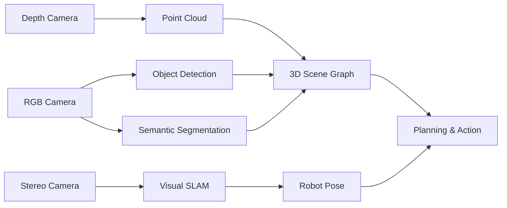
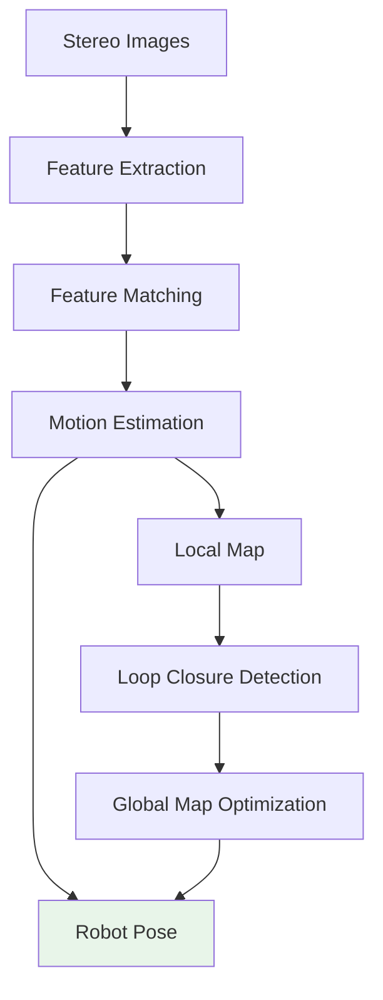
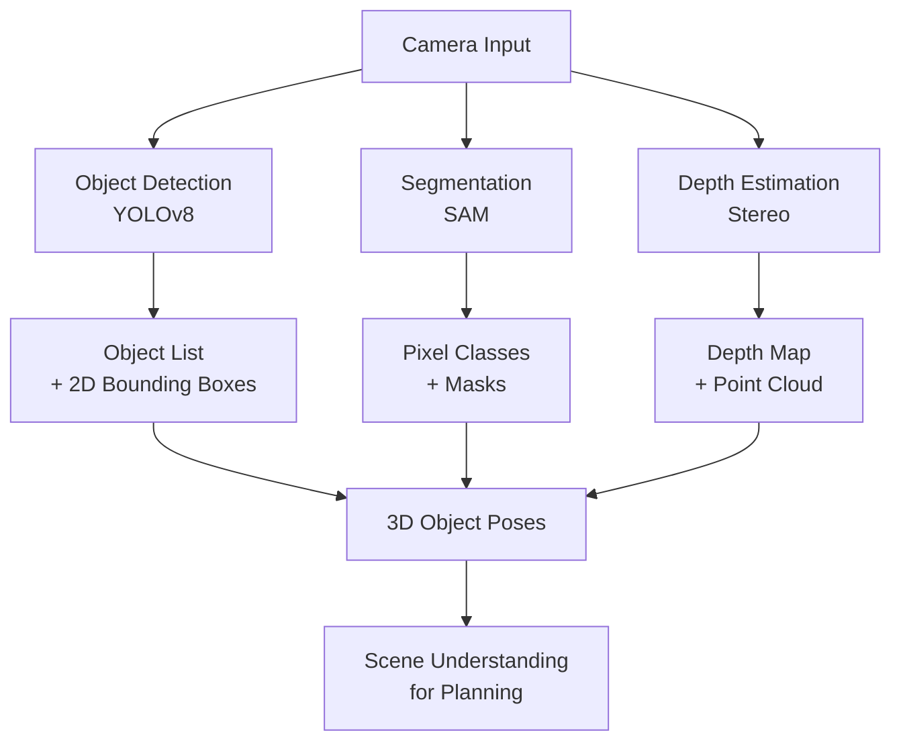

**Estimated Time**: 50 minutes

:::info[What You'll Learn]
- Build a GPU-accelerated perception pipeline using Isaac
- Implement object detection with pre-trained models
- Understand visual SLAM for robot localization
- Process depth and point cloud data for 3D scene understanding
:::

:::note[Prerequisites]
- [Isaac Sim Setup](./isaac-sim-setup.md) -- NVIDIA Isaac Sim installed and configured
:::

Perception is how robots understand their environment. NVIDIA Isaac provides GPU-accelerated perception modules that run inference at real-time speeds, enabling robots to detect objects, estimate poses, and build maps of their surroundings.

## Perception Pipeline



## Object Detection

### Using Isaac ROS with DOPE

DOPE (Deep Object Pose Estimation) detects objects and estimates their 6-DOF pose.

```python title="launch_dope_detection"
# Launch DOPE detection
# Terminal
# ros2 launch isaac_ros_dope isaac_ros_dope.launch.py \
#   model_file_path:=/models/dope_ketchup.onnx \
#   object_name:=ketchup
```

### YOLOv8 with TensorRT

```python title="yolov8_object_detector_node" showLineNumbers
import rclpy
from rclpy.node import Node
from sensor_msgs.msg import Image
from vision_msgs.msg import Detection2DArray, Detection2D
from cv_bridge import CvBridge
import numpy as np

class ObjectDetector(Node):
    """GPU-accelerated object detection using TensorRT."""

    def __init__(self):
        super().__init__('object_detector')
        # highlight-next-line
        self.declare_parameter('model_path', '/models/yolov8n.engine')
        self.declare_parameter('confidence_threshold', 0.5)

        self.bridge = CvBridge()
        # highlight-next-line
        self.subscription = self.create_subscription(
            Image, '/camera/image_raw', self.image_callback, 10)
        self.detection_pub = self.create_publisher(
            Detection2DArray, '/detections', 10)

        self.get_logger().info('Object detector initialized')

    def image_callback(self, msg):
        cv_image = self.bridge.imgmsg_to_cv2(msg, 'bgr8')
        # Run inference (simplified - actual implementation uses TensorRT)
        detections = self.run_inference(cv_image)
        self.publish_detections(detections, msg.header)

    def run_inference(self, image):
        """Run TensorRT inference on the image."""
        # Preprocess
        input_tensor = self.preprocess(image)
        # Run model (TensorRT engine)
        # outputs = self.engine.infer(input_tensor)
        # Postprocess
        # return self.postprocess(outputs)
        return []

    def publish_detections(self, detections, header):
        msg = Detection2DArray()
        msg.header = header
        for det in detections:
            d = Detection2D()
            d.bbox.center.position.x = det['cx']
            d.bbox.center.position.y = det['cy']
            d.bbox.size_x = det['width']
            d.bbox.size_y = det['height']
            msg.detections.append(d)
        self.detection_pub.publish(msg)
```

### Detection Performance

| Model | Resolution | FPS (Jetson Orin) | FPS (RTX 4090) | mAP |
|-------|-----------|-------------------|-----------------|-----|
| YOLOv8n | 640x640 | 45 | 180 | 37.3 |
| YOLOv8s | 640x640 | 30 | 120 | 44.9 |
| YOLOv8m | 640x640 | 18 | 80 | 50.2 |
| RT-DETR-L | 640x640 | 15 | 60 | 53.0 |

:::info[TensorRT Optimization]
Converting models to TensorRT format typically provides a 2-5x speedup over standard PyTorch inference. Use `trtexec` to convert ONNX models to optimized TensorRT engines for your specific GPU hardware.
:::

## Visual SLAM

Visual SLAM (Simultaneous Localization and Mapping) builds a map of the environment while tracking the robot's position.

### Isaac ROS Visual SLAM

```bash title="launch_visual_slam"
# Launch visual SLAM
ros2 launch isaac_ros_visual_slam isaac_ros_visual_slam.launch.py
```

### SLAM Architecture



### Key Concepts

| Component | Purpose | Algorithm |
|-----------|---------|-----------|
| Feature Extraction | Find distinctive points | ORB, SuperPoint |
| Feature Matching | Track points across frames | BFMatcher, LightGlue |
| Motion Estimation | Compute camera movement | PnP, Essential Matrix |
| Loop Closure | Detect revisited places | DBoW, NetVLAD |
| Bundle Adjustment | Optimize map globally | g2o, Ceres |

### SLAM Output Topics

```bash title="check_slam_output_topics" showLineNumbers
# Robot pose in map frame
ros2 topic echo /visual_slam/tracking/odometry

# 3D landmarks
ros2 topic echo /visual_slam/vis/landmarks_cloud

# highlight-next-line
# Status
ros2 topic echo /visual_slam/tracking/slam_status
```

## Semantic Segmentation

Classify every pixel in an image by category (floor, wall, object, person).

```python title="semantic_segmenter_node" showLineNumbers
class SemanticSegmenter(Node):
    """Per-pixel scene classification."""

    # highlight-next-line
    # Class labels
    CLASSES = [
        'floor', 'wall', 'ceiling', 'table', 'chair',
        'person', 'robot', 'door', 'window', 'shelf'
    ]

    def __init__(self):
        super().__init__('segmenter')
        self.subscription = self.create_subscription(
            Image, '/camera/image_raw', self.segment_callback, 10)
        self.mask_pub = self.create_publisher(
            Image, '/segmentation/mask', 10)

    def segment_callback(self, msg):
        cv_image = self.bridge.imgmsg_to_cv2(msg, 'bgr8')
        # Run segmentation model
        mask = self.run_segmentation(cv_image)
        # Publish segmentation mask
        mask_msg = self.bridge.cv2_to_imgmsg(mask, 'mono8')
        mask_msg.header = msg.header
        self.mask_pub.publish(mask_msg)
```

## 3D Point Cloud Processing

### Point Cloud Filtering

```python title="point_cloud_processor_node" showLineNumbers
import numpy as np
from sensor_msgs.msg import PointCloud2
import sensor_msgs_py.point_cloud2 as pc2

class PointCloudProcessor(Node):
    def __init__(self):
        super().__init__('pointcloud_processor')
        self.subscription = self.create_subscription(
            PointCloud2, '/depth/points', self.cloud_callback, 10)
        self.filtered_pub = self.create_publisher(
            PointCloud2, '/filtered_points', 10)

    def cloud_callback(self, msg):
        # Read points
        points = np.array(list(pc2.read_points(
            msg, field_names=('x', 'y', 'z'), skip_nans=True)))

        if len(points) == 0:
            return

        # highlight-next-line
        # Filter: keep points within 5m and above ground
        mask = (
            (np.abs(points[:, 0]) < 5.0) &
            (np.abs(points[:, 1]) < 5.0) &
            (points[:, 2] > 0.05) &
            (points[:, 2] < 2.0)
        )
        filtered = points[mask]

        self.get_logger().info(
            f'Points: {len(points)} -> {len(filtered)} after filtering',
            throttle_duration_sec=5.0)
```

### Ground Plane Removal

```python title="ground_plane_removal" showLineNumbers
def remove_ground_plane(points, height_threshold=0.1):
    """Remove points near the ground plane using RANSAC."""
    # highlight-next-line
    # Simple height-based filtering
    above_ground = points[points[:, 2] > height_threshold]
    return above_ground
```

## Perception Integration

A complete perception system combines multiple models:



## Performance Tips

| Technique | Speedup | Trade-off |
|-----------|---------|-----------|
| TensorRT optimization | 2-5x | Build time for engine |
| Half precision (FP16) | 2x | Slight accuracy loss |
| Input resolution reduction | 2-4x | Detection of small objects |
| Async inference | 1.5x | Added latency |
| Model pruning | 1.5-3x | Requires retraining |

:::warning[Memory Management]
Running multiple perception models simultaneously can quickly exhaust GPU memory. Monitor VRAM usage with `nvidia-smi` and consider staggering inference or using smaller model variants on memory-constrained hardware like Jetson.
:::

:::tip[Key Takeaways]
- GPU-accelerated perception pipelines run at real-time speeds using TensorRT-optimized models
- DOPE and YOLOv8 provide complementary object detection capabilities (6-DOF pose vs. 2D bounding boxes)
- Visual SLAM enables simultaneous map building and robot localization using stereo cameras
- Point cloud filtering is essential for removing noise and irrelevant data from depth sensors
- Combining multiple perception models creates a comprehensive 3D scene understanding
:::

## Next Steps

Continue to [Navigation](./navigation.md) to learn how perception data feeds into autonomous navigation with Nav2.
