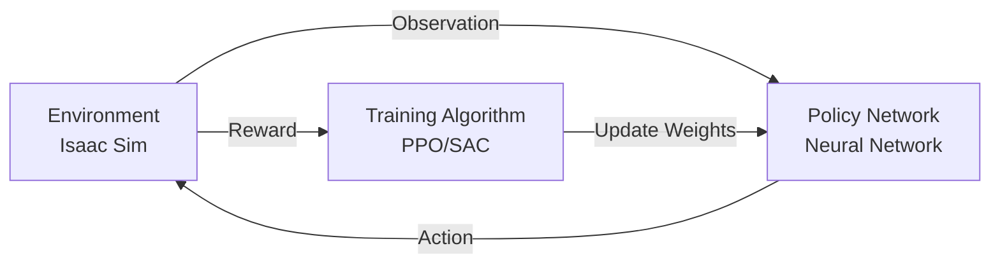
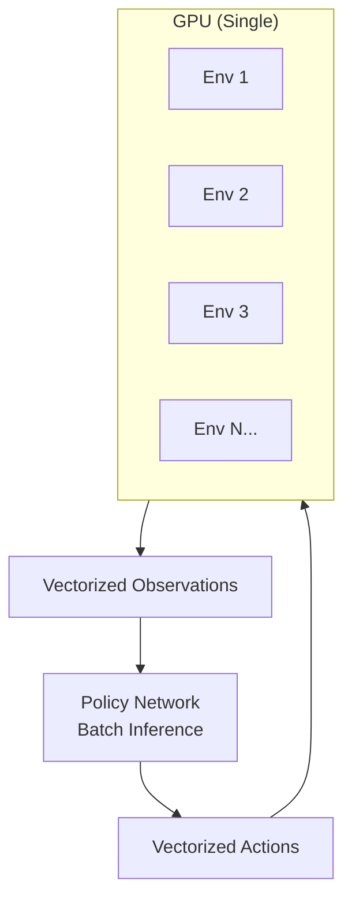
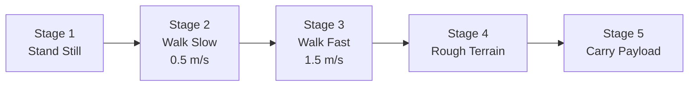

**Estimated Time**: 60 minutes

:::info[What You'll Learn]
- Understand RL fundamentals applied to robotics
- Configure parallel simulation environments in Isaac Sim
- Train locomotion policies for humanoid robots
- Evaluate and deploy trained policies
:::

:::note[Prerequisites]
- [Isaac Sim Setup](./isaac-sim-setup.md) -- NVIDIA Isaac Sim installed and configured
- [Perception](./perception.md) -- Understanding of sensor data processing
:::

Reinforcement Learning (RL) enables robots to learn behaviors through trial and error in simulation. NVIDIA Isaac Sim provides GPU-accelerated parallel environments that make RL training practical for complex robot tasks.

## RL Fundamentals for Robotics



### Key Concepts

| Concept | Robotics Example |
|---------|-----------------|
| **State/Observation** | Joint positions, velocities, sensor readings |
| **Action** | Joint torques or position targets |
| **Reward** | Distance to goal, energy efficiency, stability |
| **Episode** | One attempt at a task (e.g., walk 10 meters) |
| **Policy** | Neural network mapping observations to actions |

## Parallel Environments

Isaac Sim can run thousands of robot instances simultaneously on GPU:



### Performance Comparison

| Platform | Environments | Steps/sec | Speedup |
|----------|-------------|-----------|---------|
| CPU (single) | 1 | 60 | 1x |
| CPU (multi) | 16 | 800 | 13x |
| Isaac Sim (RTX 4090) | 4,096 | 200,000 | 3,333x |
| Isaac Sim (H100) | 16,384 | 1,000,000 | 16,667x |

:::info[Why Parallel Environments Matter]
Training a locomotion policy with a single environment would take weeks. Running 4,096 parallel environments on a single GPU provides over 3,000x speedup, reducing training time from weeks to hours. This is what makes RL practical for complex robotics tasks.
:::

## Training Setup

### Task Definition

```python title="humanoid_walk_task_config" showLineNumbers
from omni.isaac.lab.envs import ManagerBasedRLEnv
from omni.isaac.lab.envs import ManagerBasedRLEnvCfg

class HumanoidWalkCfg(ManagerBasedRLEnvCfg):
    """Configuration for humanoid walking task."""

    # highlight-next-line
    # Environment
    num_envs = 4096
    env_spacing = 2.0

    # Observations
    observation_space = {
        'joint_positions': 28,    # All joint angles
        'joint_velocities': 28,   # All joint velocities
        'base_linear_vel': 3,     # Base velocity
        'base_angular_vel': 3,    # Base angular velocity
        'projected_gravity': 3,   # Gravity in body frame
        'commands': 3,            # Target velocity command
    }

    # Actions: joint position targets
    action_space = 28  # One per actuated joint

    # Episode
    max_episode_length = 1000  # steps
    dt = 0.02  # 50 Hz control

    # highlight-next-line
    # Reward weights
    rewards = {
        'tracking_linear_vel': 1.0,
        'tracking_angular_vel': 0.5,
        'feet_air_time': 0.1,
        'action_rate': -0.01,
        'joint_torques': -0.0001,
        'termination': -2.0,
    }
```

### Reward Design

Reward engineering is critical for RL in robotics:

```python title="humanoid_reward_function" showLineNumbers
class HumanoidReward:
    """Reward function for humanoid locomotion."""

    def compute(self, obs, actions, next_obs):
        rewards = {}

        # highlight-next-line
        # Track commanded velocity
        vel_error = obs['base_linear_vel'][:, 0] - obs['commands'][:, 0]
        rewards['tracking_linear_vel'] = torch.exp(-vel_error ** 2 / 0.25)

        # Encourage foot swing (air time)
        rewards['feet_air_time'] = self._compute_feet_air_time(next_obs)

        # Penalize large actions (energy efficiency)
        rewards['action_rate'] = -torch.sum(
            (actions - self.prev_actions) ** 2, dim=-1)

        # Penalize joint torques
        rewards['joint_torques'] = -torch.sum(
            next_obs['joint_torques'] ** 2, dim=-1)

        # highlight-next-line
        # Total weighted reward
        total = sum(
            self.weights[k] * v for k, v in rewards.items())
        return total
```

### Termination Conditions

```python title="termination_conditions" showLineNumbers
class TerminationConditions:
    def check(self, obs):
        terminated = torch.zeros(self.num_envs, dtype=torch.bool)

        # highlight-next-line
        # Fall detection: base height too low
        terminated |= obs['base_height'] < 0.3

        # Excessive tilt
        terminated |= torch.abs(obs['projected_gravity'][:, 2]) < 0.5

        # Out of bounds
        terminated |= torch.abs(obs['base_position'][:, 0]) > 20.0

        return terminated
```

## Training with PPO

Proximal Policy Optimization (PPO) is the most common algorithm for robot RL.

### Training Script

```python title="ppo_training_script" showLineNumbers
import torch
from omni.isaac.lab_tasks.utils import parse_env_cfg

def train():
    # Create environment
    env_cfg = HumanoidWalkCfg()
    env = ManagerBasedRLEnv(cfg=env_cfg)

    # PPO configuration
    ppo_cfg = {
        # highlight-next-line
        'learning_rate': 3e-4,
        'gamma': 0.99,
        'gae_lambda': 0.95,
        'clip_range': 0.2,
        'entropy_coef': 0.01,
        'value_loss_coef': 0.5,
        'max_grad_norm': 1.0,
        'n_epochs': 5,
        'batch_size': 4096 * 24 // 4,  # mini-batch
    }

    # Policy network
    policy = ActorCritic(
        obs_dim=env.observation_space.shape[0],
        act_dim=env.action_space.shape[0],
        hidden_dims=[512, 256, 128])

    # Training loop
    for iteration in range(10000):
        # Collect rollouts
        rollouts = collect_rollouts(env, policy, steps=24)

        # Update policy
        loss = ppo_update(policy, rollouts, ppo_cfg)

        if iteration % 100 == 0:
            print(f'Iter {iteration}: reward={rollouts.mean_reward:.2f}, '
                  f'loss={loss:.4f}')

    # Save trained policy
    # highlight-next-line
    torch.save(policy.state_dict(), 'humanoid_walk_policy.pt')
```

### Policy Network Architecture

```python title="actor_critic_network" showLineNumbers
import torch
import torch.nn as nn

class ActorCritic(nn.Module):
    """Actor-Critic network for PPO."""

    def __init__(self, obs_dim, act_dim, hidden_dims=[512, 256, 128]):
        super().__init__()

        # Shared feature extractor
        layers = []
        prev_dim = obs_dim
        for dim in hidden_dims:
            layers.extend([
                nn.Linear(prev_dim, dim),
                nn.ELU(),
            ])
            prev_dim = dim

        self.features = nn.Sequential(*layers)

        # highlight-next-line
        # Actor head (policy)
        self.actor_mean = nn.Linear(prev_dim, act_dim)
        self.actor_log_std = nn.Parameter(
            torch.zeros(act_dim))

        # Critic head (value function)
        self.critic = nn.Linear(prev_dim, 1)

    def forward(self, obs):
        features = self.features(obs)
        action_mean = self.actor_mean(features)
        action_std = self.actor_log_std.exp()
        value = self.critic(features)
        return action_mean, action_std, value
```

## Training Curriculum

Curriculum learning gradually increases task difficulty:



```python title="curriculum_learning_manager" showLineNumbers
class Curriculum:
    def __init__(self):
        self.stage = 0
        self.stages = [
            {'max_vel': 0.0, 'terrain': 'flat'},
            {'max_vel': 0.5, 'terrain': 'flat'},
            {'max_vel': 1.5, 'terrain': 'flat'},
            {'max_vel': 1.5, 'terrain': 'rough'},
            {'max_vel': 1.0, 'terrain': 'rough', 'payload': 2.0},
        ]

    # highlight-next-line
    def update(self, mean_reward, threshold=0.8):
        if mean_reward > threshold and self.stage < len(self.stages) - 1:
            self.stage += 1
            return self.stages[self.stage]
        return self.stages[self.stage]
```

## Domain Randomization

Randomize simulation parameters to improve real-world transfer:

| Parameter | Range | Purpose |
|-----------|-------|---------|
| Friction | 0.5 - 1.5 | Ground surface variation |
| Mass | +/-15% | Payload uncertainty |
| Motor strength | +/-10% | Actuator variation |
| Observation noise | +/-5% | Sensor noise |
| Push force | 0 - 50N | External disturbances |
| Terrain roughness | 0 - 5cm | Surface irregularities |

## Monitoring Training

```bash title="monitor_rl_training" showLineNumbers
# Launch TensorBoard
tensorboard --logdir=runs/

# Key metrics to watch:
# - Mean episode reward (should increase)
# - Episode length (should increase for locomotion)
# highlight-next-line
# - Policy loss (should decrease then stabilize)
# - Value loss (should decrease)
# - Entropy (should decrease slowly)
```

:::tip[Training Diagnostics]
If your reward curve plateaus early, try adjusting the reward weights or introducing curriculum learning. If training is unstable (reward oscillates), reduce the learning rate or increase the PPO clip range. Monitor the entropy metric -- if it drops to near zero too quickly, the policy has collapsed to a single behavior.
:::

## Deploying Trained Policies

```python title="policy_deployment_node" showLineNumbers
class PolicyDeployer(Node):
    """Deploy a trained RL policy on the real robot."""

    def __init__(self):
        super().__init__('policy_deployer')
        # highlight-next-line
        self.policy = ActorCritic(obs_dim=68, act_dim=28)
        self.policy.load_state_dict(
            torch.load('humanoid_walk_policy.pt'))
        self.policy.eval()

        self.joint_sub = self.create_subscription(
            JointState, '/joint_states', self.state_callback, 10)
        self.joint_pub = self.create_publisher(
            JointState, '/joint_commands', 10)
        self.timer = self.create_timer(0.02, self.control_loop)

    def control_loop(self):
        if self.latest_obs is None:
            return
        with torch.no_grad():
            obs_tensor = torch.tensor(self.latest_obs).float()
            action_mean, _, _ = self.policy(obs_tensor)
        # Publish joint position targets
        self.publish_joint_commands(action_mean.numpy())
```

:::tip[Key Takeaways]
- GPU-accelerated parallel environments provide 3,000x+ speedup over single-CPU training
- PPO is the standard algorithm for robot RL due to its stability and sample efficiency
- Reward design requires balancing task objectives (velocity tracking) with penalties (energy, stability)
- Curriculum learning progressively increases difficulty to train robust policies
- Domain randomization during training improves policy transfer to real hardware
- Always monitor training metrics via TensorBoard to diagnose convergence issues
:::

## Next Steps

Continue to [Sim-to-Real Transfer](./sim-to-real.md) to learn how to bridge the gap between simulation-trained policies and real-world deployment.
