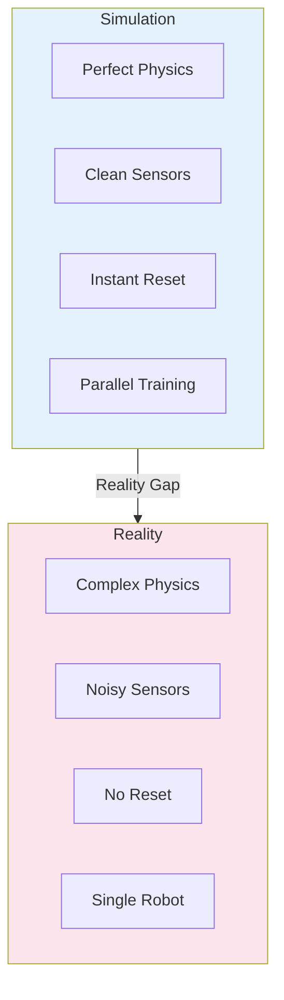
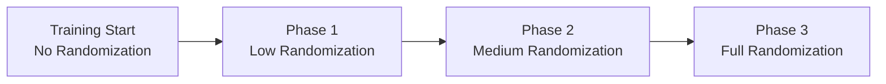
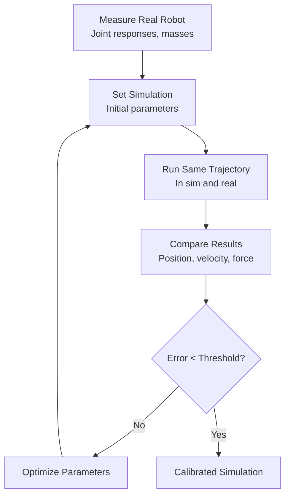
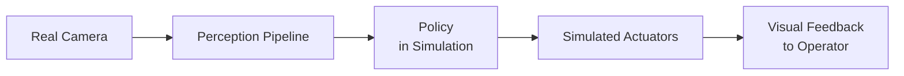
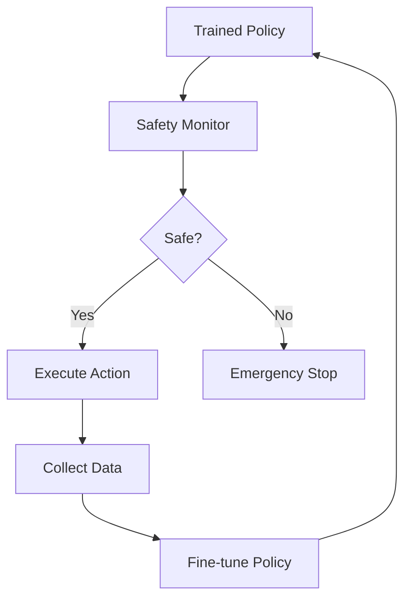

**Estimated Time**: 45 minutes

:::info[What You'll Learn]
- Identify the key challenges in the sim-to-real transfer gap
- Apply domain randomization to improve policy robustness
- Use system identification to calibrate simulation models
- Implement progressive deployment strategies
:::

:::note[Prerequisites]
- [Isaac Sim Setup](./isaac-sim-setup.md) -- NVIDIA Isaac Sim installed and configured
- [Reinforcement Learning](./reinforcement-learning.md) -- RL training fundamentals and policy deployment
:::

The "reality gap" between simulation and the physical world is one of the biggest challenges in robotics. Policies that work in simulation often fail on real hardware due to differences in physics, sensing, and actuation. This chapter covers techniques to bridge that gap.

## The Reality Gap



### Sources of the Gap

| Source | Simulation | Reality |
|--------|-----------|---------|
| **Physics** | Simplified contact, no deformation | Complex interactions |
| **Sensors** | Perfect readings, low latency | Noise, bias, latency |
| **Actuators** | Instant response, perfect tracking | Delay, backlash, wear |
| **Environment** | Static, known | Dynamic, unpredictable |
| **Dynamics** | Modeled parameters | Unknown variations |

## Domain Randomization

Randomize simulation parameters so the policy learns to handle variation, making it robust to real-world conditions.

### What to Randomize

```python title="domain_randomization_config" showLineNumbers
class DomainRandomization:
    """Randomize simulation parameters each episode."""

    def randomize(self, env):
        # highlight-next-line
        # Physics parameters
        env.set_friction(uniform(0.5, 1.5))
        env.set_restitution(uniform(0.0, 0.3))

        # Robot parameters
        for link in env.robot.links:
            link.mass *= uniform(0.85, 1.15)
            link.inertia *= uniform(0.9, 1.1)

        # Actuator parameters
        for joint in env.robot.joints:
            joint.damping *= uniform(0.8, 1.2)
            joint.friction *= uniform(0.5, 2.0)
            joint.max_torque *= uniform(0.9, 1.1)

        # highlight-next-line
        # Sensor noise
        env.camera.noise_std = uniform(0.005, 0.02)
        env.imu.gyro_bias = uniform(-0.01, 0.01)
        env.imu.accel_bias = uniform(-0.05, 0.05)

        # External disturbances
        env.apply_random_force(
            magnitude=uniform(0, 50),  # Newtons
            interval=uniform(1.0, 5.0))  # seconds

        # Visual randomization (for perception)
        env.set_lighting(
            intensity=uniform(0.3, 2.0),
            color=random_color())
        env.set_floor_texture(random_texture())
```

### Randomization Schedule



Gradually increase randomization as the policy improves:

```python title="adaptive_randomization" showLineNumbers
class AdaptiveRandomization:
    def get_params(self, training_progress):
        # highlight-next-line
        # Scale from 0% to 100% randomization
        scale = min(1.0, training_progress / 0.5)

        return {
            'friction_range': (1.0 - 0.5 * scale, 1.0 + 0.5 * scale),
            'mass_range': (1.0 - 0.15 * scale, 1.0 + 0.15 * scale),
            'force_range': (0, 50 * scale),
            'sensor_noise': 0.02 * scale,
        }
```

:::warning[Over-Randomization]
Excessive domain randomization can make the task too difficult for the policy to learn anything useful. Start with narrow randomization ranges and widen them gradually. If training reward drops significantly after adding randomization, reduce the ranges or use curriculum-based randomization scheduling.
:::

## System Identification

Match simulation parameters to the real robot through measurement.

### Parameter Identification Process



### What to Identify

```python title="system_identification_parameters" showLineNumbers
class SystemIdentification:
    """Parameters to identify from real hardware."""

    parameters = {
        # Link properties
        'link_masses': {},         # Weigh each link
        'center_of_mass': {},      # Balance point tests
        'moments_of_inertia': {},  # Swing tests

        # highlight-next-line
        # Joint properties
        'joint_friction': {},      # Move slowly, measure resistance
        'joint_damping': {},       # Free oscillation tests
        'motor_constants': {},     # Torque vs current mapping
        'gear_ratios': {},         # Manufacturer specs + verification

        # Sensor calibration
        'camera_intrinsics': {},   # Checkerboard calibration
        'imu_bias': {},            # Static measurements
        'encoder_offsets': {},     # Known position calibration
    }
```

### Motor Identification Example

```python title="motor_parameter_identification" showLineNumbers
def identify_motor_params(robot, joint_name):
    """Identify motor parameters from step response."""
    # Apply step torque and record response
    responses = []
    for torque in [0.5, 1.0, 2.0, 5.0]:
        robot.apply_torque(joint_name, torque)
        response = robot.record_trajectory(
            joint_name, duration=2.0, rate=1000)
        responses.append((torque, response))

    # highlight-next-line
    # Fit model: T = J*alpha + B*omega + F*sign(omega)
    # J = inertia, B = damping, F = friction
    J, B, F = fit_motor_model(responses)
    return {'inertia': J, 'damping': B, 'friction': F}
```

## Progressive Deployment

### Stage 1: Policy Verification in Sim

```python title="sim_policy_verification" showLineNumbers
def verify_in_sim(policy, env, num_episodes=100):
    """Test policy across varied conditions."""
    results = []
    for i in range(num_episodes):
        env.randomize()
        obs = env.reset()
        total_reward = 0
        for step in range(1000):
            action = policy(obs)
            obs, reward, done, info = env.step(action)
            total_reward += reward
            if done:
                break
        results.append({
            'reward': total_reward,
            'steps': step,
            'success': info.get('success', False)
        })

    # highlight-next-line
    success_rate = sum(r['success'] for r in results) / len(results)
    print(f'Success rate: {success_rate:.1%}')
    return success_rate > 0.9
```

### Stage 2: Hardware-in-the-Loop

Connect real sensors to the simulation:



### Stage 3: Guided Real-World Testing

```python title="safe_deployment_wrapper" showLineNumbers
class SafeDeployment:
    """Deploy policy with safety constraints."""

    def __init__(self, policy, safety_limits):
        self.policy = policy
        self.limits = safety_limits

    def get_action(self, obs):
        action = self.policy(obs)

        # highlight-next-line
        # Clamp joint velocities
        action = np.clip(action,
            self.limits['min_vel'],
            self.limits['max_vel'])

        # Clamp joint torques
        action = np.clip(action,
            self.limits['min_torque'],
            self.limits['max_torque'])

        # Check stability
        if obs['base_tilt'] > self.limits['max_tilt']:
            # highlight-next-line
            return self.emergency_stop()

        return action

    def emergency_stop(self):
        """Return zero-torque action for safe stop."""
        return np.zeros(self.action_dim)
```

### Stage 4: Autonomous Operation



## Evaluation Metrics

| Metric | Simulation | Real-World | Acceptable Gap |
|--------|-----------|-----------|---------------|
| Walking speed | 1.5 m/s | 1.2 m/s | &lt;25% |
| Stability (fall rate) | 0% | &lt;5% | &lt;5% |
| Energy efficiency | Baseline | &gt;=80% of sim | &lt;20% |
| Task success rate | 95% | &gt;80% | &lt;15% |

:::info[Measuring the Gap]
Track the performance gap between simulation and reality across multiple metrics. A gap greater than 25% on any critical metric indicates that the simulation model needs further calibration or more aggressive domain randomization is required.
:::

## Common Failure Modes

| Failure | Cause | Fix |
|---------|-------|-----|
| Robot falls immediately | Inaccurate inertia | Better system ID |
| Oscillating joints | No actuator delay modeled | Add delay in sim |
| Drifting | IMU bias not modeled | Add sensor noise |
| Weak movements | Friction too low in sim | Increase friction range |
| Jerky motion | Action rate too high | Add action smoothing |

:::tip[Key Takeaways]
- The reality gap stems from differences in physics, sensors, actuators, and environmental conditions
- Domain randomization trains policies robust to real-world variation by exposing them to parameter ranges during training
- System identification calibrates simulation parameters to match real hardware measurements
- Progressive deployment (sim verification, hardware-in-loop, guided testing, autonomous) minimizes risk
- Always implement safety constraints (velocity limits, torque limits, emergency stop) when deploying on real hardware
- Track sim-to-real performance gaps across multiple metrics to guide calibration efforts
:::

## Next Steps

Practice what you've learned in the [Module 3 Exercises](./exercises.md) covering perception, navigation, and RL training.
