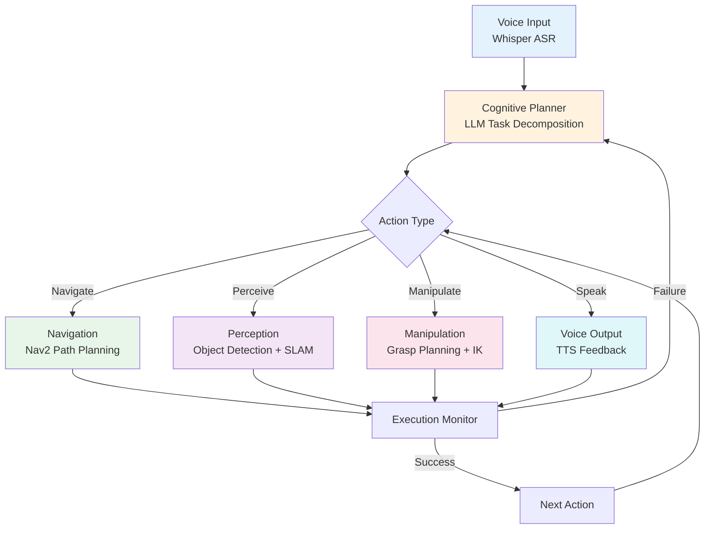
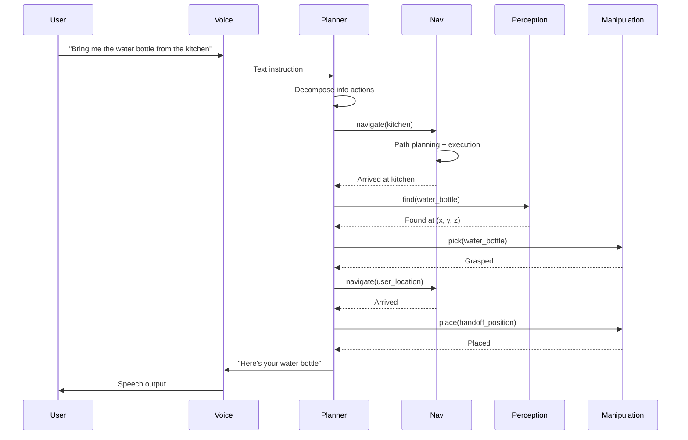

**Estimated Time**: 60 minutes

:::info[What You'll Learn]
- Design the architecture for a complete humanoid robot system
- Integrate all five pipeline components into a working system
- Test the system end-to-end with realistic scenarios
- Document design decisions and trade-offs
:::

:::note[Prerequisites]
Before starting this chapter, complete:
- [Voice-to-Action Pipeline](./voice-to-action.md)
- [LLM-Powered Cognitive Planning](./cognitive-planning.md)
- [Humanoid Robot Fundamentals](./humanoid-fundamentals.md)
- [Multi-Modal Human-Robot Interaction](./multi-modal-hri.md)
:::

The capstone project integrates everything you've learned across all four modules into a complete autonomous humanoid robot system. The robot receives voice commands and autonomously executes multi-step tasks involving navigation, perception, and manipulation.

## System Architecture



## The Five Pipeline Components

### 1. Voice Command Interface

**Module Reference**: [Voice-to-Action](./voice-to-action.md)

Converts spoken commands into structured text for the planner.

```python title="voice_interface.py" showLineNumbers
class VoiceInterface:
    """Component 1: Speech recognition and synthesis."""

    def listen(self) -> str:
        """Capture and transcribe user speech."""
        audio = self.microphone.capture(duration=5.0)
        # highlight-next-line
        text = self.whisper.transcribe(audio)
        return text

    def speak(self, message: str):
        """Generate speech output."""
        self.tts.synthesize(message)
```

### 2. Cognitive Planning

**Module Reference**: [Cognitive Planning](./cognitive-planning.md)

Decomposes natural language instructions into executable action sequences.

```python title="cognitive_planner.py" showLineNumbers
class CognitivePlanner:
    """Component 2: LLM-based task planning."""

    def plan(self, instruction: str, context: dict) -> list:
        """Generate action sequence from instruction."""
        prompt = self.build_prompt(instruction, context)
        response = self.llm.generate(prompt)
        actions = self.parse_actions(response)
        # highlight-next-line
        validated = self.validate_against_skills(actions)
        return validated
```

### 3. Navigation

**Module References**: [Module 3 Navigation](../module-3/navigation.md), [Module 2 Gazebo](../module-2/gazebo-setup.md)

Moves the robot to target locations using Nav2.

```python title="navigation_component.py" showLineNumbers
class NavigationComponent:
    """Component 3: Autonomous navigation."""

    def navigate_to(self, location: str) -> bool:
        """Navigate to a named location."""
        pose = self.location_database.get(location)
        if pose is None:
            return False
        # highlight-next-line
        self.navigator.goToPose(pose)
        while not self.navigator.isTaskComplete():
            feedback = self.navigator.getFeedback()
            self.publish_progress(feedback)
        return self.navigator.getResult() == TaskResult.SUCCEEDED
```

### 4. Perception

**Module References**: [Module 3 Perception](../module-3/perception.md), [Module 2 Sensors](../module-2/sensors.md)

Detects and localizes objects in the environment.

```python title="perception_component.py" showLineNumbers
class PerceptionComponent:
    """Component 4: Object detection and scene understanding."""

    def find_object(self, object_name: str) -> dict:
        """Locate a specific object in the scene."""
        detections = self.detector.detect(self.get_image())
        for det in detections:
            # highlight-next-line
            if det.label == object_name:
                pose_3d = self.estimate_3d_pose(det)
                return {
                    'label': det.label,
                    'confidence': det.confidence,
                    'pose': pose_3d
                }
        return None

    def scan_environment(self) -> list:
        """Get all visible objects."""
        return self.detector.detect(self.get_image())
```

### 5. Manipulation

**Module References**: [Humanoid Fundamentals](./humanoid-fundamentals.md), [Module 1 URDF](../module-1/urdf-basics.md)

Controls the robot's arms and hands for grasping and placing.

```python title="manipulation_component.py" showLineNumbers
class ManipulationComponent:
    """Component 5: Arm and hand control."""

    def pick(self, object_pose: dict) -> bool:
        """Pick up an object at the given pose."""
        # Plan approach
        pre_grasp = self.compute_pre_grasp(object_pose)
        self.arm_ik.move_to(pre_grasp)
        # Approach and grasp
        self.arm_ik.move_to(object_pose)
        # highlight-next-line
        self.gripper.close()
        # Verify
        return self.gripper.has_object()

    def place(self, target_pose: dict) -> bool:
        """Place held object at target pose."""
        self.arm_ik.move_to(target_pose)
        self.gripper.open()
        self.arm_ik.move_to_home()
        return True
```

## Integration: The Capstone Node

```python title="capstone_robot_node.py" showLineNumbers
class CapstoneRobot(Node):
    """Complete autonomous humanoid assistant."""

    def __init__(self):
        super().__init__('capstone_robot')

        # Initialize components
        self.voice = VoiceInterface(self)
        self.planner = CognitivePlanner(self)
        self.navigation = NavigationComponent(self)
        self.perception = PerceptionComponent(self)
        self.manipulation = ManipulationComponent(self)

        # State
        self.env_state = EnvironmentState()
        self.executing = False

        # Listen for commands
        # highlight-next-line
        self.voice_sub = self.create_subscription(
            String, '/voice/command', self.on_command, 10)
        self.get_logger().info('Capstone robot ready!')

    def on_command(self, msg):
        instruction = msg.data
        self.get_logger().info(f'Received: "{instruction}"')
        self.voice.speak(f'Planning how to: {instruction}')

        # Plan
        context = self.env_state.get_context()
        plan = self.planner.plan(instruction, context)
        self.voice.speak(f'I have a {len(plan)}-step plan. Starting now.')

        # Execute
        self.execute_plan(plan, instruction)

    def execute_plan(self, plan, original_instruction):
        for i, action in enumerate(plan):
            self.get_logger().info(
                f'Step {i+1}/{len(plan)}: {action["skill"]}')

            success = self.execute_action(action)

            if not success:
                self.voice.speak(f'Step {i+1} failed. Re-planning.')
                # highlight-next-line
                # Re-plan from current state
                remaining = self.planner.replan(
                    original_instruction,
                    completed=plan[:i],
                    failed=action,
                    context=self.env_state.get_context())
                self.execute_plan(remaining, original_instruction)
                return

            self.env_state.update(action)

        self.voice.speak('Task complete!')

    def execute_action(self, action):
        skill = action['skill']
        params = action.get('params', {})

        if skill == 'navigate':
            return self.navigation.navigate_to(params['location'])
        elif skill == 'pick':
            obj = self.perception.find_object(params['object'])
            if obj is None:
                self.voice.speak(f"I can't see the {params['object']}")
                return False
            return self.manipulation.pick(obj['pose'])
        elif skill == 'place':
            return self.manipulation.place(params['location'])
        elif skill == 'say':
            self.voice.speak(params['message'])
            return True
        elif skill == 'look_at':
            return self.perception.look_at(params['target'])
        else:
            self.get_logger().warn(f'Unknown skill: {skill}')
            return False
```

:::warning[Recursive Re-Planning]
The `execute_plan` method calls itself recursively on failure. In production, limit recursion depth to prevent infinite re-planning loops. Add a `max_replans` counter and fail gracefully after 3 attempts.
:::

## Example Scenarios

### Scenario 1: "Bring me the water bottle from the kitchen"



### Scenario 2: "Clean up the living room"

Expected plan:
1. `navigate(living_room)`
2. `look_at(room)` -- scan for misplaced items
3. `pick(mug)` -- found mug on coffee table
4. `navigate(kitchen)`
5. `place(mug, counter)`
6. `navigate(living_room)`
7. `pick(book)` -- found book on floor
8. `place(book, bookshelf)`
9. `say("Living room is clean!")`

### Scenario 3: "Check if the front door is locked"

Expected plan:
1. `navigate(front_door)`
2. `look_at(door_lock)`
3. `say("The front door appears to be locked")`

## Project Requirements

### Minimum Viable Capstone

| Requirement | Description |
|------------|-------------|
| Voice input | Accept at least 5 different voice commands |
| Task planning | Decompose commands into 2+ action sequences |
| Navigation | Navigate between at least 3 locations |
| Perception | Detect at least 3 object types |
| Manipulation | Pick and place at least 1 object type |
| Feedback | Provide verbal status updates |
| Re-planning | Handle at least 1 failure scenario |

### Evaluation Criteria

| Criterion | Weight | Description |
|-----------|--------|-------------|
| System Integration | 30% | All 5 components work together |
| Task Success Rate | 25% | Percentage of commands completed |
| Error Handling | 15% | Graceful failure and re-planning |
| Code Quality | 15% | Clean architecture, documented |
| Presentation | 15% | Demo and documentation |

## ROS 2 Launch File

```python title="capstone_launch.py" showLineNumbers
# launch/capstone.launch.py
from launch import LaunchDescription
from launch_ros.actions import Node

def generate_launch_description():
    return LaunchDescription([
        # Perception
        Node(package='capstone', executable='perception_node',
             name='perception'),
        # Navigation
        Node(package='capstone', executable='navigation_node',
             name='navigation'),
        # Voice
        Node(package='capstone', executable='voice_node',
             name='voice'),
        # highlight-next-line
        # Planner
        Node(package='capstone', executable='planner_node',
             name='planner'),
        # Manipulation
        Node(package='capstone', executable='manipulation_node',
             name='manipulation'),
        # Main coordinator
        Node(package='capstone', executable='capstone_robot',
             name='capstone_coordinator'),
    ])
```

## Testing Strategy

```bash title="testing_commands"
# 1. Test individual components
ros2 launch capstone test_perception.launch.py
ros2 launch capstone test_navigation.launch.py
ros2 launch capstone test_manipulation.launch.py

# 2. Test integration pairs
ros2 launch capstone test_perception_manipulation.launch.py
ros2 launch capstone test_voice_planning.launch.py

# 3. Full system test in simulation
ros2 launch capstone capstone_sim.launch.py

# 4. Run automated test scenarios
ros2 launch capstone capstone_test_scenarios.launch.py
```

:::tip[Key Takeaways]
- A complete autonomous humanoid system integrates five core components: voice, planning, navigation, perception, and manipulation
- The cognitive planner serves as the central coordinator, decomposing instructions and dispatching to skill-specific components
- Re-planning on failure enables robust task completion even when individual steps fail
- Test components individually, then in pairs, before full integration testing
- Document design decisions and trade-offs as part of the deliverables
:::

## Next Steps

See [Assessments](./assessments.md) for the full rubric and submission requirements.
