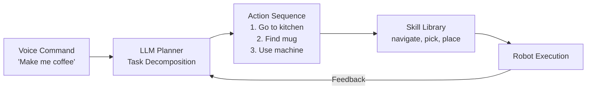
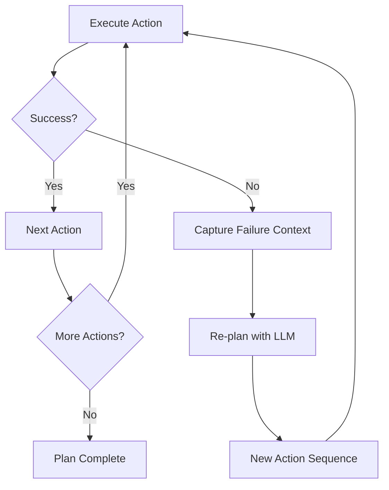

# LLM-Powered Cognitive Planning

Large Language Models (LLMs) give robots the ability to understand complex natural language instructions and decompose them into executable action sequences. This chapter covers how to use LLMs as cognitive planners that bridge human intent and robot execution.

## The Planning Pipeline



## Why LLMs for Robot Planning?

| Approach | Strengths | Weaknesses |
|----------|-----------|------------|
| Classical Planning (PDDL) | Optimal, complete | Requires formal domain definition |
| Behavior Trees | Reactive, modular | Manual design, limited flexibility |
| LLM Planning | Natural language, generalizable | May hallucinate, needs grounding |
| **LLM + Grounding** | **Flexible + reliable** | **Requires skill library** |

## Task Decomposition

### Basic Prompt Design

```python
PLANNER_PROMPT = """You are a robot task planner. Given a user instruction
and the robot's available skills, decompose the instruction into a sequence
of executable actions.

Available skills:
- navigate(location): Move to a named location
- pick(object): Grasp an object
- place(object, location): Place object at location
- open(object): Open a door, drawer, or container
- close(object): Close a door, drawer, or container
- say(message): Speak a message to the user
- wait(seconds): Wait for a duration
- look_at(object): Turn to face an object

Known locations: kitchen, living_room, bedroom, bathroom, front_door
Known objects: mug, plate, bottle, remote, keys, book

User instruction: {instruction}
Current location: {current_location}
Visible objects: {visible_objects}

Output a JSON array of actions:
"""
```

### Planning Node

```python
import rclpy
from rclpy.node import Node
from std_msgs.msg import String
import json

class CognitivePlanner(Node):
    """LLM-based task planner for robot actions."""

    def __init__(self):
        super().__init__('cognitive_planner')
        self.declare_parameter('model', 'gpt-4')
        self.declare_parameter('api_key_env', 'OPENAI_API_KEY')

        self.instruction_sub = self.create_subscription(
            String, '/voice/instruction', self.plan_callback, 10)
        self.plan_pub = self.create_publisher(
            String, '/planner/action_sequence', 10)

        self.current_location = 'living_room'
        self.visible_objects = []

    def plan_callback(self, msg):
        instruction = msg.data
        self.get_logger().info(f'Planning for: "{instruction}"')

        # Build prompt with current context
        prompt = PLANNER_PROMPT.format(
            instruction=instruction,
            current_location=self.current_location,
            visible_objects=', '.join(self.visible_objects))

        # Call LLM API
        plan = self.call_llm(prompt)

        # Validate plan against skill library
        validated_plan = self.validate_plan(plan)

        # Publish action sequence
        plan_msg = String()
        plan_msg.data = json.dumps(validated_plan)
        self.plan_pub.publish(plan_msg)
        self.get_logger().info(f'Plan: {len(validated_plan)} actions')

    def validate_plan(self, plan):
        """Verify all actions use valid skills and parameters."""
        valid_skills = {
            'navigate', 'pick', 'place', 'open',
            'close', 'say', 'wait', 'look_at'}
        validated = []
        for action in plan:
            if action.get('skill') in valid_skills:
                validated.append(action)
            else:
                self.get_logger().warn(
                    f'Unknown skill: {action.get("skill")}')
        return validated
```

## Grounding Plans in Reality

### Environment State Tracking

```python
class EnvironmentState:
    """Track what the robot knows about the world."""

    def __init__(self):
        self.robot_location = 'unknown'
        self.held_object = None
        self.known_objects = {}  # object -> location
        self.door_states = {}   # door -> open/closed

    def update_from_perception(self, detections):
        """Update state from perception pipeline."""
        for det in detections:
            self.known_objects[det.label] = det.position

    def get_context_string(self):
        """Format state for LLM prompt."""
        lines = [
            f"Robot location: {self.robot_location}",
            f"Holding: {self.held_object or 'nothing'}",
            "Known objects:"
        ]
        for obj, loc in self.known_objects.items():
            lines.append(f"  - {obj} at {loc}")
        return '\n'.join(lines)
```

### Precondition Checking

```python
class PreconditionChecker:
    """Verify action preconditions before execution."""

    def check(self, action, state):
        skill = action['skill']

        if skill == 'pick':
            obj = action['params']['object']
            if state.held_object is not None:
                return False, f"Already holding {state.held_object}"
            if obj not in state.known_objects:
                return False, f"Don't know where {obj} is"
            return True, "OK"

        if skill == 'place':
            if state.held_object is None:
                return False, "Not holding anything"
            return True, "OK"

        if skill == 'navigate':
            return True, "OK"  # Always attempt navigation

        return True, "OK"
```

## Plan Execution

### Action Executor

```python
class PlanExecutor(Node):
    """Execute a sequence of planned actions."""

    def __init__(self):
        super().__init__('plan_executor')
        self.plan_sub = self.create_subscription(
            String, '/planner/action_sequence',
            self.execute_plan, 10)
        self.status_pub = self.create_publisher(
            String, '/executor/status', 10)

        # Skill implementations (action clients)
        self.skills = {
            'navigate': self.navigate_skill,
            'pick': self.pick_skill,
            'place': self.place_skill,
            'say': self.say_skill,
        }

    async def execute_plan(self, msg):
        plan = json.loads(msg.data)
        for i, action in enumerate(plan):
            skill_name = action['skill']
            params = action.get('params', {})

            self.publish_status(
                f'Executing step {i+1}/{len(plan)}: '
                f'{skill_name}({params})')

            skill_fn = self.skills.get(skill_name)
            if skill_fn is None:
                self.publish_status(f'Unknown skill: {skill_name}')
                break

            success = await skill_fn(**params)
            if not success:
                self.publish_status(
                    f'Step {i+1} failed. Requesting replan.')
                self.request_replan(plan, i)
                break

        self.publish_status('Plan complete')
```

## Re-Planning on Failure



```python
REPLAN_PROMPT = """The robot was executing a plan but step {step_num} failed.

Original instruction: {instruction}
Completed steps: {completed}
Failed step: {failed_step}
Failure reason: {failure_reason}
Current state: {current_state}

Generate a new plan to complete the original instruction from
the current state. Use the same skill format.
"""
```

## Chain-of-Thought Planning

For complex tasks, use chain-of-thought reasoning:

```python
COT_PROMPT = """Think step by step about how to accomplish this task.

Task: {instruction}
Robot capabilities: {skills}
Environment: {state}

First, reason about what needs to happen:
1. What is the goal state?
2. What is the current state?
3. What intermediate steps are needed?
4. Are there any obstacles or dependencies?

Then output the action plan as JSON.
"""
```

## Safety Constraints

```python
class SafetyFilter:
    """Filter unsafe actions from LLM-generated plans."""

    FORBIDDEN_ACTIONS = [
        'throw', 'break', 'force', 'override_safety'
    ]

    MAX_PLAN_LENGTH = 20

    def filter(self, plan):
        safe_plan = []
        for action in plan[:self.MAX_PLAN_LENGTH]:
            if action['skill'] in self.FORBIDDEN_ACTIONS:
                continue
            if self._is_safe(action):
                safe_plan.append(action)
        return safe_plan

    def _is_safe(self, action):
        # Check force limits
        if 'force' in action.get('params', {}):
            if action['params']['force'] > 10.0:
                return False
        # Check speed limits
        if 'speed' in action.get('params', {}):
            if action['params']['speed'] > 0.5:
                return False
        return True
```

## Next Steps

Continue to [Humanoid Fundamentals](./humanoid-fundamentals.md) to learn about bipedal locomotion, balance control, and whole-body coordination.
