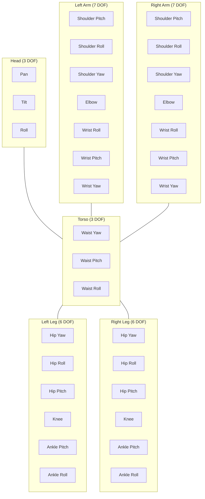
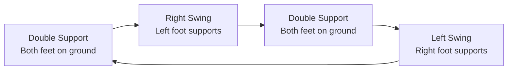
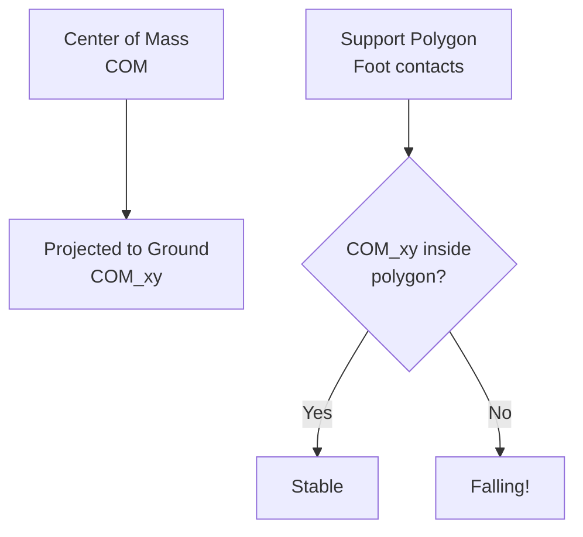
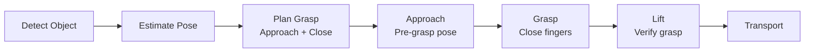
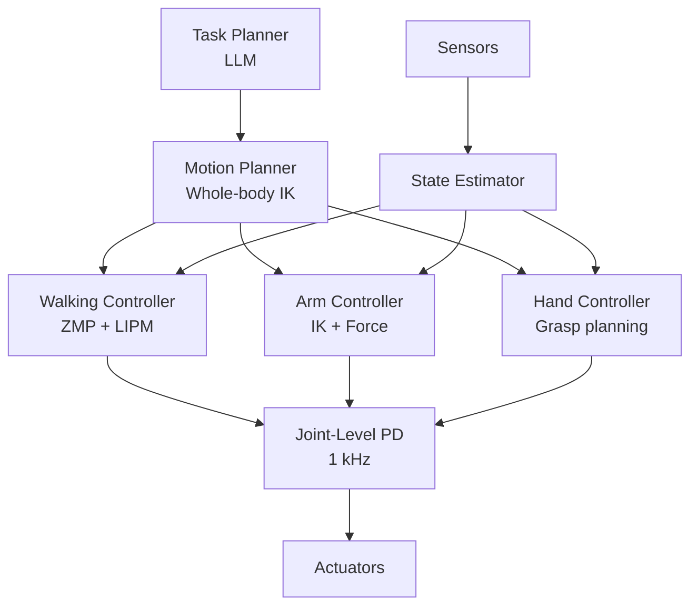

# Humanoid Robot Fundamentals

Humanoid robots present unique challenges compared to wheeled or tracked platforms. This chapter covers the foundational concepts of bipedal locomotion, balance, and whole-body coordination that make humanoid robots functional.

## Humanoid Kinematics

### Degrees of Freedom



**Typical humanoid**: 30-40 DOF (6 per leg, 7 per arm, 3 torso, 3 head, + hands)

## Bipedal Locomotion

### Gait Cycle



### Key Parameters

| Parameter | Typical Value | Effect |
|-----------|-------------|--------|
| Step length | 0.3-0.6 m | Walking speed |
| Step height | 0.05-0.15 m | Obstacle clearance |
| Step width | 0.15-0.25 m | Lateral stability |
| Cycle time | 0.6-1.2 s | Walking cadence |
| Double support ratio | 20-40% | Stability margin |

### Walking Pattern Generation

```python
import numpy as np

class WalkingPatternGenerator:
    """Generate foot placement patterns for bipedal walking."""

    def __init__(self, step_length=0.4, step_width=0.2,
                 step_height=0.08, cycle_time=0.8):
        self.step_length = step_length
        self.step_width = step_width
        self.step_height = step_height
        self.cycle_time = cycle_time

    def generate_footsteps(self, num_steps, start_foot='right'):
        """Generate a sequence of foot placements."""
        footsteps = []
        x = 0.0
        for i in range(num_steps):
            foot = 'right' if (i % 2 == 0) == (start_foot == 'right') else 'left'
            y = self.step_width / 2 if foot == 'left' else -self.step_width / 2
            x += self.step_length
            footsteps.append({
                'foot': foot,
                'position': np.array([x, y, 0.0]),
                'time': i * self.cycle_time
            })
        return footsteps

    def compute_foot_trajectory(self, start, end, phase):
        """Compute foot position during swing phase (0 to 1)."""
        # Horizontal: linear interpolation
        xy = start[:2] + phase * (end[:2] - start[:2])
        # Vertical: parabolic arc
        z = self.step_height * 4 * phase * (1 - phase)
        return np.array([xy[0], xy[1], z])
```

## Balance Control

### Zero Moment Point (ZMP)

The ZMP is the point on the ground where the total moment of active forces is zero. For stable walking, the ZMP must stay within the support polygon.



### Balance Controller

```python
class BalanceController:
    """ZMP-based balance control for humanoid robots."""

    def __init__(self, robot_mass, com_height):
        self.mass = robot_mass
        self.com_height = com_height
        self.g = 9.81

    def compute_zmp(self, com_pos, com_accel):
        """Compute the Zero Moment Point."""
        zmp_x = com_pos[0] - (self.com_height / self.g) * com_accel[0]
        zmp_y = com_pos[1] - (self.com_height / self.g) * com_accel[1]
        return np.array([zmp_x, zmp_y])

    def is_stable(self, zmp, support_polygon):
        """Check if ZMP is within support polygon."""
        from shapely.geometry import Point, Polygon
        return Polygon(support_polygon).contains(Point(zmp))

    def compute_correction(self, zmp, target_zmp):
        """Compute ankle torque to move ZMP toward target."""
        error = target_zmp - zmp
        # PD controller
        torque_x = self.kp * error[1] + self.kd * self.error_dot[1]
        torque_y = -self.kp * error[0] - self.kd * self.error_dot[0]
        return np.array([torque_x, torque_y])
```

### Linear Inverted Pendulum Model

The LIPM simplifies humanoid dynamics for real-time control:

```python
class LIPM:
    """Linear Inverted Pendulum Model for COM trajectory."""

    def __init__(self, com_height, gravity=9.81):
        self.omega = np.sqrt(gravity / com_height)

    def predict_com(self, x0, v0, t):
        """Predict COM position and velocity at time t."""
        x = x0 * np.cosh(self.omega * t) + \
            v0 / self.omega * np.sinh(self.omega * t)
        v = x0 * self.omega * np.sinh(self.omega * t) + \
            v0 * np.cosh(self.omega * t)
        return x, v
```

## Inverse Kinematics

### Arm IK for Manipulation

```python
class ArmIK:
    """Inverse kinematics for a 7-DOF robot arm."""

    def __init__(self, robot_model):
        self.model = robot_model
        self.chain = robot_model.get_chain('torso', 'hand')

    def solve(self, target_pose, seed_angles=None):
        """Compute joint angles to reach target pose."""
        from ikpy.chain import Chain

        # Target: position (x, y, z) + orientation (quaternion)
        target_position = target_pose[:3]
        target_orientation = target_pose[3:]

        # Solve IK
        joint_angles = self.chain.inverse_kinematics(
            target_position=target_position,
            initial_position=seed_angles)

        # Verify solution
        fk_result = self.chain.forward_kinematics(joint_angles)
        error = np.linalg.norm(
            fk_result[:3, 3] - target_position)

        return joint_angles, error
```

### Whole-Body IK

```python
class WholeBodyIK:
    """Coordinate arms, torso, and legs simultaneously."""

    def solve(self, tasks):
        """Solve multiple IK tasks with priorities.

        tasks = [
            {'type': 'hand_pose', 'target': pose, 'priority': 1},
            {'type': 'gaze', 'target': point, 'priority': 2},
            {'type': 'balance', 'com_target': com, 'priority': 0},
        ]
        """
        # Priority 0: Balance (highest)
        # Priority 1: Primary task (hand positioning)
        # Priority 2: Secondary tasks (gaze, posture)

        # Use null-space projection for lower priorities
        q = self.current_joints.copy()
        for task in sorted(tasks, key=lambda t: t['priority']):
            J = self.compute_jacobian(task)
            error = self.compute_error(task)
            dq = self.solve_task(J, error, null_space=True)
            q += dq
        return q
```

## Manipulation

### Grasp Planning



### Grasp Controller

```python
class GraspController:
    """Control grasping with force feedback."""

    def __init__(self, gripper):
        self.gripper = gripper
        self.max_force = 20.0  # Newtons

    def approach(self, target_pose):
        """Move hand to pre-grasp position."""
        pre_grasp = target_pose.copy()
        pre_grasp[2] += 0.1  # 10cm above
        self.arm_ik.solve(pre_grasp)

    def grasp(self, target_width):
        """Close gripper with force control."""
        self.gripper.set_width(target_width + 0.02)  # Slightly open
        self.gripper.move_to_object()

        while self.gripper.get_force() < self.max_force * 0.5:
            self.gripper.close_increment(0.001)

    def verify_grasp(self):
        """Lift slightly and check force feedback."""
        self.arm_ik.solve_relative(dz=0.05)  # Lift 5cm
        force = self.gripper.get_force()
        return force > 1.0  # Object still grasped
```

## Humanoid Control Architecture



## Next Steps

Continue to [Multi-Modal Human-Robot Interaction](./multi-modal-hri.md) to learn how humanoid robots interact with humans through speech, gesture, and visual communication.
