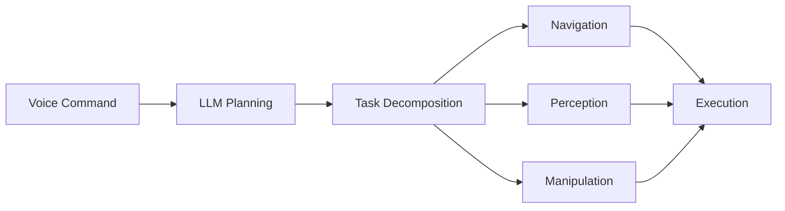

# Module 4: VLA & Capstone Project

**Weeks 11-13** | Prerequisites: Module 3 complete

## Learning Objectives

By the end of this module, you will be able to:

- Implement voice-to-action pipelines using LLMs
- Build cognitive planning systems for robots
- Understand humanoid robot fundamentals
- Design multi-modal human-robot interaction
- Complete an end-to-end capstone project

## Module Structure

| Chapter | Topic | Time |
|---------|-------|------|
| 4.1 | Voice-to-Action | 90 min |
| 4.2 | Cognitive Planning | 90 min |
| 4.3 | Humanoid Fundamentals | 120 min |
| 4.4 | Multi-Modal HRI | 60 min |
| 4.5 | Capstone Project | 300 min |
| 4.6 | Assessments | 60 min |

## Capstone Architecture

Begin with [Voice-to-Action](./voice-to-action) to start building intelligent robot interfaces.
