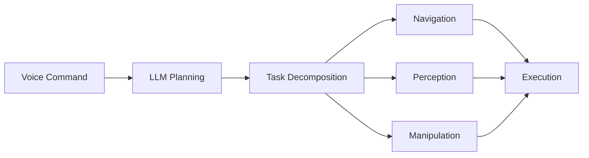

**Estimated Time**: 12 hours

:::info[What You'll Learn]
- Implement voice-to-action pipelines using LLMs for robot control
- Build cognitive planning systems that decompose tasks into actions
- Understand humanoid robot fundamentals including locomotion and balance
- Design multi-modal human-robot interaction systems
- Complete an end-to-end capstone project integrating all modules
:::

:::note[Prerequisites]
Before starting this module, complete:
- [Module 3: NVIDIA Isaac & AI](../module-3/index.md)
:::

**Weeks 11-13** | This module covers advanced robot intelligence and culminates in a full system integration project.

## Module Structure

| Chapter | Topic | Time |
|---------|-------|------|
| 4.1 | [Voice-to-Action](./voice-to-action.md) | 90 min |
| 4.2 | [Cognitive Planning](./cognitive-planning.md) | 50 min |
| 4.3 | [Humanoid Fundamentals](./humanoid-fundamentals.md) | 55 min |
| 4.4 | [Multi-Modal HRI](./multi-modal-hri.md) | 45 min |
| 4.5 | [Capstone Project](./capstone-project.md) | 60 min |
| 4.6 | [Assessments](./assessments.md) | 20 min |

## Capstone Architecture

:::tip[Key Takeaways]
- LLMs enable natural language interfaces for robot control
- Cognitive planning bridges human intent and robot execution
- Humanoid robots require specialized balance and locomotion control
- Multi-modal fusion combines speech, gesture, and gaze for robust interaction
- The capstone project integrates all skills from Modules 1-4
:::

## Next Steps

Begin with [Voice-to-Action](./voice-to-action.md) to start building intelligent robot interfaces.
