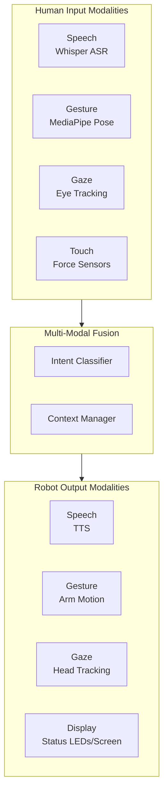
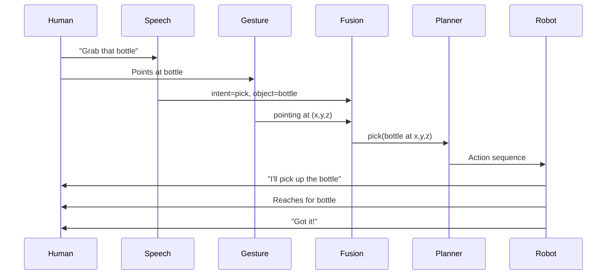

# Multi-Modal Human-Robot Interaction

For humanoid robots to work alongside humans, they need natural interaction capabilities. Multi-modal HRI combines speech, gesture, gaze, and physical interaction into a coherent communication system.

## Multi-Modal Architecture



## Speech Interaction

### Natural Language Understanding

```python
class SpeechInterface(Node):
    """Bi-directional speech for human-robot interaction."""

    def __init__(self):
        super().__init__('speech_interface')
        # Input: speech recognition
        self.audio_sub = self.create_subscription(
            AudioData, '/microphone/audio', self.audio_callback, 10)
        # Output: text-to-speech
        self.speak_sub = self.create_subscription(
            String, '/robot/speak', self.speak_callback, 10)
        self.intent_pub = self.create_publisher(
            String, '/hri/speech_intent', 10)

    def audio_callback(self, msg):
        # Transcribe with Whisper
        text = self.transcribe(msg.data)
        if text:
            self.get_logger().info(f'Heard: "{text}"')
            # Classify intent
            intent = self.classify_intent(text)
            self.intent_pub.publish(String(data=json.dumps({
                'text': text,
                'intent': intent['action'],
                'confidence': intent['confidence'],
                'entities': intent['entities']
            })))

    def classify_intent(self, text):
        """Classify user intent from transcribed text."""
        intents = {
            'navigate': ['go to', 'move to', 'come here', 'follow me'],
            'pick': ['grab', 'pick up', 'get me', 'bring me'],
            'stop': ['stop', 'halt', 'freeze', 'wait'],
            'status': ['how are you', 'what are you doing', 'status'],
        }
        text_lower = text.lower()
        for intent, patterns in intents.items():
            for pattern in patterns:
                if pattern in text_lower:
                    return {
                        'action': intent,
                        'confidence': 0.9,
                        'entities': self.extract_entities(text_lower)
                    }
        return {'action': 'unknown', 'confidence': 0.0, 'entities': {}}

    def speak_callback(self, msg):
        """Convert text to speech and play through speakers."""
        self.text_to_speech(msg.data)
```

### Dialogue Management

```python
class DialogueManager:
    """Manage conversation context and turn-taking."""

    def __init__(self):
        self.history = []
        self.context = {}

    def process_turn(self, user_input):
        self.history.append({'role': 'user', 'text': user_input})

        # Check for clarification need
        if self.needs_clarification(user_input):
            response = self.ask_clarification(user_input)
        else:
            response = self.generate_response(user_input)

        self.history.append({'role': 'robot', 'text': response})
        return response

    def needs_clarification(self, text):
        """Detect ambiguous instructions."""
        ambiguous_patterns = [
            'that thing', 'over there', 'the other one', 'it'
        ]
        return any(p in text.lower() for p in ambiguous_patterns)

    def ask_clarification(self, text):
        """Generate a clarification question."""
        if 'that' in text.lower() or 'it' in text.lower():
            return "Could you point to what you mean?"
        if 'there' in text.lower():
            return "Where exactly should I go?"
        return "Could you be more specific?"
```

## Gesture Recognition

### Body Pose Estimation

```python
class GestureRecognizer(Node):
    """Recognize human gestures from camera input."""

    GESTURES = {
        'pointing': 'User is pointing at something',
        'waving': 'User is waving (greeting or attention)',
        'stop': 'User shows stop hand signal',
        'come_here': 'User beckons the robot',
        'thumbs_up': 'User approves / confirms',
    }

    def __init__(self):
        super().__init__('gesture_recognizer')
        self.image_sub = self.create_subscription(
            Image, '/camera/image_raw', self.image_callback, 10)
        self.gesture_pub = self.create_publisher(
            String, '/hri/gesture', 10)

    def image_callback(self, msg):
        cv_image = self.bridge.imgmsg_to_cv2(msg, 'bgr8')
        # Detect body keypoints
        keypoints = self.detect_pose(cv_image)
        if keypoints is not None:
            gesture = self.classify_gesture(keypoints)
            if gesture:
                self.gesture_pub.publish(String(data=json.dumps({
                    'gesture': gesture,
                    'keypoints': keypoints.tolist()
                })))

    def classify_gesture(self, keypoints):
        """Classify gesture from body keypoints."""
        right_wrist = keypoints[16]
        right_elbow = keypoints[14]
        right_shoulder = keypoints[12]

        # Pointing: arm extended, wrist far from shoulder
        arm_length = np.linalg.norm(right_wrist - right_shoulder)
        if arm_length > 0.6:  # Normalized
            # Compute pointing direction
            direction = right_wrist - right_elbow
            return 'pointing'

        # Waving: hand above head, moving side to side
        if right_wrist[1] < right_shoulder[1] - 0.3:
            return 'waving'

        return None
```

### Pointing Resolution

```python
class PointingResolver(Node):
    """Determine what the user is pointing at."""

    def __init__(self):
        super().__init__('pointing_resolver')
        self.gesture_sub = self.create_subscription(
            String, '/hri/gesture', self.gesture_callback, 10)
        self.detection_sub = self.create_subscription(
            Detection2DArray, '/detections', self.detection_callback, 10)
        self.target_pub = self.create_publisher(
            String, '/hri/pointed_object', 10)

    def gesture_callback(self, msg):
        gesture_data = json.loads(msg.data)
        if gesture_data['gesture'] == 'pointing':
            keypoints = gesture_data['keypoints']
            # Cast ray from hand in pointing direction
            ray = self.compute_pointing_ray(keypoints)
            # Find object closest to ray
            target = self.find_target_along_ray(
                ray, self.latest_detections)
            if target:
                self.target_pub.publish(String(data=target))
```

## Multi-Modal Fusion

### Intent Fusion

```python
class MultiModalFusion(Node):
    """Fuse speech, gesture, and gaze into unified intent."""

    def __init__(self):
        super().__init__('multimodal_fusion')
        self.speech_sub = self.create_subscription(
            String, '/hri/speech_intent', self.speech_callback, 10)
        self.gesture_sub = self.create_subscription(
            String, '/hri/gesture', self.gesture_callback, 10)
        self.gaze_sub = self.create_subscription(
            String, '/hri/gaze_target', self.gaze_callback, 10)
        self.intent_pub = self.create_publisher(
            String, '/hri/fused_intent', 10)

        self.recent_speech = None
        self.recent_gesture = None
        self.recent_gaze = None
        self.fusion_window = 2.0  # seconds

    def fuse(self):
        """Combine modalities within time window."""
        now = self.get_clock().now()
        intent = {}

        # Speech provides action type
        if self.recent_speech and self.is_recent(self.recent_speech):
            intent['action'] = self.recent_speech['intent']
            intent['text'] = self.recent_speech['text']

        # Gesture provides target/direction
        if self.recent_gesture and self.is_recent(self.recent_gesture):
            if self.recent_gesture['gesture'] == 'pointing':
                intent['target_direction'] = self.recent_gesture['direction']

        # Gaze provides attention target
        if self.recent_gaze and self.is_recent(self.recent_gaze):
            intent['gaze_target'] = self.recent_gaze['target']

        # Resolve: "pick up that" + pointing = pick(pointed_object)
        if intent.get('action') == 'pick' and 'target_direction' in intent:
            intent['target'] = self.resolve_reference(
                intent['target_direction'])

        return intent
```

## Robot Feedback

### Visual Feedback

```python
class RobotFeedback(Node):
    """Provide feedback to humans through multiple channels."""

    def __init__(self):
        super().__init__('robot_feedback')

    def acknowledge(self, intent):
        """Confirm understanding of user intent."""
        # Look at the user
        self.publish_gaze_target('user_face')
        # Nod head
        self.publish_head_gesture('nod')
        # Verbal confirmation
        self.speak(f"I'll {intent['action']} the {intent.get('target', 'object')}")
        # Status indicator
        self.set_status_led('processing')

    def report_progress(self, action, progress):
        """Report task progress."""
        self.speak(f"Working on it. {progress}% complete.",
                   throttle=5.0)
        self.set_status_led('active')

    def report_failure(self, action, reason):
        """Report task failure with explanation."""
        self.speak(f"I couldn't {action}. {reason}")
        self.publish_head_gesture('shake')
        self.set_status_led('error')

    def report_success(self):
        """Indicate task completion."""
        self.speak("Done!")
        self.publish_head_gesture('nod')
        self.set_status_led('success')
```

## Social Behaviors

### Personal Space

```python
class ProxemicsController:
    """Maintain appropriate distance from humans."""

    # Hall's proxemic zones (meters)
    INTIMATE = 0.45
    PERSONAL = 1.2
    SOCIAL = 3.6
    PUBLIC = 7.6

    def get_target_distance(self, interaction_type):
        if interaction_type == 'handoff':
            return self.PERSONAL * 0.6  # Close personal
        elif interaction_type == 'conversation':
            return self.SOCIAL * 0.5    # Near social
        elif interaction_type == 'following':
            return self.PERSONAL        # Personal distance
        else:
            return self.SOCIAL          # Default social
```

## Interaction Pipeline Summary



## Next Steps

Continue to [Capstone Project](./capstone-project.md) to integrate all modules into a complete autonomous humanoid robot system.
