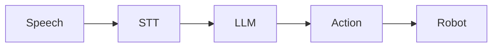

**Estimated Time**: 90 minutes

:::info[What You'll Learn]
- Implement speech recognition for robot commands using Whisper
- Use LLMs for natural language command interpretation
- Bridge natural language to executable robot actions via ROS 2
:::

:::note[Prerequisites]
Before starting this chapter, complete:
- [AI-Powered Perception](../module-3/perception.md)
:::

This chapter teaches you to build natural language interfaces for robot control, enabling robots to understand and execute spoken commands.

## Overview

Voice-to-Action enables robots to understand and execute natural language commands:



## Components

### 1. Speech-to-Text (STT)

Convert audio to text using Whisper or similar:

```python title="speech_to_text.py" showLineNumbers
import whisper

# highlight-next-line
model = whisper.load_model("base")

def transcribe(audio_path):
    result = model.transcribe(audio_path)
    return result["text"]
```

### 2. Language Understanding

Use an LLM to parse commands:

```python title="command_parser.py" showLineNumbers
from openai import OpenAI

client = OpenAI()

def parse_command(text):
    response = client.chat.completions.create(
        model="gpt-4",
        messages=[
            # highlight-next-line
            {"role": "system", "content": "Parse robot commands into actions."},
            {"role": "user", "content": text}
        ]
    )
    return response.choices[0].message.content
```

### 3. Action Mapping

Convert parsed commands to ROS 2 actions:

```python title="action_mapper.py" showLineNumbers
import rclpy
from geometry_msgs.msg import Twist

def execute_action(action):
    # highlight-next-line
    if action["type"] == "move":
        # Publish velocity command
        msg = Twist()
        msg.linear.x = action["speed"]
        publisher.publish(msg)
```

:::warning[API Key Security]
Never hardcode API keys in your source code. Use environment variables or a `.env` file for all credentials (e.g., `OPENAI_API_KEY`). See the [ROS 2 parameter system](../module-1/core-concepts.md) for secure configuration patterns.
:::

## ROS 2 Integration

```python title="voice_command_node.py" showLineNumbers
import rclpy
from rclpy.node import Node
from std_msgs.msg import String

class VoiceCommandNode(Node):
    def __init__(self):
        super().__init__('voice_command')
        # highlight-next-line
        self.subscription = self.create_subscription(
            String,
            'voice_input',
            self.command_callback,
            10)

    def command_callback(self, msg):
        # highlight-next-line
        command = parse_command(msg.data)
        execute_action(command)
```

:::tip[Testing Voice Commands]
Start by testing with typed text input before integrating microphone capture. You can publish test commands with `ros2 topic pub /voice_input std_msgs/msg/String "data: 'move forward'"` to validate your pipeline without audio hardware.
:::

## Safety Considerations

- Always validate commands before execution
- Implement emergency stop capability
- Use confirmation for dangerous actions
- Log all voice commands for auditing

:::tip[Key Takeaways]
- Whisper provides robust speech-to-text for robot voice interfaces
- LLMs can interpret natural language commands into structured action formats
- ROS 2 topics connect the voice pipeline to robot actuators
- Always validate and safety-check commands before execution
:::

## Next Steps

With voice-to-action working, continue to [Cognitive Planning](./cognitive-planning.md) to learn about task decomposition and re-planning strategies.
