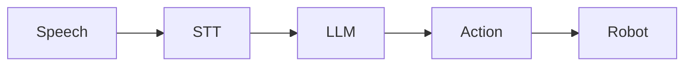

# Voice-to-Action Pipeline

This chapter teaches you to build natural language interfaces for robot control.

## Overview

Voice-to-Action enables robots to understand and execute natural language commands:



## Components

### 1. Speech-to-Text (STT)

Convert audio to text using Whisper or similar:

```python
import whisper

model = whisper.load_model("base")

def transcribe(audio_path):
    result = model.transcribe(audio_path)
    return result["text"]
```

### 2. Language Understanding

Use an LLM to parse commands:

```python
from openai import OpenAI

client = OpenAI()

def parse_command(text):
    response = client.chat.completions.create(
        model="gpt-4",
        messages=[
            {"role": "system", "content": "Parse robot commands into actions."},
            {"role": "user", "content": text}
        ]
    )
    return response.choices[0].message.content
```

### 3. Action Mapping

Convert parsed commands to ROS 2 actions:

```python
import rclpy
from geometry_msgs.msg import Twist

def execute_action(action):
    if action["type"] == "move":
        # Publish velocity command
        msg = Twist()
        msg.linear.x = action["speed"]
        publisher.publish(msg)
```

## ROS 2 Integration

```python
import rclpy
from rclpy.node import Node
from std_msgs.msg import String

class VoiceCommandNode(Node):
    def __init__(self):
        super().__init__('voice_command')
        self.subscription = self.create_subscription(
            String,
            'voice_input',
            self.command_callback,
            10)

    def command_callback(self, msg):
        command = parse_command(msg.data)
        execute_action(command)
```

## Safety Considerations

- Always validate commands before execution
- Implement emergency stop capability
- Use confirmation for dangerous actions
- Log all voice commands for auditing

## Next Steps

With voice-to-action working, you're ready to learn about cognitive planning and task decomposition.
