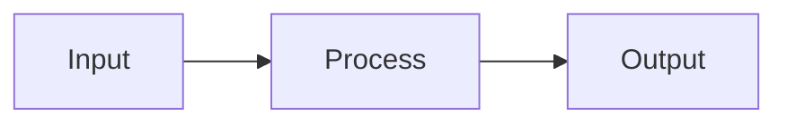

---
# =============================================================================
# CHAPTER FRONTMATTER — All 7 fields below are REQUIRED
# Validated against contracts/frontmatter-schema.json at build time.
# See: specs/002-chapter-template-system/contracts/template-structure.md
# =============================================================================
sidebar_position: 1
title: "Your Chapter Title Here (5-100 characters)"
sidebar_label: "Short Label (3-40 characters)"
description: "SEO meta description — summarize what the reader will learn in this chapter. Must be 50-300 characters."
keywords: [keyword1, keyword2, keyword3]
estimated_time: "45 minutes"
learning_objectives:
  - "First learning objective — what the student will be able to do (10-200 chars)"
  - "Second learning objective"
  - "Third learning objective"
# --- Optional fields ---
# prerequisites:
#   - "chapter-id-in-kebab-case"
# slug: "/custom-url-path"
# tags: [tag1, tag2]
# draft: true
---

<!-- ==========================================================================
  CONTENT TYPE GUIDE — Choose ONE type for this chapter and follow its pattern.
  Delete the guidance comments for other types before publishing.

  TUTORIAL     — "Follow along and build X"
                 Primary: step-by-step instructions with runnable code
                 Emphasis: numbered steps, cumulative code blocks, tips for shortcuts
                 Admonitions: :::tip (shortcuts), :::warning (gotchas)
                 Code density: HIGH (runnable, builds on previous steps)
                 Example chapters: installation.md, building-packages.md

  CONCEPT      — "Understand how X works and why"
                 Primary: explanation with diagrams and comparisons
                 Emphasis: theory, architecture diagrams, comparison tables
                 Admonitions: :::info (context), :::note (supplementary detail)
                 Code density: LOW (short illustrative snippets only)
                 Example chapters: what-is-physical-ai.md, core-concepts.md

  HANDS-ON LAB — "Complete this guided exercise"
                 Primary: objective-driven exercise with validation steps
                 Emphasis: exercise goals, setup, step-by-step, validation/testing
                 Admonitions: :::danger (hardware safety), :::warning (common errors)
                 Code density: HIGH (exercise code with highlighted key lines)
                 Example chapters: exercises.md files in each module

  REFERENCE    — "Look up how to use X"
                 Primary: command/API documentation with complete examples
                 Emphasis: parameter tables, complete code snippets, version notes
                 Admonitions: :::note (version notes), :::warning (deprecations)
                 Code density: HIGH (complete reference snippets)
                 Example chapters: troubleshooting.md, resources.md
========================================================================== -->

<!-- TIME BADGE — Must match estimated_time in frontmatter above -->
**Estimated Time**: 45 minutes

<!-- ==========================================================================
  LEARNING OBJECTIVES — Use :::info admonition (renders as blue box)
  - List 2-6 objectives that mirror the learning_objectives in frontmatter
  - Each objective should start with an action verb (Explain, Create, Implement, etc.)
  - Keep each to a single sentence, 10-200 characters
========================================================================== -->

:::info[What You'll Learn]
- First learning objective (matches frontmatter)
- Second learning objective
- Third learning objective
:::

<!-- ==========================================================================
  PREREQUISITES — Use :::note admonition (renders as gray/blue box)
  - Link to prerequisite chapters using relative Docusaurus paths
  - If no prerequisites: write "No prerequisites — you can start here."
  - Use format: [Chapter Title](./relative-path.md) or (../module/path.md)
========================================================================== -->

:::note[Prerequisites]
Before starting this chapter, complete:
- [Previous Chapter Title](./previous-chapter.md)
:::

<!-- If this chapter has no prerequisites, use this instead:
:::note[Prerequisites]
No prerequisites — you can start here.
:::
-->

<!-- ==========================================================================
  MAIN CONTENT — Structure depends on your content type (see guide above)

  ALL TYPES: Use H2 (##) for main sections, H3 (###) for subsections.
  Never use H1 (#) — Docusaurus generates it from the title frontmatter.
  Maximum nesting: H4 (####). Never skip levels (e.g., H2 → H4).

  TUTORIAL pattern:
    ## Step 1: Setup / First Action
    ## Step 2: Build / Next Action
    ## Step 3: Test / Validate
    (numbered steps with code at each step)

  CONCEPT pattern:
    ## Overview / Introduction
    ## How It Works (with Mermaid diagram)
    ## Key Concepts (with comparison table)
    ## Practical Example
    (explanation → diagram → comparison → example)

  HANDS-ON LAB pattern:
    ## Lab Objectives
    ## Environment Setup
    ## Exercise 1: Title
    ## Exercise 2: Title
    ## Validation & Testing
    (objective → setup → exercises → validation)

  REFERENCE pattern:
    ## Command / API Name
    ### Parameters
    ### Examples
    ### Notes
    (command → params → examples → notes)
========================================================================== -->

## Section Title

<!-- TUTORIAL: Start with a brief introduction to what this step accomplishes -->
<!-- CONCEPT: Explain the concept with context before diving into details -->
<!-- LAB: State the exercise objective clearly -->
<!-- REFERENCE: Describe the command/API purpose -->

Your content here. Write clear, concise prose. Define jargon on first use.

### Subsection

<!-- ==========================================================================
  CODE BLOCK STANDARDS — Follow these rules for ALL code blocks:

  1. LANGUAGE: Always specify the language after opening backticks
     Available: python, bash, yaml, cpp, json, markup

  2. TITLE: Always add title="description" to every code block
     Use filenames: title="talker_node.py"
     Or descriptions: title="Install ROS 2 dependencies"

  3. LINE NUMBERS: Add showLineNumbers for blocks > 5 lines
     Only for: python, bash, cpp, yaml

  4. HIGHLIGHTING: Mark important lines for the reader
     Comment-based: # highlight-next-line (Python/Bash)
                    // highlight-next-line (C++/JSON)
     Range-based: {3,7-9} in metastring

  5. OUTPUT: Show expected output in separate block with title="Output"
========================================================================== -->

```python title="example_node.py" showLineNumbers
import rclpy
from rclpy.node import Node

class ExampleNode(Node):
    def __init__(self):
        super().__init__('example_node')
        # highlight-next-line
        self.get_logger().info('Node started!')

def main(args=None):
    rclpy.init(args=args)
    node = ExampleNode()
    rclpy.spin(node)
    node.destroy_node()
    rclpy.shutdown()
```

```bash title="Run the node"
ros2 run my_package example_node
```

```text title="Expected output"
[INFO] [example_node]: Node started!
```

<!-- ==========================================================================
  ADMONITION EXAMPLES — Use these patterns in your content

  Each content type typically uses different admonition types:
  - Tutorial: :::tip and :::warning
  - Concept: :::info and :::note
  - Lab: :::danger and :::warning
  - Reference: :::note and :::warning
========================================================================== -->

<!-- TUTORIAL admonition example: -->
:::tip[Pro Tip]
Use `ros2 topic echo --once /topic_name` to capture a single message
without flooding your terminal.
:::

<!-- CONCEPT admonition example: -->
:::info[Key Insight]
ROS 2 uses DDS (Data Distribution Service) as its middleware, enabling
flexible quality-of-service configurations for different use cases.
:::

<!-- LAB admonition example: -->
:::danger[Hardware Safety]
Never send velocity commands to a real robot without first testing
in simulation. Unexpected motor movements can cause physical injury.
:::

<!-- REFERENCE admonition example: -->
:::note[Version Note]
This command syntax is specific to ROS 2 Jazzy (May 2024).
Earlier distributions may use different flag names.
:::

<!-- GENERAL admonition — use for common mistakes: -->
:::warning[Common Mistake]
Do not call `rclpy.spin()` before creating all publishers and subscribers.
The node will start processing callbacks immediately.
:::

<!-- ==========================================================================
  MERMAID DIAGRAMS — Use for architecture, flow, and sequence diagrams
  Supported types: flowchart, sequence, graph, classDiagram, stateDiagram
  Themes: neutral (light), dark (dark mode) — configured in docusaurus.config.ts
========================================================================== -->



## Another Section

Continue your content following the same patterns above.

<!-- Add more H2 sections as needed for your content type -->

<!-- ==========================================================================
  KEY TAKEAWAYS — Use :::tip admonition (renders as green box)
  - Include 3-7 bullet points summarizing the main concepts
  - Each point: ONE sentence, ONE concept
  - Reader should be able to verify understanding from these points
========================================================================== -->

:::tip[Key Takeaways]
- First key concept — a single sentence summarizing what was learned
- Second key concept — another main idea from this chapter
- Third key concept — the third most important thing to remember
:::

<!-- ==========================================================================
  NEXT STEPS — Links to 1-3 related or subsequent chapters
  - Use relative Docusaurus paths only (./file.md or ../module/file.md)
  - For module-ending chapters, link to the next module's overview
  - Include a brief description of what the next chapter covers
========================================================================== -->

## Next Steps

Continue your learning journey:
- [Next Chapter Title](./next-chapter.md) — brief description of what's covered
- [Related Chapter](../module-name/chapter-name.md) — why this is relevant
