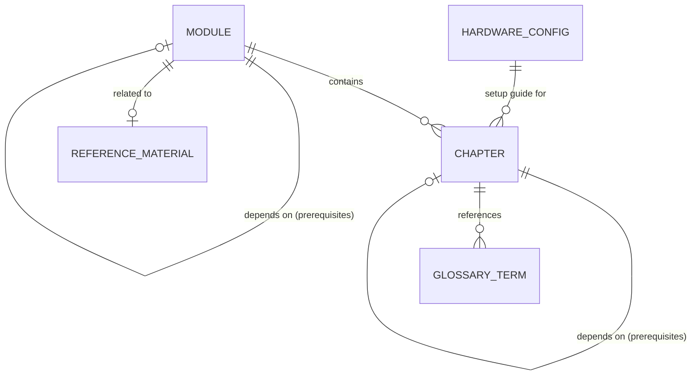

# Data Model: Physical AI & Humanoid Robotics Textbook

**Feature**: 001-book-master-plan
**Date**: 2026-02-02
**Purpose**: Define entities, attributes, and relationships for content organization

---

## Entity Definitions

### 1. Module

A major content section corresponding to course weeks.

| Attribute | Type | Required | Description |
|-----------|------|----------|-------------|
| id | string | Yes | Unique identifier (e.g., "module-1") |
| title | string | Yes | Display title (e.g., "ROS 2 Jazzy Fundamentals") |
| short_title | string | Yes | Sidebar label (e.g., "Module 1: ROS 2") |
| week_start | number | Yes | Starting week (1-13) |
| week_end | number | Yes | Ending week (1-13) |
| description | string | Yes | Brief overview (1-2 sentences) |
| prerequisites | string[] | No | List of required module IDs |
| learning_objectives | string[] | Yes | Module-level learning outcomes |
| chapters | Chapter[] | Yes | Ordered list of chapters |

**Relationships**:
- Contains 1..n Chapters
- May depend on 0..n other Modules (prerequisites)

**Example**:
```json
{
  "id": "module-1",
  "title": "ROS 2 Jazzy Fundamentals",
  "short_title": "Module 1: ROS 2",
  "week_start": 3,
  "week_end": 5,
  "description": "Learn the fundamentals of Robot Operating System 2, including nodes, topics, services, and package development.",
  "prerequisites": [],
  "learning_objectives": [
    "Install and configure ROS 2 Jazzy on Ubuntu 24.04",
    "Understand the ROS 2 computational graph",
    "Create Python-based ROS 2 packages",
    "Work with URDF robot descriptions"
  ],
  "chapters": ["installation", "core-concepts", "building-packages", "python-agents", "urdf-basics", "exercises"]
}
```

---

### 2. Chapter

An individual learning unit within a module.

| Attribute | Type | Required | Description |
|-----------|------|----------|-------------|
| id | string | Yes | Unique identifier (filename without .md) |
| sidebar_position | number | Yes | Order in sidebar (1-based) |
| title | string | Yes | Full page title |
| sidebar_label | string | Yes | Shorter sidebar display name |
| description | string | Yes | SEO/preview description (150-300 chars) |
| keywords | string[] | Yes | Search optimization terms |
| estimated_time | string | Yes | Reading/completion time (e.g., "30 minutes") |
| prerequisites | string[] | No | Chapter IDs that must be completed first |
| learning_objectives | string[] | Yes | Chapter-specific learning outcomes |
| module_id | string | Yes | Parent module identifier |

**Relationships**:
- Belongs to exactly 1 Module
- May depend on 0..n other Chapters (prerequisites)
- Contains 0..n GlossaryTerm references

**Example** (as frontmatter):
```yaml
---
sidebar_position: 3
title: "Core Concepts: Nodes, Topics, Services, and Actions"
sidebar_label: "Core Concepts"
description: "Master the fundamental building blocks of ROS 2: nodes for computation, topics for streaming data, services for request-response, and actions for long-running tasks."
keywords: [ros2, nodes, topics, services, actions, pub-sub, computational-graph]
estimated_time: "45 minutes"
prerequisites: ["installation"]
learning_objectives:
  - "Explain the ROS 2 computational graph model"
  - "Create and run ROS 2 nodes using Python"
  - "Implement publishers and subscribers for topic communication"
  - "Use services for synchronous request-response patterns"
  - "Understand when to use actions for long-running tasks"
---
```

---

### 3. Hardware Configuration

One of 3 supported development environment setups.

| Attribute | Type | Required | Description |
|-----------|------|----------|-------------|
| id | string | Yes | Unique identifier |
| name | string | Yes | Display name |
| tier | enum | Yes | "workstation" \| "edge" \| "cloud" |
| description | string | Yes | Overview of this configuration |
| hardware_requirements | object | Yes | CPU, GPU, RAM, storage specs |
| software_requirements | string[] | Yes | OS, drivers, tools needed |
| installation_steps | Step[] | Yes | Ordered setup instructions |
| verification_checklist | string[] | Yes | Commands to verify setup |
| estimated_setup_time | string | Yes | Time to complete setup |
| cost_tier | enum | Yes | "free" \| "low" \| "medium" \| "high" |

**Example**:
```json
{
  "id": "workstation",
  "name": "Digital Twin Workstation",
  "tier": "workstation",
  "description": "Full-featured local development with GPU-accelerated simulation.",
  "hardware_requirements": {
    "cpu": "8+ cores, x86_64",
    "gpu": "NVIDIA RTX 3060+ (12GB VRAM recommended)",
    "ram": "32GB minimum, 64GB recommended",
    "storage": "100GB SSD free space"
  },
  "software_requirements": [
    "Ubuntu 24.04 LTS",
    "NVIDIA Driver 535+",
    "CUDA 12.x",
    "Docker (optional)"
  ],
  "installation_steps": [
    {"order": 1, "title": "Install Ubuntu 24.04", "content": "..."},
    {"order": 2, "title": "Install NVIDIA Drivers", "content": "..."},
    {"order": 3, "title": "Install ROS 2 Jazzy", "content": "..."},
    {"order": 4, "title": "Install Isaac Sim", "content": "..."}
  ],
  "verification_checklist": [
    "ros2 doctor --report",
    "nvidia-smi",
    "isaac-sim --version"
  ],
  "estimated_setup_time": "2-3 hours",
  "cost_tier": "high"
}
```

---

### 4. Glossary Term

A technical term with definition and context.

| Attribute | Type | Required | Description |
|-----------|------|----------|-------------|
| term | string | Yes | The term itself |
| definition | string | Yes | Clear, concise definition |
| acronym_for | string | No | Full form if term is acronym |
| related_terms | string[] | No | Links to related glossary entries |
| first_appearance | string | No | Chapter ID where term is introduced |
| category | enum | Yes | "ros2" \| "simulation" \| "ai" \| "hardware" \| "general" |

**Example**:
```json
{
  "term": "URDF",
  "definition": "Unified Robot Description Format - an XML-based file format for describing robot models including links, joints, sensors, and visual/collision geometry.",
  "acronym_for": "Unified Robot Description Format",
  "related_terms": ["SDF", "Xacro", "TF2"],
  "first_appearance": "module-1/urdf-basics",
  "category": "ros2"
}
```

---

### 5. Reference Material

Quick reference content like command cheat sheets.

| Attribute | Type | Required | Description |
|-----------|------|----------|-------------|
| id | string | Yes | Unique identifier |
| title | string | Yes | Reference title |
| category | enum | Yes | "commands" \| "shortcuts" \| "troubleshooting" |
| related_module | string | No | Associated module ID |
| content | Section[] | Yes | Organized reference content |

**Example**:
```json
{
  "id": "ros2-commands",
  "title": "ROS 2 Command Reference",
  "category": "commands",
  "related_module": "module-1",
  "content": [
    {
      "heading": "Node Commands",
      "items": [
        {"command": "ros2 run <pkg> <node>", "description": "Run a node"},
        {"command": "ros2 node list", "description": "List running nodes"},
        {"command": "ros2 node info <node>", "description": "Get node details"}
      ]
    }
  ]
}
```

---

## Relationships Diagram



---

## Content Hierarchy

```
Book
├── Introduction (not a module, standalone section)
│   └── Chapters: what-is-physical-ai, humanoid-landscape, hardware-overview, development-workflow
├── Module 1: ROS 2 Jazzy (Weeks 3-5)
│   └── Chapters: index, installation, core-concepts, building-packages, python-agents, urdf-basics, exercises
├── Module 2: Digital Twin (Weeks 6-7)
│   └── Chapters: index, gazebo-setup, urdf-sdf, physics-sim, sensors, unity-bridge, exercises
├── Module 3: AI-Robot Brain (Weeks 8-10)
│   └── Chapters: index, isaac-sim-setup, perception, navigation, reinforcement-learning, sim-to-real, exercises
├── Module 4: VLA & Capstone (Weeks 11-13)
│   └── Chapters: index, voice-to-action, cognitive-planning, humanoid-fundamentals, multi-modal-hri, capstone-project, assessments
├── Hardware Guide (standalone)
│   └── Chapters: index, workstation, jetson, cloud-options
└── Appendices (standalone)
    └── Chapters: glossary, resources, troubleshooting
```

---

## Validation Rules

### Module Validation
- `week_start` must be ≤ `week_end`
- `week_start` must be ≥ 1 and `week_end` must be ≤ 13
- All `prerequisites` must reference existing module IDs
- `chapters` array must not be empty

### Chapter Validation
- `sidebar_position` must be unique within module
- `estimated_time` must match format: `"N minutes"` or `"N hours"`
- `prerequisites` must reference chapters within same module or completed modules
- `keywords` array must have 3-10 items
- `learning_objectives` must have 2-6 items

### Glossary Term Validation
- `term` must be unique (case-insensitive)
- `definition` must be 10-500 characters
- `related_terms` must reference existing terms
- `first_appearance` must be valid chapter path

### Hardware Configuration Validation
- `verification_checklist` must have ≥3 items
- All installation steps must have unique `order` values
- `cost_tier` must align with hardware requirements
