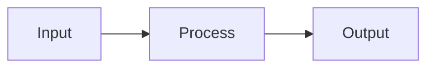

# Quickstart: Physical AI & Humanoid Robotics Textbook Development

**Feature**: 001-book-master-plan
**Date**: 2026-02-02
**Purpose**: Developer setup guide for contributing to the textbook

---

## Prerequisites

Before you begin, ensure you have:

- **Node.js 20.x LTS** - [Download](https://nodejs.org/)
- **Yarn 1.x** - Install with `npm install -g yarn`
- **Git** - [Download](https://git-scm.com/)
- **VS Code** (recommended) - [Download](https://code.visualstudio.com/)

### Recommended VS Code Extensions

- ESLint
- Prettier
- MDX
- Mermaid Editor

---

## Installation

### 1. Clone the Repository

```bash
git clone https://github.com/username/hackathon-Book2026.git
cd hackathon-Book2026/my-website
```

### 2. Install Dependencies

```bash
yarn install
```

### 3. Start Development Server

```bash
yarn start
```

The site will open at `http://localhost:3000/hackathon-Book2026/`.

---

## Project Structure

```
my-website/
├── docusaurus.config.ts    # Main configuration
├── sidebars.ts             # Sidebar configuration
├── package.json            # Dependencies
├── src/
│   ├── components/         # React components
│   │   ├── ModuleCard/     # Dashboard module cards
│   │   └── HomepageDashboard/
│   ├── css/
│   │   └── custom.css      # Custom styles
│   └── pages/
│       └── index.tsx       # Homepage
├── docs/                   # Content pages
│   ├── intro.md
│   ├── introduction/
│   ├── module-1/
│   ├── module-2/
│   ├── module-3/
│   ├── module-4/
│   ├── hardware-guide/
│   └── appendices/
└── static/
    └── img/                # Images
```

---

## Creating Content

### Creating a New Chapter

1. Create a new `.md` file in the appropriate module directory:

```bash
# Example: New chapter in Module 1
touch docs/module-1/my-new-chapter.md
```

2. Add required frontmatter:

```yaml
---
sidebar_position: 8
title: "My New Chapter Title"
sidebar_label: "My New Chapter"
description: "A brief description for SEO and previews (50-300 characters)."
keywords: [keyword1, keyword2, keyword3]
estimated_time: "30 minutes"
prerequisites: ["core-concepts"]
learning_objectives:
  - "First learning objective"
  - "Second learning objective"
  - "Third learning objective"
---

# My New Chapter Title

Content goes here...
```

3. Verify frontmatter against schema:

```bash
# Optional: Validate frontmatter (if validation script is set up)
yarn validate:frontmatter docs/module-1/my-new-chapter.md
```

### Adding Code Examples

Use fenced code blocks with language identifiers:

````markdown
```python title="example.py" showLineNumbers
import rclpy
from rclpy.node import Node

class MyNode(Node):
    def __init__(self):
        super().__init__('my_node')
        self.get_logger().info('Hello, ROS 2!')

def main():
    rclpy.init()
    node = MyNode()
    rclpy.spin(node)
    rclpy.shutdown()

if __name__ == '__main__':
    main()
```
````

**Supported languages**: python, bash, yaml, xml, cpp, json, typescript, javascript

### Adding Diagrams

Use Mermaid for diagrams:

````markdown

````

### Adding Admonitions

```markdown
:::note
This is a note.
:::

:::tip
This is a helpful tip.
:::

:::warning
This is a warning.
:::

:::danger
This is dangerous!
:::

:::info
This is informational.
:::
```

---

## Building for Production

### Build the Site

```bash
yarn build
```

Output is in the `build/` directory.

### Preview Production Build

```bash
yarn serve
```

### Check for Issues

```bash
# Check for broken links
yarn build && npx linkinator ./build --recurse

# Check TypeScript
yarn typecheck

# Check linting
yarn lint
```

---

## Deployment

Deployment is automated via GitHub Actions on push to `main` branch.

### Manual Deployment (if needed)

```bash
# Build and deploy to GitHub Pages
GIT_USER=<your-github-username> yarn deploy
```

---

## Common Tasks

### Update Sidebar Order

Edit the `sidebar_position` in the page's frontmatter:

```yaml
---
sidebar_position: 5  # Change this number
---
```

### Add a New Module

1. Create directory: `docs/module-N/`
2. Create `_category_.json`:

```json
{
  "position": N,
  "label": "Module N: Title",
  "collapsible": true,
  "collapsed": true,
  "link": {
    "type": "doc",
    "id": "module-N/index"
  }
}
```

3. Create `index.md` with module overview

### Update Homepage Module Cards

Edit `src/pages/index.tsx` to add/modify module cards.

### Add Images

1. Place images in `static/img/`
2. Reference in markdown:

```markdown

```

### Add Glossary Terms

Edit `docs/appendices/glossary.md`:

```markdown
### TERM

**Definition**: Clear, concise definition here.

**Related**: [Related Term 1](#related-term-1), [Related Term 2](#related-term-2)
```

---

## Troubleshooting

### Build Fails

1. Clear cache: `yarn clear`
2. Delete `node_modules` and reinstall: `rm -rf node_modules && yarn install`
3. Check for syntax errors in frontmatter

### Hot Reload Not Working

1. Restart dev server: `Ctrl+C` then `yarn start`
2. Check for file save errors
3. Verify file is in `docs/` directory

### Mermaid Diagram Not Rendering

1. Ensure `mermaid: true` is in `docusaurus.config.ts`
2. Check Mermaid syntax at [live editor](https://mermaid.live/)
3. Restart dev server after config changes

### Search Not Finding Content

1. Rebuild search index: `yarn build`
2. Check content is not marked as `draft: true`
3. Verify content is in `docs/` directory

---

## Quality Checklist

Before submitting a PR, verify:

- [ ] Frontmatter has all required fields
- [ ] Code examples have language identifiers
- [ ] All links are working
- [ ] Images have alt text
- [ ] Mermaid diagrams render correctly
- [ ] `yarn build` succeeds with no errors
- [ ] Content follows terminology from glossary

---

## Getting Help

- **Docusaurus Docs**: https://docusaurus.io/docs
- **Project Spec**: `/specs/001-book-master-plan/spec.md`
- **Data Model**: `/specs/001-book-master-plan/data-model.md`
- **Research**: `/specs/001-book-master-plan/research.md`
