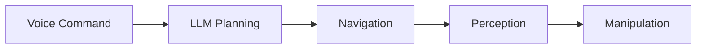

# Research: Physical AI & Humanoid Robotics Textbook

**Feature**: 001-book-master-plan
**Date**: 2026-02-02
**Purpose**: Document technology decisions, best practices, and alternatives for Docusaurus implementation

---

## 1. Docusaurus v3 Configuration

### Decision
Use TypeScript configuration (`docusaurus.config.ts`) with typed imports for better developer experience.

### Rationale
- Type safety catches configuration errors at build time
- IDE autocompletion for all config options
- Docusaurus 3.x has first-class TypeScript support
- Aligns with modern JavaScript/TypeScript best practices

### Implementation
```typescript
import type {Config} from '@docusaurus/types';
import type * as Preset from '@docusaurus/preset-classic';

const config: Config = {
  title: 'Physical AI & Humanoid Robotics',
  tagline: 'A 13-week course for industry practitioners',
  favicon: 'img/favicon.ico',
  url: 'https://username.github.io',
  baseUrl: '/hackathon-Book2026/',
  // ... rest of config
} satisfies Config;

export default config;
```

### Alternatives Considered
- JavaScript config (`docusaurus.config.js`) - Less type safety, no IDE support
- JSON config - Not supported by Docusaurus 3.x

---

## 2. Sidebar Configuration

### Decision
Use autogenerated sidebar with `_category_.json` files for category metadata.

### Rationale
- Filesystem-based organization matches content hierarchy
- Less manual maintenance as content grows
- Category metadata (position, label, collapsed state) in dedicated files
- Supports collapsible categories out of the box

### Implementation
Each module directory contains `_category_.json`:
```json
{
  "position": 2,
  "label": "Module 1: ROS 2 Jazzy",
  "collapsible": true,
  "collapsed": true,
  "link": {
    "type": "generated-index",
    "title": "ROS 2 Jazzy Fundamentals"
  }
}
```

### Alternatives Considered
- Fully manual `sidebars.ts` - More control but high maintenance burden
- Hybrid (manual + autogenerated) - Added complexity without clear benefit

---

## 3. Search Implementation

### Decision
Use `@easyops-cn/docusaurus-search-local` plugin for offline-capable local search.

### Rationale
- No external service dependency (Algolia requires application)
- Works offline for students without reliable internet
- Indexes all content including code blocks
- Zero cost, fully self-hosted

### Implementation
```typescript
// In docusaurus.config.ts
themes: [
  [
    '@easyops-cn/docusaurus-search-local',
    {
      hashed: true,
      language: ['en'],
      indexDocs: true,
      indexBlog: false,
      indexPages: true,
      docsRouteBasePath: '/docs',
      highlightSearchTermsOnTargetPage: true,
    },
  ],
],
```

### Alternatives Considered
- Algolia DocSearch - Requires approval process, external dependency
- Built-in search (none in Docusaurus) - Would need custom implementation
- Lunr.js directly - More complex setup, plugin handles this

---

## 4. Mermaid Diagram Support

### Decision
Use `@docusaurus/theme-mermaid` for rendering diagrams in markdown.

### Rationale
- First-party Docusaurus theme (well-maintained)
- Diagrams render as SVG (scalable, accessible)
- Supports all Mermaid diagram types (flowchart, sequence, class, etc.)
- Code-based diagrams (version control friendly)

### Implementation
```typescript
// In docusaurus.config.ts
themes: ['@docusaurus/theme-mermaid'],
markdown: {
  mermaid: true,
},
```

Usage in markdown:
```markdown

```

### Alternatives Considered
- Static images - Not version-control friendly, harder to update
- PlantUML - Requires server, less modern syntax
- Draw.io exports - Manual process, not integrated

---

## 5. GitHub Pages Deployment

### Decision
Use GitHub Actions with `actions/deploy-pages@v4` for automated deployment.

### Rationale
- Native GitHub integration (no external CI/CD service)
- Free for public repositories
- Automatic HTTPS with custom domain support
- Build artifacts cached between runs

### Implementation
```yaml
# .github/workflows/deploy.yml
name: Deploy to GitHub Pages

on:
  push:
    branches: [main]

jobs:
  build:
    runs-on: ubuntu-latest
    steps:
      - uses: actions/checkout@v4
      - uses: actions/setup-node@v4
        with:
          node-version: 20
          cache: yarn
      - run: yarn install --frozen-lockfile
      - run: yarn build
      - uses: actions/upload-pages-artifact@v3
        with:
          path: build

  deploy:
    needs: build
    permissions:
      pages: write
      id-token: write
    environment:
      name: github-pages
      url: ${{ steps.deployment.outputs.page_url }}
    runs-on: ubuntu-latest
    steps:
      - uses: actions/deploy-pages@v4
        id: deployment
```

### Alternatives Considered
- Netlify - Additional account, overkill for static site
- Vercel - Similar to Netlify, unnecessary complexity
- Manual deployment - Error-prone, not automated

---

## 6. Homepage Dashboard Pattern

### Decision
Custom React component with CSS Grid for module cards layout.

### Rationale
- Docusaurus allows custom React pages in `src/pages/`
- CSS Grid provides responsive layout without external dependencies
- Module cards can display: title, week range, prerequisites, progress indicator
- Consistent with Docusaurus theme via `@theme/Layout` wrapper

### Implementation
```tsx
// src/pages/index.tsx
import Layout from '@theme/Layout';
import ModuleCard from '@site/src/components/ModuleCard';

export default function Home() {
  return (
    <Layout title="Home" description="Physical AI & Humanoid Robotics Course">
      <main className="dashboard">
        <section className="hero">
          <h1>Physical AI & Humanoid Robotics</h1>
          <p>A 13-week course for industry practitioners</p>
        </section>
        <section className="modules-grid">
          <ModuleCard
            title="Module 1: ROS 2 Jazzy"
            weeks="3-5"
            prerequisites={[]}
            link="/docs/module-1"
          />
          {/* ... more cards */}
        </section>
      </main>
    </Layout>
  );
}
```

### Alternatives Considered
- Default Docusaurus landing page - Less customizable for course structure
- External component library (MUI, Chakra) - Added bundle size, dependency
- MDX homepage - Less dynamic, harder to iterate

---

## 7. Frontmatter Schema

### Decision
Standardize 8 required fields across all chapter pages with JSON Schema validation.

### Rationale
- Consistent metadata enables automated table-of-contents generation
- Learning objectives visible at page level for student reference
- Prerequisites support prerequisite warning feature (edge case)
- Keywords improve search relevance

### Implementation
Required fields:
```yaml
---
sidebar_position: 1
title: "Core Concepts"
sidebar_label: "Core Concepts"
description: "Understanding ROS 2 nodes, topics, services, and actions"
keywords: [ros2, nodes, topics, services, actions, pub-sub]
estimated_time: "45 minutes"
prerequisites: ["installation"]
learning_objectives:
  - "Understand the ROS 2 computational graph"
  - "Create and run nodes"
  - "Publish and subscribe to topics"
---
```

### Alternatives Considered
- Minimal frontmatter (title only) - Misses educational metadata opportunity
- External metadata file - Harder to maintain, split from content
- Database-driven metadata - Overkill for static site

---

## 8. Code Block Configuration

### Decision
Use Prism with language-specific highlighting and copy button enabled.

### Rationale
- Prism is bundled with Docusaurus (no extra dependency)
- Copy button improves UX for code examples
- Line highlighting supports teaching specific code sections
- Title support helps identify file paths

### Implementation
```typescript
// In docusaurus.config.ts
themeConfig: {
  prism: {
    theme: prismThemes.github,
    darkTheme: prismThemes.dracula,
    additionalLanguages: ['bash', 'python', 'yaml', 'xml', 'cpp', 'json'],
  },
},
```

Usage:
```markdown
```python title="publisher_node.py" showLineNumbers
import rclpy
from rclpy.node import Node

class MinimalPublisher(Node):
    # highlighted-next-line
    def __init__(self):
        super().__init__('minimal_publisher')
```
```

### Alternatives Considered
- highlight.js - Less features than Prism in Docusaurus context
- CodeMirror - Overkill for static display, adds bundle size
- No highlighting - Poor UX for code-heavy content

---

## 9. Link Validation

### Decision
Use linkinator in CI pipeline for automated broken link detection.

### Rationale
- Catches broken internal links before deployment
- Validates external links (official docs, GitHub repos)
- CLI tool integrates easily with GitHub Actions
- Configurable exclusions for expected 404s

### Implementation
```yaml
# In GitHub Actions workflow
- name: Check for broken links
  run: npx linkinator ./build --recurse --skip "^(?!http://localhost)"
```

### Alternatives Considered
- Manual checking - Error-prone, doesn't scale
- Docusaurus built-in (none) - Would need custom plugin
- Broken-link-checker - Similar to linkinator, less maintained

---

## 10. Performance Optimization

### Decision
Optimize images with sharp, enable lazy loading, minimize bundle size.

### Rationale
- Lighthouse Performance ≥90 is a success criterion (SC-007)
- Images are primary page weight for documentation
- Lazy loading improves initial load time
- Tree shaking removes unused code

### Implementation
```typescript
// In docusaurus.config.ts
presets: [
  [
    'classic',
    {
      docs: {
        // Enable MDX 2 for better performance
        remarkPlugins: [],
        rehypePlugins: [],
      },
    },
  ],
],
```

Image optimization in build:
```yaml
# In GitHub Actions
- name: Optimize images
  run: npx sharp-cli --input "static/img/**/*.{png,jpg}" --output "static/img/"
```

### Alternatives Considered
- No optimization - Would fail Lighthouse targets
- External CDN for images - Added complexity, external dependency
- WebP-only format - Browser compatibility concerns

---

## Summary of Technology Stack

| Component | Technology | Version |
|-----------|------------|---------|
| Framework | Docusaurus | 3.x |
| Config Language | TypeScript | 5.x |
| Content Format | MDX | 2.x |
| UI Framework | React | 18.x |
| Search | docusaurus-search-local | Latest |
| Diagrams | Mermaid | Latest |
| Syntax Highlighting | Prism | Bundled |
| Deployment | GitHub Pages | N/A |
| CI/CD | GitHub Actions | N/A |
| Link Validation | linkinator | Latest |
| Package Manager | Yarn | 1.x |
| Node.js | Node.js | 20.x LTS |
