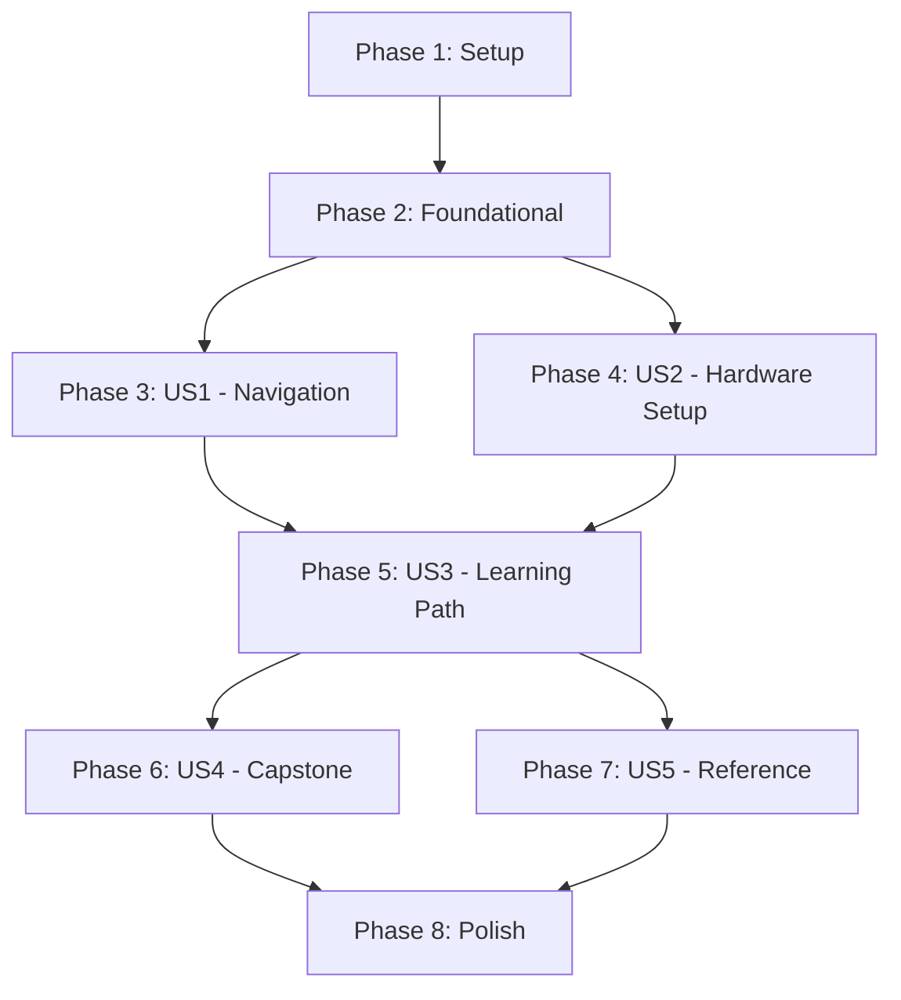

# Tasks: Physical AI & Humanoid Robotics Textbook

**Input**: Design documents from `/specs/001-book-master-plan/`
**Prerequisites**: plan.md ✅, spec.md ✅, research.md ✅, data-model.md ✅, contracts/ ✅

**Tests**: No automated tests required (documentation project - validation via build and Lighthouse CI)

**Organization**: Tasks grouped by user story to enable independent implementation and testing.

## Format: `[ID] [P?] [Story?] Description`

- **[P]**: Can run in parallel (different files, no dependencies)
- **[Story]**: Which user story this task belongs to (US1, US2, US3, US4, US5)
- File paths relative to `my-website/`

---

## Phase 1: Setup (Docusaurus Infrastructure)

**Purpose**: Initialize Docusaurus project with required plugins and configuration

- [ ] T001 Create Docusaurus project with `npx create-docusaurus@latest my-website classic --typescript`
- [ ] T002 Install search plugin with `yarn add @easyops-cn/docusaurus-search-local` in my-website/
- [ ] T003 [P] Install Mermaid theme with `yarn add @docusaurus/theme-mermaid` in my-website/
- [ ] T004 Configure TypeScript with strict mode in my-website/tsconfig.json
- [ ] T005 Verify initial build succeeds with `yarn build` in my-website/

**Checkpoint**: Docusaurus project created with all required dependencies installed

---

## Phase 2: Foundational (Blocking Prerequisites)

**Purpose**: Core infrastructure that MUST be complete before ANY user story can be implemented

**⚠️ CRITICAL**: No user story work can begin until this phase is complete

### Site Configuration

- [ ] T006 Configure site metadata (title, tagline, URL, baseUrl) in my-website/docusaurus.config.ts
- [ ] T007 [P] Configure Mermaid theme and markdown settings in my-website/docusaurus.config.ts
- [ ] T008 [P] Configure local search plugin in my-website/docusaurus.config.ts
- [ ] T009 [P] Configure Prism syntax highlighting for python, bash, yaml, xml, cpp in my-website/docusaurus.config.ts
- [ ] T010 Configure sidebar autogeneration in my-website/sidebars.ts

### Directory Structure

- [ ] T011 [P] Create docs/introduction/ directory with _category_.json
- [ ] T012 [P] Create docs/module-1/ directory with _category_.json
- [ ] T013 [P] Create docs/module-2/ directory with _category_.json
- [ ] T014 [P] Create docs/module-3/ directory with _category_.json
- [ ] T015 [P] Create docs/module-4/ directory with _category_.json
- [ ] T016 [P] Create docs/hardware-guide/ directory with _category_.json
- [ ] T017 [P] Create docs/appendices/ directory with _category_.json

### CI/CD Pipeline

- [ ] T018 Create GitHub Actions deployment workflow in .github/workflows/deploy.yml
- [ ] T019 [P] Create GitHub Actions PR test workflow in .github/workflows/test-build.yml
- [ ] T020 Verify deployment workflow syntax with `gh workflow view`

**Checkpoint**: Foundation ready - all directories created, config complete, CI/CD ready

---

## Phase 3: User Story 1 - Navigate Complete Course Structure (Priority: P1) 🎯 MVP

**Goal**: Students see 13-week course structure with modules, chapters, prerequisites, and 2-click navigation

**Independent Test**: Navigate from homepage to any module/chapter within 2 clicks; verify sidebar shows all sections

### Homepage Dashboard

- [ ] T021 [US1] Create ModuleCard component in my-website/src/components/ModuleCard/index.tsx
- [ ] T022 [P] [US1] Create ModuleCard styles in my-website/src/components/ModuleCard/styles.module.css
- [ ] T023 [US1] Create homepage dashboard layout in my-website/src/pages/index.tsx
- [ ] T024 [P] [US1] Create custom CSS variables in my-website/src/css/custom.css

### Course Introduction

- [ ] T025 [US1] Write course introduction in my-website/docs/intro.md with frontmatter
- [ ] T026 [P] [US1] Create Introduction section index in my-website/docs/introduction/index.md
- [ ] T027 [P] [US1] Create what-is-physical-ai.md in my-website/docs/introduction/
- [ ] T028 [P] [US1] Create humanoid-landscape.md in my-website/docs/introduction/
- [ ] T029 [P] [US1] Create hardware-overview.md in my-website/docs/introduction/
- [ ] T030 [P] [US1] Create development-workflow.md in my-website/docs/introduction/

### Module Index Pages

- [ ] T031 [P] [US1] Create Module 1 index in my-website/docs/module-1/index.md with learning objectives
- [ ] T032 [P] [US1] Create Module 2 index in my-website/docs/module-2/index.md with learning objectives
- [ ] T033 [P] [US1] Create Module 3 index in my-website/docs/module-3/index.md with learning objectives
- [ ] T034 [P] [US1] Create Module 4 index in my-website/docs/module-4/index.md with learning objectives

### Verification

- [ ] T035 [US1] Verify 2-click navigation from homepage to any module index
- [ ] T036 [US1] Verify sidebar shows all modules with correct hierarchy

**Checkpoint**: Homepage dashboard complete with module cards; all module index pages accessible

---

## Phase 4: User Story 2 - Access Hardware Setup Documentation (Priority: P1)

**Goal**: Students can access complete setup guides for 3 hardware configurations

**Independent Test**: Follow any hardware setup guide end-to-end and verify all commands/steps are present

### Hardware Guide Content

- [ ] T037 [US2] Create hardware guide index in my-website/docs/hardware-guide/index.md
- [ ] T038 [P] [US2] Create Digital Twin Workstation guide in my-website/docs/hardware-guide/workstation.md
- [ ] T039 [P] [US2] Create Physical AI Edge Kit guide in my-website/docs/hardware-guide/jetson.md
- [ ] T040 [P] [US2] Create Cloud-Native Setup guide in my-website/docs/hardware-guide/cloud-options.md

### Verification Checklists

- [ ] T041 [US2] Add verification commands to workstation.md (ros2 doctor, nvidia-smi, etc.)
- [ ] T042 [P] [US2] Add verification commands to jetson.md
- [ ] T043 [P] [US2] Add verification commands to cloud-options.md

**Checkpoint**: All 3 hardware setup guides complete with verification checklists

---

## Phase 5: User Story 3 - Follow Module-Based Learning Path (Priority: P2)

**Goal**: Students progress through modules with clear objectives, time estimates, and chapter navigation

**Independent Test**: Complete Module 1 reading and verify next/previous navigation works

### Module 1 Content (ROS 2 Jazzy)

- [ ] T044 [P] [US3] Create installation.md in my-website/docs/module-1/
- [ ] T045 [P] [US3] Create core-concepts.md in my-website/docs/module-1/
- [ ] T046 [P] [US3] Create building-packages.md in my-website/docs/module-1/
- [ ] T047 [P] [US3] Create python-agents.md in my-website/docs/module-1/
- [ ] T048 [P] [US3] Create urdf-basics.md in my-website/docs/module-1/
- [ ] T049 [US3] Create exercises.md in my-website/docs/module-1/

### Module 2 Content (Digital Twin)

- [ ] T050 [P] [US3] Create gazebo-setup.md in my-website/docs/module-2/
- [ ] T051 [P] [US3] Create urdf-sdf.md in my-website/docs/module-2/
- [ ] T052 [P] [US3] Create physics-sim.md in my-website/docs/module-2/
- [ ] T053 [P] [US3] Create sensors.md in my-website/docs/module-2/
- [ ] T054 [P] [US3] Create unity-bridge.md in my-website/docs/module-2/
- [ ] T055 [US3] Create exercises.md in my-website/docs/module-2/

### Module 3 Content (Isaac Platform)

- [ ] T056 [P] [US3] Create isaac-sim-setup.md in my-website/docs/module-3/
- [ ] T057 [P] [US3] Create perception.md in my-website/docs/module-3/
- [ ] T058 [P] [US3] Create navigation.md in my-website/docs/module-3/
- [ ] T059 [P] [US3] Create reinforcement-learning.md in my-website/docs/module-3/
- [ ] T060 [P] [US3] Create sim-to-real.md in my-website/docs/module-3/
- [ ] T061 [US3] Create exercises.md in my-website/docs/module-3/

### Module 4 Content (VLA & Capstone)

- [ ] T062 [P] [US3] Create voice-to-action.md in my-website/docs/module-4/
- [ ] T063 [P] [US3] Create cognitive-planning.md in my-website/docs/module-4/
- [ ] T064 [P] [US3] Create humanoid-fundamentals.md in my-website/docs/module-4/
- [ ] T065 [P] [US3] Create multi-modal-hri.md in my-website/docs/module-4/

**Checkpoint**: All 4 modules have complete chapter content with frontmatter

---

## Phase 6: User Story 4 - Access Capstone Project Guidelines (Priority: P2)

**Goal**: Students access capstone architecture and mapping to module content

**Independent Test**: Read capstone guide and find links to all 5 pipeline components

### Capstone Documentation

- [ ] T066 [US4] Create capstone-project.md in my-website/docs/module-4/ with architecture diagram
- [ ] T067 [US4] Add voice component section with link to voice-to-action.md
- [ ] T068 [US4] Add planning component section with link to cognitive-planning.md
- [ ] T069 [US4] Add navigation component section with link to Module 3 navigation.md
- [ ] T070 [US4] Add perception component section with link to Module 3 perception.md
- [ ] T071 [US4] Add manipulation component section with links to humanoid-fundamentals.md

### Assessment Content

- [ ] T072 [US4] Create assessments.md in my-website/docs/module-4/ with rubrics

**Checkpoint**: Capstone guide complete with all 5 component links and assessment rubrics

---

## Phase 7: User Story 5 - Reference Quick Guides and Glossary (Priority: P3)

**Goal**: Students quickly find glossary terms, command references, and troubleshooting

**Independent Test**: Search for "URDF" and find glossary definition within 5 seconds

### Appendices Content

- [ ] T073 [US5] Create glossary.md in my-website/docs/appendices/ with 100+ terms
- [ ] T074 [P] [US5] Create resources.md in my-website/docs/appendices/ with external links
- [ ] T075 [P] [US5] Create troubleshooting.md in my-website/docs/appendices/ with common issues

### Search Verification

- [ ] T076 [US5] Verify search indexes glossary terms correctly
- [ ] T077 [US5] Verify search returns relevant results for module topics

**Checkpoint**: Glossary complete with 100+ terms, resources and troubleshooting guides accessible

---

## Phase 8: Polish & Cross-Cutting Concerns

**Purpose**: Final validation, optimization, and deployment readiness

### Quality Validation

- [ ] T078 Run `yarn build` and verify zero errors in my-website/
- [ ] T079 [P] Run linkinator to validate all internal links
- [ ] T080 [P] Verify mobile responsiveness at 375px viewport
- [ ] T081 Deploy to GitHub Pages and verify site is accessible
- [ ] T082 Run Lighthouse audit and verify scores (Performance ≥90, Accessibility ≥95, SEO 100)

### Content Polish

- [ ] T083 [P] Add Mermaid diagrams to module pages (architecture, data flow)
- [ ] T084 [P] Verify all code blocks have language identifiers and copy buttons
- [ ] T085 [P] Verify all images have alt text
- [ ] T086 Add about page in my-website/src/pages/about.md

**Checkpoint**: Site deployed, all quality gates passed, ready for student use

---

## Dependencies & Execution Order

### Phase Dependencies

### User Story Dependencies

- **US1 (P1)**: Can start after Phase 2 - No dependencies on other stories
- **US2 (P1)**: Can start after Phase 2 - Parallel with US1
- **US3 (P2)**: Depends on US1 completion (needs sidebar structure)
- **US4 (P2)**: Depends on US3 (needs module content for links)
- **US5 (P3)**: Depends on US3 (glossary references module terms)

### Parallel Opportunities

**Phase 2 (Foundational):**
- T007, T008, T009 can run in parallel (different config sections)
- T011-T017 can run in parallel (different directories)
- T019 can run in parallel with T018 (different files)

**Phase 3 (US1):**
- T022, T024 can run in parallel with T021 (styles vs component)
- T026-T030 can all run in parallel (different files)
- T031-T034 can all run in parallel (different module indexes)

**Phase 4 (US2):**
- T038-T040 can all run in parallel (different hardware guides)
- T042-T043 can run in parallel with T041 (different files)

**Phase 5 (US3):**
- All chapter files within same module can run in parallel
- Different modules can run in parallel

---

## Implementation Strategy

### MVP First (US1 + US2)

1. Complete Phase 1: Setup → Docusaurus installed
2. Complete Phase 2: Foundational → Directory structure ready
3. Complete Phase 3: US1 → Homepage dashboard + navigation working
4. Complete Phase 4: US2 → Hardware setup guides complete
5. **STOP and VALIDATE**: Site navigable, hardware guides accessible
6. Deploy preview if ready

### Incremental Delivery

1. Setup + Foundational → Site skeleton live
2. Add US1 (Navigation) → Deploy (Homepage + module indexes!)
3. Add US2 (Hardware) → Deploy (Setup guides available!)
4. Add US3 (Content) → Deploy (Full module content!)
5. Add US4 (Capstone) → Deploy (Capstone guide!)
6. Add US5 (Reference) → Deploy (Glossary + troubleshooting!)
7. Polish → Final deploy with Lighthouse validation

---

## Summary

| Phase | Tasks | Parallel | Description |
|-------|-------|----------|-------------|
| 1. Setup | T001-T005 | 1 | Docusaurus infrastructure |
| 2. Foundational | T006-T020 | 13 | Config, directories, CI/CD |
| 3. US1 - Navigation | T021-T036 | 13 | Homepage, module indexes |
| 4. US2 - Hardware | T037-T043 | 5 | 3 setup guides |
| 5. US3 - Content | T044-T065 | 20 | All module chapters |
| 6. US4 - Capstone | T066-T072 | 0 | Capstone guide |
| 7. US5 - Reference | T073-T077 | 2 | Glossary, troubleshooting |
| 8. Polish | T078-T086 | 5 | Validation, deployment |
| **Total** | **86** | **59** | |

---

## Notes

- [P] tasks = different files, can run in parallel
- [US#] labels = user story for traceability
- Human review gates not included (content accuracy verified during writing)
- Each module should have consistent frontmatter per schema
- Commit after each task or logical group (conventional commits)
- All content pages must include 8 required frontmatter fields per FR-017
